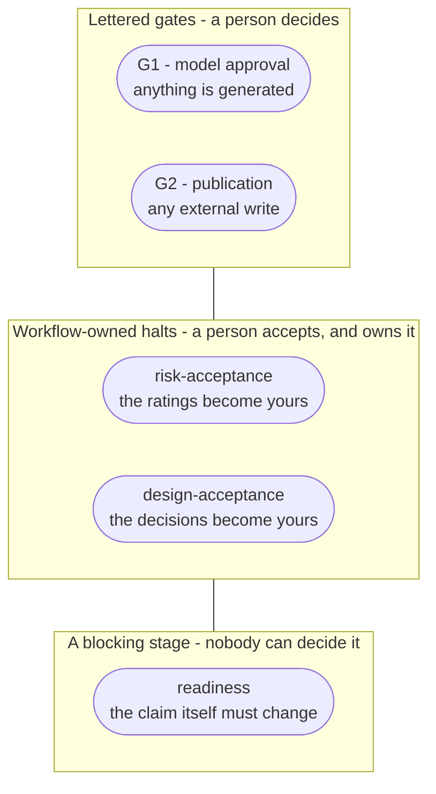

# 5 · The two gates, and why there are only two

Métis stops for a human twice. Everything else runs unattended, and the two
places it stops are chosen so that the **safe failure is always "no tests
generated"**, never "tests generated from something nobody checked".

| Gate | Sits before | Decides | Evidence a reviewer is shown |
|---|---|---|---|
| **G1 — model approval** | anything is generated | is this behaviour real | validation findings, reconciliation gaps, the criteria each rule carries |
| **G2 — publication** | any external write | do we send this | the whole batch, in full |

## Nothing auto-approves, and nothing expires into approval

An unreviewed model stays unapproved indefinitely. There is no timeout that
promotes it, no "approved unless objected to", and no threshold of confidence
that stands in for a decision. Generation reads only `Approved` (**D-10**), so an
unreviewed model produces nothing rather than producing something unmarked.

This is worth stating because the alternative is so tempting. A queue of 200
elements invites a bulk accept, and a bulk accept is indistinguishable from
nobody looking. **N-5** permits a batch decision and prohibits batch blindness:
the decision may cover many elements, and it must name what it covered.

## A decision that cannot show its evidence is blocked

**N-4.** If the screen cannot present validation findings and reconciliation
gaps, it does not present a thinner screen — it refuses the decision. Over HTTP
that is a `409`. The reasoning is that an approval means *"I looked at the
evidence"*, and an approval taken without it is a record of something that did
not happen.

## The proposer may not approve

**N-10.** Whoever put an element forward cannot be the one who accepts it. The
analyser is the proposer for code-derived models, which is why the audit record
carries `proposed_by` — before it did, `check_self_approval` received `None` for
every landed element and the separation had never once fired.

An override exists and is **recorded as an override**, never silent (**N-11**).

## G2 is a literal word, in that run

Publication takes an affirmative confirmation — the literal word, not a default,
not a `-y` flag (**T-18**). It covers a batch shown in full (**T-17**), and it
records who gave it (**N-13**).

On a terminal, *"in that run"* enforces itself: the run is the process the
operator is looking at. Over HTTP it does not — a request body is a string a
proxy can retry and a client can resend. So a confirmation over the API is a
single-use ticket bound to the batch shown and the identity shown it, consumed on
first use (**N-19**).

The default transport is the dry run: the gate is real and the transport behind
it sends nothing. **A live one exists** — `metis publish --transport zephyr-scale`
writes into a real Zephyr Scale project — and reaching it takes a second key the
G2 confirmation cannot supply: `METIS_ALLOW_EXTERNAL_WRITES=yes`, set on the
installation by a person. Lesson 01 has the full argument for why that second key
is the one that matters.

## Four things stop a run, and only two of them are gates

The title still holds — there are two **lettered** gates and there will not be a
third. But a run can stop in four ways now, and telling them apart is the useful
skill.

**A gate waits for a decision.** G1 and G2 are the two moments where the system
would otherwise act on its own judgement: generating from behaviour nobody
approved, and writing to somebody else's tracker.

**A workflow-owned halt waits for ownership.** `risk-acceptance` and
`design-acceptance` are not asking whether to proceed — they are asking somebody
to put their name to ratings and decisions Métis proposed and did not make. Each
costs its own literal, and the literal that passes one passes nothing else.
That is deliberate: a single word that opened two different doors would stop
meaning either.

**A blocking stage waits for nothing.** `readiness` refuses a claim that cannot
be represented — a need nobody has specified would become a node nothing can
ever be checked against. There is no literal, no override, no "import it
anyway", because there is nothing to decide: the claim itself has to change.
That makes it a *failed* stage rather than a blocked one, and it says what
failed and what to do about it.

**Why this is not a third gate.** A gate's whole value is that it is rare and it
means one thing. Four lettered gates would mean four kinds of "somebody
approved", and the first time two of them got confused the guarantee would be
gone. So the count stays at two, and everything else is named for what it
actually is.

## What this costs, honestly

Two gates mean two places a person must be present, and a system that cannot run
end to end without one. That is the trade: Métis is not trying to be autonomous.
It is trying to make the moment of judgement **visible and recorded**, and
everything above follows from taking that seriously.
