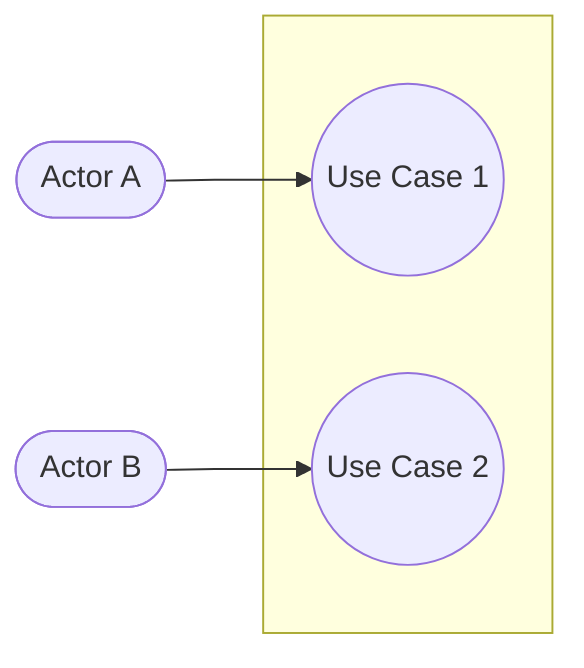
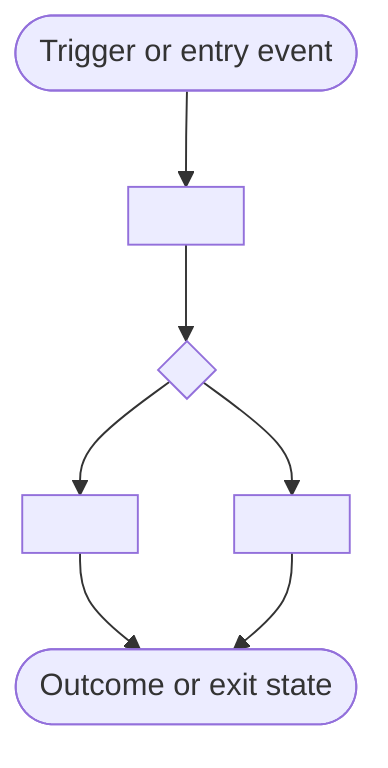

# Test Design Overview Template (High-Level)

Use this template for the **high-level, reviewer-facing** test-design artifact. It is written FIRST, before any
BDD scenario or automation-catalog detail exists, so a reviewer can confirm scope and grouping before the
expensive detailed artifact (`test-design-template.md`) is authored.

**Hard constraints:**

- No Gherkin/BDD steps. No `TDS-*`/`TCS-*`/`TPR-*` catalogs. No per-scenario preconditions or oracle notes.
- Every scenario/acceptance-criterion in scope must belong to exactly one **Group ID** (`SG-01`, `SG-02`, ...).
  Group IDs are the sole traceability bridge to the detailed artifact — the detailed artifact's Stage 07/08
  expand each Group ID into full BDD scenarios and MUST carry a `Source Group: SG-xx` back-reference for every
  drafted scenario. Do not invent, drop, or renumber Group IDs after user confirmation — that would break the
  sync check (`scripts/check_design_sync.py`) run at Stage 08's Gate.
- Keep this document short. If a section would require BDD or catalog-level content to be meaningful, omit it —
  it belongs in the detailed artifact instead.

## Specification Metadata And Document Control

| Field | Value |
|---|---|
| Feature Name/ID | `<project_code>-xxxxx or feature-id>` |
| Status | `<Draft | Review | Approved>` |
| High-Level Objective | `<brief description of what is being built>` |
| Project code | `<project_code>` |
| Analyst | `<name>` |
| Report date | `<yyyy-mm-dd>` |
| Coverage Mode | `<single ticket coverage | full functional coverage | n/a>` |
| Detailed Artifact (companion) | `.atlas/test-design/<scope-id>.md` (written after this overview is confirmed) |
| Recommendation status | `<ready for review | needs clarification | blocked>` |

## Scope Summary

| Scope Area | Summary | Evidence |
|---|---|---|
| Business or feature scope | `<what behavior is in scope>` | `<jira, story, or artifact evidence>` |
| Release or environment scope | `<version, release train, or environment>` | `<athena or jira evidence>` |
| Quality objective | `<why this analysis is being performed>` | `<user request or linked ticket>` |

## Coverage Mode And High-Level Testing Map

| Topic | Summary | Evidence |
|---|---|---|
| Coverage Mode | `<single ticket coverage | full functional coverage>` | `<user choice or upstream artifact>` |
| Highest Reachable Epic | `<project_code>-xxxxx or none>` | `<ticket graph or linked parent chain>` |
| Epic-Branch Scope Summary | `<which parent or sibling items are in scope>` | `<business-analysis artifact>` |

## Use Case Diagram And Flow Chart (MANDATORY)

Reuse the same mandatory-diagram convention as the detailed template — omit only for a single-actor, single-step
scope, and say so explicitly. These diagrams are copied as-is into the detailed artifact later (no rework needed).

### Use Case Diagram

### Flow Chart

## Stakeholders

- `<product>`
- `<QA>`
- `<engineering>`
- `<shared service>`

## Acceptance Criteria

| AC ID | Acceptance Criterion | Source | Priority |
|---|---|---|---|
| AC-01 | `<specific check for verification>` | `<ticket, spec, or BA artifact>` | `<critical, high, medium, low>` |

## Scenario Grouping (Group ID Is The Sync Anchor — No BDD Here)

Every group must map to one or more Acceptance Criteria. Do not write Given/When/Then here — one line of business
intent per group is enough for the reviewer to approve scope. The detailed artifact will expand each group into
one or more full BDD scenarios, each tagged `Source Group: SG-xx`.

| Group ID | Linked AC(s) | Group Intent (one line, no BDD) | Coverage Status | Automation Direction | Risk |
|---|---|---|---|---|---|
| SG-01 | `AC-01` | `<what business behavior this group covers>` | `<covered, partial, gap>` | `<automate now | automate later | keep manual>` | `<low, medium, high>` |
| SG-02 | `AC-02` | `<what business behavior this group covers>` | `<coverage status>` | `<direction>` | `<risk>` |

## Risk And Quality Driver Summary

| Risk Or Quality ID | Category | Description | Priority |
|---|---|---|---|
| RQ-01 | `<functional, security, data, workflow, UX, performance, observability>` | `<risk or quality concern>` | `<critical, high, medium, low>` |

## Testing Approach Summary

| Group ID | Recommended Test Level | Rationale |
|---|---|---|
| SG-01 | `<unit, component, integration, contract, API, UI, performance>` | `<why this level fits, at a group level — technique selection happens in the detailed artifact>` |

## Prioritized Next Actions (High-Level)

| Action | Owner | Priority | Status |
|---|---|---|---|
| Confirm scenario grouping and scope before detailed drafting begins | `<owner>` | `<high>` | `<pending>` |

## Gate — User Confirmation Required

**Do not proceed to the detailed artifact (Stage 07/08) until the user explicitly confirms this grouping.**
Default to **STOP** if approval is ambiguous, deferred, or bypassed. Once confirmed, Group IDs are locked — the
detailed artifact must expand every Group ID here and must not introduce scenarios that trace to no Group ID.
