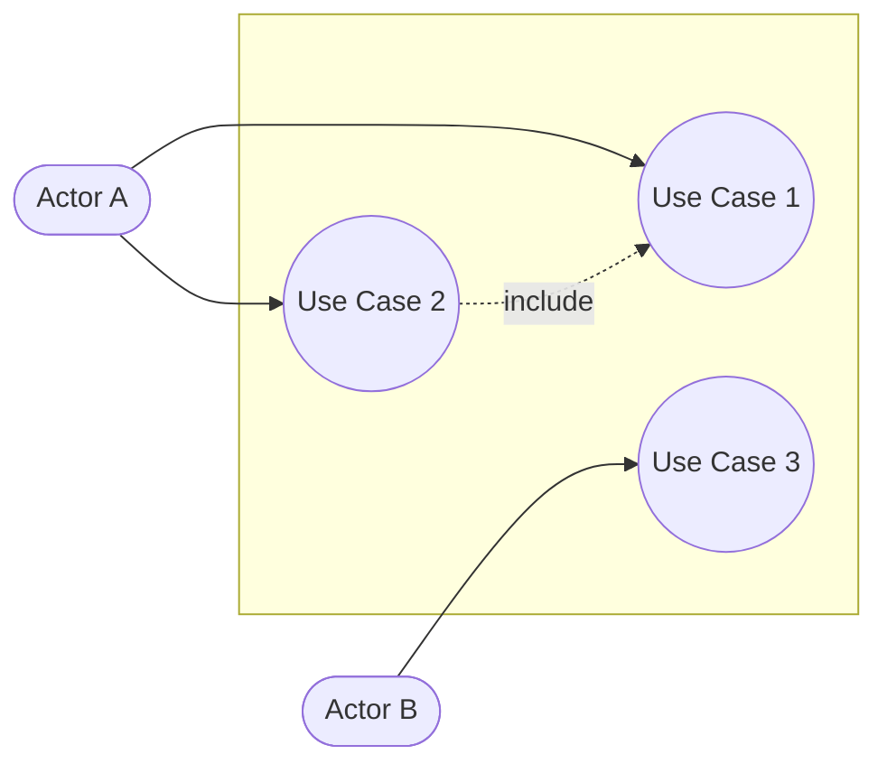
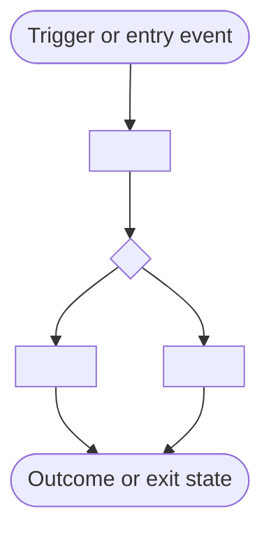
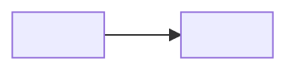

# Test Design Template

Use this template when a feature, Epic, Story, or Test Case needs one artifact that combines current coverage, testing gaps, test technical debt, recommended test approach, and prioritized next test-design work.

This template is intentionally detailed and consolidates ISO/IEC/IEEE 29119, IEEE 829, ISO/IEC/IEEE 15288, and ISO/IEC/IEEE 12207 concerns into **one** deterministic artifact instead of many partially-filled annex files. See `../../knowledge/iso-29119-test-documentation-map.md` for the full standard-to-section mapping. It is designed to be right-sized:

- keep the full structure when the request needs formal design documentation,
- collapse low-value sections when the scope is small,
- and preserve placeholders instead of inventing evidence.

## Mandatory Security & Robustness Requirements

When this template is used to render the durable test-design artifact the following scenario groups are MANDATORY for every API endpoint included in scope:

- **Security Tests:** scenarios for missing Authorization header, invalid token, expired token, wrong scope/role/tenant, malformed tokens, revoked tokens, and token replay variations.
- **Header Validation:** scenarios for absent required headers, invalid header formats, unexpected types, duplicated headers, oversized headers, and header-injection patterns.
- **Field Fuzzing & Injection/Overflow:** for every request field generate boundary and negative cases including SQL/XSS-like payloads, extreme-length strings, numeric overflow patterns, control characters, and encoding edge cases. Drive cases by declared field type and constraints.

These groups must appear as first-class scenario rows in the `Scenario-Level Coverage And Gap Matrix` and must be represented in both the transient review artifact and the durable project artifact.

## Template Usage Requirement (MANDATORY)

The durable test-design artifact written for a project MUST strictly follow this template's top-level structure. Atlas test-designer implementations MUST write the durable artifact to the owning project's `.atlas/test-design/<scope-id>.md` for every ticket scope. If the consuming project cannot accept the durable artifact (e.g., missing path resolution or permissions), the generator MUST stop and return the smallest missing inputs rather than emitting a partial or restructured document.

This detailed artifact has a high-level companion, `.atlas/test-design/<scope-id>.overview.md` (Stage 06,
`resources/templates/test-design-overview-template.md`), written and user-confirmed BEFORE this document.
Every scenario/design here MUST carry a `Source Group: SG-xx` back-reference to a Group ID declared in the
confirmed overview — never introduce a scenario that traces to no Group ID. This document MUST begin with an
HTML comment `<!-- overview-source-hash: <sha256 of the confirmed overview file's exact contents> -->` immediately
below the title, so `scripts/check_design_sync.py` can detect staleness. Stage 08's Gate runs that script and
hard-blocks completion on any mismatch.

## Quick Reference: Coverage And Decision Tables

Use these tables early in review to communicate coverage status and testing approach before detailed sections:

| Scenario ID | Scenario | Coverage Status | Automation Status | Evidence |
|---|---|---|---|---|
| `SCN-01` | `business scenario` | `covered or missing` | `not started or blocked` | `artifact path` |

| Scenario ID | Testing Technique | Testing Method | Rationale | Evidence |
|---|---|---|---|---|
| `SCN-01` | `happy path, negative path, boundary, idempotency, concurrency, soft delete, parity` | `API functional test, DB assertion, unit test, contract test, concurrent request test` | `why this method fits the scenario` | `artifact path` |

## Artifact Rules

- Jira issues should use `https://jira.example.com/browse/<project_code>-xxxxx`.
- Existing Scale test cases should use `https://jira.example.com/secure/Tests.jspa#/testCase/<project_code>-Txxxxx`.
- Proposed or missing Scale test cases must remain visible as `<project_code>-Txxxxx` until a real key exists.
- If a coverage item ID contains `-T`, place it in the Scale fields. Otherwise verify the evidenced item type before placing it in Jira or Scale fields.
- When missing tests or work items may later be created, research a project-specific item-definition template on demand from local optimized Jira or Scale sessions for the same project and item family instead of precreating templates for all projects.
- If the scoped project already has Scale test items in evidence, prefer Scale for new test definitions and keep Jira and Scale test definitions separate.
- If no exact local session exists for the project and item family, fall back to the generic starter item template or nearest evidenced session shape and mark inferred fields clearly.
- The final deliverable must be a markdown file and must include complete scenario-level coverage and missing coverage for every scenario in scope.
- Keep discovery bounded to the named primary item, any explicit repository-evidence or testing-evidence artifacts supplied for this analysis, and the directly connected Jira or Scale items evidenced by those inputs.
- Every existing test entry must show its Item ID and current status.
- Every scenario in scope must appear under a stable `Scenario ID`; do not collapse multiple scenarios into one summary row when coverage or missing coverage differs.
- Keep existing and missing tests in separate sections so coverage rows are not duplicated unnecessarily.
- If data setup, ownership, or environment access is uncertain, keep a visible placeholder rather than guessing.
- This artifact is draft-only for Scale creation in v1.
- Use the annex-style sections only when they materially improve downstream implementation or review.

## Artifact Path Model

- Use a folder-based ticket root for this workflow.
- Write the transient review artifact to `./.atlas/tmp/test-designer/<scope-id>/07-design/test-design-index.md`.
- Write transient supporting drafts under `./.atlas/tmp/test-designer/<scope-id>/07-design/drafts/`.
- Write the durable full design to `.atlas/test-design/<scope-id>.md`.
- When the scope is not a Jira or Scale item, replace `<scope-id>` with a normalized scope slug.
- Keep short titles and ticket types out of the path. Keep those in metadata instead.
- Use the folder because one ticket may later need annex-style design specs, case specs, or procedure specs beside the main document.

## Specification Metadata And Document Control

| Field | Value |
|---|---|
| Feature Name/ID | `<project_code>-xxxxx or feature-id>` |
| Status | `<Draft | Review | Approved | Implemented>` |
| High-Level Objective | `<brief description of what is being built>` |
| User Story | `As a <user>, I want to <action> so that <outcome>.` |
| Primary item | `<project_code>-xxxxx or feature name>` |
| Title | `<epic, story, test case, or feature title>` |
| Project code | `<project_code>` |
| Analyst | `<name>` |
| Report date | `<yyyy-mm-dd>` |
| Document type | `<test design report | test design specification | gap analysis | mixed>` |
| Detail level | `<summary | standard | detailed>` |
| Coverage Mode | `<single ticket coverage | full functional coverage | n/a>` |
| Highest Reachable Epic | `<project_code>-xxxxx or none>` |
| Requested Test Placement | `<seed scenario | branch member | sibling context | n/a>` |
| Canonical Big Map | `.atlas/test-design/<scope-id>.md` |
| High-Level Overview (companion) | `.atlas/test-design/<scope-id>.overview.md` |
| Recommendation status | `<ready for review | needs clarification | blocked>` |

## Metadata Lists And Source Inputs

- Functional Areas: `<functional area list>`
- Components: `<component list>`
- Domain: `<domain list>`
- Product Area: `<product area list>`
- Shared markers: `functional_area=<functional area list>; component=<component list>; domain=<domain list>; product_area=<product area list>`
- Implement In Versions: `<target versions>`
- Impacted Versions: `<affected versions>`
- Source artifacts: `<business-analysis.md, canonical-spec.json, requirement-graph.json, athena queries, zephyr analysis, execution reports>`

## Scope Summary

| Scope Area | Summary | Evidence |
|---|---|---|
| Business or feature scope | `<what behavior is in scope>` | `<jira, story, or artifact evidence>` |
| Release or environment scope | `<version, release train, or environment>` | `<athena or jira evidence>` |
| Quality objective | `<why this analysis is being performed>` | `<user request or linked ticket>` |
| Discovery boundary | `<primary item, explicit evidence artifacts, and evidenced directly connected Jira or Scale scope only>` | `<analyst note or artifact reference>` |
| Testing decision boundary | `<what this report will and will not decide>` | `<analyst note>` |

## Coverage Mode And High-Level Testing Map

| Topic | Summary | Evidence |
|---|---|---|
| Coverage Mode | `<single ticket coverage | full functional coverage>` | `<user choice or upstream artifact>` |
| Highest Reachable Epic | `<project_code>-xxxxx or none>` | `<ticket graph or linked parent chain>` |
| Epic-Branch Scope Summary | `<which parent or sibling items are in scope>` | `<business-analysis artifact>` |
| Requested Test Placement | `<how the requested test fits in the larger map>` | `<analysis note>` |
| Dossier Summary Surface | `.atlas/specs/<primary>/<secondary>/` or `.atlas/repositories/<repo>/` | `<artifact reference>` |

## Life Cycle Process Alignment (ISO/IEC/IEEE 15288 & ISO/IEC/IEEE 12207)

Ground this design in the system or software life cycle stage it supports. Use ISO/IEC/IEEE 15288 (systems, hardware-inclusive scopes) or ISO/IEC/IEEE 12207 (software-only scopes) — most Atlas scopes use 12207. Mark a process `not applicable` rather than deleting the row when this scope does not touch it (e.g., a pure bug-fix rarely touches Stakeholder Needs).

| Life Cycle Process | Standard Reference | Current Stage Status | Verification Or Validation Activity | Evidence |
|---|---|---|---|---|
| Stakeholder Needs & Requirements Definition | 15288 §6.4.2 / 12207 §6.4.1 | `<complete, in progress, not started, not applicable>` | `<how requirements were confirmed>` | `<business-analysis.md, canonical-spec.json>` |
| System/Software Requirements Analysis | 15288 §6.4.3 / 12207 §6.4.2 | `<status>` | `<requirement review or traceability check>` | `<evidence>` |
| Architecture/Design Definition | 15288 §6.4.4 / 12207 §6.4.4 | `<status>` | `<design review or interface check>` | `<evidence>` |
| Integration Process | 15288 §6.4.7 / 12207 §6.4.6 | `<status>` | `<integration test scope>` | `<evidence>` |
| Verification Process | 15288 §6.4.8 / 12207 §6.4.7 | `<status>` | `<this artifact's test conditions and cases prove the system was built right>` | `<TCN/TCS rows>` |
| Validation Process | 15288 §6.4.9 / 12207 §6.4.8 | `<status>` | `<acceptance criteria and scenario coverage prove the system does the right thing>` | `<AC rows, scenario matrix>` |
| Transition / Qualification Testing | 15288 §6.4.10 / 12207 §6.4.9 | `<status>` | `<release readiness, rollout, or cutover coverage>` | `<readiness criteria, deployment sequence>` |

## Confluence And Documentation Evidence

| Source | Availability | Key Behavior Or Rule | How It Should Be Used | Gap Or Risk |
|---|---|---|---|---|
| `<root confluence page or linked child page>` | `<available, partial, missing>` | `<rule or behavior extracted from documentation>` | `<test basis, acceptance clarification, or implementation context>` | `<what remains unresolved>` |
| `<jira description, comment, or BA artifact>` | `<availability>` | `<behavior>` | `<use>` | `<risk>` |

## Use Case Diagram And Flow Chart Requirement (MANDATORY)

Every test-design artifact MUST include at least one **Use Case Diagram** and one **Flow Chart** so reviewers can visually confirm actor coverage and process flow before reading the tables below. Omit only when the scope has a single actor and a single linear step — state the omission explicitly rather than leaving it silent.

Mermaid has no native UML use-case notation. Represent use cases with a `flowchart` convention:

- Actors as bracket nodes (`[Actor Name]`) outside the boundary.
- Use cases as double-parenthesis "bubble" nodes (`((Use Case Name))`) inside a `subgraph` that represents the system or feature boundary.
- Plain edges (`-->`) for actor-to-use-case associations; dotted edges (`-.->`) labeled `include` or `extend` for `<<include>>`/`<<extend>>` relationships between use cases.

## Mermaid Diagram Strategy

Use Case Diagram and Flow Chart default to `yes`; the remaining diagram types stay conditional on what improves review clarity for the scoped conditions.

| Diagram | Include? | When It Adds Value | Typical Use In This Artifact |
|---|---|---|---|
| Use Case Diagram (`flowchart` convention) | `yes (default)` | `actor-to-goal coverage must be visually confirmed` | `show every actor and every in-scope use case, plus include/extend relationships` |
| Flow Chart (`flowchart TD` or `LR`) | `yes (default)` | `any process, decision branch, or dependency needs a visual trace` | `show the primary business or technical flow from trigger to outcome, including decision branches` |
| `sequenceDiagram` | `<yes or no>` | `<ordering, handoff, or request-response evidence matters>` | `<show request, validation, and outcome checkpoints>` |
| `stateDiagram-v2` | `<yes or no>` | `<toggle, lifecycle, or eligibility state matters>` | `<show hidden, visible, enabled, rejected, or duplicate states>` |

## Mermaid Diagram Drafts

Generate every diagram marked `yes` above and keep each diagram tied to specific conditions or scenarios. Use Case Diagram and Flow Chart are drafted first since they anchor the rest of the review.

### Use Case Diagram



### Flow Chart



### Other Diagrams

Generate only the remaining diagrams marked `yes` above.



## Stakeholders

- `<product>`
- `<QA>`
- `<engineering>`
- `<shared service>`

## Test Basis

| Test Basis Item | Type | Scope | Reliability | Notes |
|---|---|---|---|---|
| TB-01 | `<requirement, AC, story, ticket, design, spec, incident, runbook>` | `<what it defines>` | `<confirmed | partial | weak>` | `<why it matters>` |
| TB-02 | `<type>` | `<scope>` | `<reliability>` | `<notes>` |

## Specification Clause Traceability

Use this section only when the primary source is a normative, clause-bearing specification (API contract, workflow rule document, regulatory spec, or acceptance-criteria catalog). Derive test conditions clause by clause instead of brainstorming from the implementation. Skip this section entirely when no such source exists — do not fabricate clauses.

| Clause ID | Source Document | Clause Summary | Derived Rule | Linked Condition ID | Ambiguity Or Gap |
|---|---|---|---|---|---|
| `<CL-01>` | `<spec document and section>` | `<what the clause states>` | `<testable rule extracted from the clause>` | `<TCN-01>` | `<none or open question>` |

## Technical Constraints & Assumptions

| ID | Type | Statement | Impact On Design | Evidence Or Owner |
|---|---|---|---|---|
| A-01 | `<assumption | constraint | dependency>` | `<statement>` | `<how it limits or shapes testing>` | `<evidence or owner>` |
| A-02 | `<type>` | `<statement>` | `<impact>` | `<owner>` |

## Functional Requirements

| Requirement ID | Functional Requirement | Source | Notes |
|---|---|---|---|
| FR-01 | `<what behavior is required>` | `<ticket, spec, or BA artifact>` | `<notes>` |
| FR-02 | `<behavior>` | `<source>` | `<notes>` |

## Boundary Conditions & Edge Cases

| Edge Case ID | Scenario | Expected Behavior | Source | Notes |
|---|---|---|---|---|
| EC-01 | `<invalid input, empty state, timeout, stale data, or retry case>` | `<expected behavior>` | `<source>` | `<notes>` |

## Non-Goals/Out-of-Scope

| Item | Reason | Evidence |
|---|---|---|
| `<explicitly excluded item>` | `<why it is excluded>` | `<evidence>` |

## Existing Evidence Discovery

| Source | Scope Reviewed | Findings | Action |
|---|---|---|---|
| Jira related tickets | `<epic, story, linked bug, task>` | `<existing work or known gap>` | `<reuse, monitor, or expand>` |
| Scale tests | `<existing cases>` | `<covered, partial, or missing>` | `<reuse, compare, or propose placeholder>` |
| Athena test locator | `<related tests and execution footprint>` | `<recent execution or inventory signal>` | `<reuse, validate, or investigate>` |
| Automation assets | `<repo, artifact, or compiled comparison>` | `<existing automation or drift>` | `<reuse, extend, or automate>` |
| Repository evidence | `<repository-evidence.json>` | `<implementation surfaces, dependencies, existing dev-functional automation signals, bottleneck hints>` | `<consume before final technique and Locust decisions>` |
| Business testing evidence | `<testing-evidence.json>` | `<non-functional requirements, chart set, risks, incidents>` | `<consume before final test-condition synthesis>` |
| Canonical spec handoff | `<canonical-spec.json>` | `<normalized feature, flows, endpoints, data model, rules, gaps, and traceability>` | `<use as default normalized basis before deriving conditions or scenario splits>` |
| Requirement graph handoff | `<requirement-graph.json>` | `<feature-to-flow, API, DB entity, dependency, and test-relationship map>` | `<use as the default structural traceability map when filling coverage and missing-coverage sections>` |
| Performance assets | `<locust project, report, or none>` | `<existing or missing performance evidence>` | `<reuse or suggest>` |
| Historical incidents | `<prod issue, support trend, flaky area>` | `<defect or fragility pattern>` | `<add targeted coverage>` |

## Non-Functional Requirements And SLA Targets

| NFR ID | Type | Requirement Or Target | Source | Notes |
|---|---|---|---|---|
| NFR-01 | `<latency, throughput, availability, durability, observability>` | `<target or explicit unknown>` | `<testing-evidence, story, confluence, repo evidence>` | `<notes>` |

## Performance Sensitivity Map

| Area Or Flow | Sensitivity Driver | Bottleneck Hint | Current Evidence | Test Implication |
|---|---|---|---|---|
| `<feature or endpoint group>` | `<concurrency, payload size, fan-out, polling, queue depth>` | `<hint or none>` | `<repository evidence or placeholder>` | `<Locust, component perf, resilience, or none>` |

## Reliability And Scalability Risk Inventory

| Risk ID | Category | Description | Evidence | Proposed Coverage |
|---|---|---|---|---|
| RS-01 | `<reliability or scalability>` | `<risk>` | `<testing-evidence or repository-evidence>` | `<test slice>` |

## Observability And Evidence Collection Requirements

| Requirement ID | Signal Or Evidence | Needed For | Source | Notes |
|---|---|---|---|---|
| OBS-01 | `<logs, metrics, traces, DB checks, queue depth>` | `<design, case, or condition>` | `<testing-evidence or repository-evidence>` | `<notes>` |

## Incident History And Operational Weak Spots

| Incident Or Weak Spot | Source | Why It Matters | Coverage Response |
|---|---|---|---|
| `<bug, prod issue, support trend, flaky area>` | `<ticket or evidence>` | `<impact>` | `<regression, resilience, or monitoring coverage>` |

## Related Epics

Find these from the parent or epic chain for the primary item.

| Link | Name | Status | Last Sync | Relationship | Notes |
|---|---|---|---|---|---|
| `<epic link>` | `<epic name>` | `<status>` | `<yyyy-mm-dd or timestamp>` | `<parent, linked, or inherited>` | `<notes>` |

## Related Stories

Find these from epics and directly linked story relationships.

| Link | Name | Status | Last Sync | Relationship | Notes |
|---|---|---|---|---|---|
| `<story link>` | `<story name>` | `<status>` | `<yyyy-mm-dd or timestamp>` | `<parent, child, linked>` | `<notes>` |

## Related Jira Tests

Find these from epics, stories, and defects when the evidenced test item is Jira-backed.

| Item ID | Link | Name | Status | Last Sync | Relationship | Notes |
|---|---|---|---|---|---|---|
| `<project_code>-xxxxx` | `<test link>` | `<test name>` | `<status>` | `<yyyy-mm-dd or timestamp>` | `<linked test relationship>` | `<notes>` |

## Related Scale Tests

Find these from epics, stories, and defects when the evidenced test item is Scale-backed.

| Item ID | Link | Name | Status | Last Sync | Relationship | Notes |
|---|---|---|---|---|---|---|
| `<project_code>-Txxxxx` | `<scale link>` | `<test name>` | `<status>` | `<yyyy-mm-dd or timestamp>` | `<linked test relationship>` | `<notes>` |

## Related Defects

Find these from epics, stories, and tests.

| Link | Name | Status | Last Sync | Relationship | Notes |
|---|---|---|---|---|---|
| `<defect link>` | `<defect name>` | `<status>` | `<yyyy-mm-dd or timestamp>` | `<linked defect relationship>` | `<notes>` |

## Related SQL Queries

Retrieve only evidenced database queries or query references from tests, stories, epics, and defects, and add a short note on the input or output touchpoint.

| Source Artifact | Query Snippet Or Reference | Input Or Output Touchpoint | Short Note | Linked Item |
|---|---|---|---|---|
| `<ticket or artifact>` | `<query or query reference>` | `<input or output>` | `<why it matters>` | `<linked epic/story/test/defect>` |

## Project Item-Definition Template Research

| Target Item Family | Preferred System | Template Status | Evidence Basis | Reusable Fields | Fallback Plan | Notes |
|---|---|---|---|---|---|---|
| `<test case, requirement, or defect item>` | `<Scale or Jira>` | `<existing, inferred, missing>` | `<optimized session, scoped linked items, or starter template>` | `<summary, description, status, labels, components, links, custom fields>` | `<generic starter template or nearest evidenced session shape>` | `<why this system is preferred and what is still inferred>` |

## Risk And Quality Driver Summary

| Risk Or Quality ID | Category | Description | Likelihood | Impact | Priority | Notes |
|---|---|---|---|---|---|---|
| RQ-01 | `<functional, security, data, workflow, UX, performance, observability>` | `<risk or quality concern>` | `<low, medium, high>` | `<low, medium, high>` | `<critical, high, medium, low>` | `<notes>` |
| RQ-02 | `<category>` | `<description>` | `<likelihood>` | `<impact>` | `<priority>` | `<notes>` |

## Acceptance Criteria

| AC ID | Acceptance Criterion | Source | Priority | Verification Note |
|---|---|---|---|---|
| AC-01 | `<specific check for verification>` | `<ticket, spec, or BA artifact>` | `<critical, high, medium, low>` | `<notes>` |

## Requirement, Risk, And Test Condition Traceability

When multiple levels are viable for the same behavior, prefer `unit` over `integration`, `integration` over `API`, and `API` over `UI` or `Web`.

Keep `Condition ID` stable, and derive one or more `Scenario ID` rows anywhere scenario behavior, current coverage, or missing coverage splits below the condition level.

| Condition ID | Acceptance Criterion ID | Source Requirement Or Risk | Test Condition | Coverage Objective | Recommended Test Level | Selected Technique | Oracle Or Pass Intent | Feature File | Notes |
|---|---|---|---|---|---|---|---|---|---|
| TCN-01 | `AC-01` | `<project_code>-xxxxx or RQ-01>` | `<what must be verified>` | `<what must be covered>` | `<unit, component, integration, contract, API, UI, performance>` | `<technique>` | `<what outcome proves success or controlled failure>` | `TCN-01.features` | `<notes>` |
| TCN-02 | `AC-02` | `<source>` | `<condition>` | `<objective>` | `<level>` | `<technique>` | `<oracle>` | `TCN-02.features` | `<notes>` |

## Testing Approach Summary

Use the lowest sufficient level that can prove the behavior. When multiple levels are viable, prefer `unit` over `integration`, `integration` over `API`, and `API` over `UI` or `Web`.

| Condition ID | Requirement Or Risk | Recommended Test Level | Selected Technique | Technique Rationale | Automation Direction | Performance Relevance | Notes |
|---|---|---|---|---|---|---|---|
| TCN-01 | `<requirement or risk>` | `<unit, component, integration, contract, API, UI, performance>` | `<EP, BVA, decision table, state transition, scenario, combinatorial, exploratory, risk-based>` | `<why this technique fits>` | `<automate now | automate later | keep manual | reuse dev-functional>` | `<none, candidate, required>` | `<key constraints or assumptions>` |
| TCN-02 | `<requirement or risk>` | `<level>` | `<technique>` | `<why>` | `<direction>` | `<relevance>` | `<notes>` |

## Features In Scope And Out Of Scope

| Item | Status | Reason | Evidence |
|---|---|---|---|
| `<feature, rule, state, interface>` | `<in scope | out of scope | deferred>` | `<why>` | `<evidence>` |
| `<item>` | `<status>` | `<reason>` | `<evidence>` |

## Scenario-Level Coverage And Gap Matrix

Repeat rows until every scenario in scope is represented, including already covered scenarios.

| Scenario ID | Condition ID | Scenario Summary | Existing Jira | Existing Scale | Existing Automation | Existing Performance | Coverage Status | Automation Status | Gap Summary | Testability Blocker | Proposed Action |
|---|---|---|---|---|---|---|---|---|---|---|
| SCN-01 | TCN-01 | `<business scenario summary>` | `<project_code>-xxxxx or none` | `<project_code>-Txxxxx or none` | `<repo path, class, dev-functional, or none>` | `<locust asset or none>` | `<covered, partial, gap>` | `<not-applicable, backlog, in-progress, partial, implemented, blocked, manual-only>` | `<what is still missing after accounting for any dev-functional reuse>` | `<none or blocker>` | `<reuse, add test, refactor setup, add Locust>` |
| SCN-02 | TCN-02 | `<business scenario summary>` | `<project_code>-xxxxx or none` | `<project_code>-Txxxxx or none` | `<repo path, class, dev-functional, or none>` | `<locust asset or none>` | `<covered, partial, gap>` | `<automation status>` | `<what is still missing>` | `<blocker>` | `<action>` |

## Existing Test Coverage

Repeat rows until all scenario-level existing coverage entries are represented.

| Scenario ID | Condition ID | Coverage Item Type | Existing Jira ID | Existing Scale ID | Existing Test | Existing Status | Automation Status | Reuse Note |
|---|---|---|---|---|---|---|---|
| SCN-01 | TCN-01 | `<jira test | scale test case>` | `<project_code>-xxxxx or none>` | `<project_code>-Txxxxx or none>` | `<existing test name>` | `<draft, ready, blocked, passed, failed, or other current status>` | `<implemented, partial, blocked, manual-only, or not-applicable>` | `<reuse current test or dev-functional automation>` |
| SCN-02 | TCN-02 | `<jira test | scale test case>` | `<project_code>-xxxxx or none>` | `<project_code>-Txxxxx or none>` | `<existing test name>` | `<status>` | `<automation status>` | `<reuse note>` |

## Missing Test Coverage

Repeat rows until all scenario-level missing coverage entries are represented.

| Scenario ID | Condition ID | Target Item Type | Proposed Jira ID | Proposed Scale ID | Missing Case To Create | Proposed Status | Automation Status | Gap Or Blocker |
|---|---|---|---|---|---|---|---|
| SCN-03 | TCN-02 | `<jira work item | scale test case>` | `<project_code>-xxxxx or none>` | `<project_code>-Txxxxx or none>` | `<missing case to create>` | `<proposed, to create, blocked>` | `<backlog, in-progress, blocked, manual-only, or not-applicable>` | `<what still blocks or why the gap exists>` |
| SCN-04 | TCN-03 | `<jira work item | scale test case>` | `<project_code>-xxxxx or none>` | `<project_code>-Txxxxx or none>` | `<missing case to create>` | `<proposed status>` | `<automation status>` | `<note>` |

## Missing Scenario Definition Drafts

Repeat this subsection for each missing Scenario ID that is likely to be created later. Include BDD scenario, implementation outline, and validation approach for each.

### `<Scenario ID> - <missing scenario title>`

- Source Group: `<SG-xx from the confirmed .atlas/test-design/<scope-id>.overview.md>`
- Target system: `<Scale or Jira>`
- Proposed item key: `<project_code>-Txxxxx or <project_code>-xxxxx>`
- Draft artifact path: `./.atlas/tmp/test-definitions/drafts_<scope-id>_<scenario-id>.md` when the scenario is Scale-ready
- Template basis: `<cached project payload, inferred fallback, or starter template>`
- Evidence inputs: `<Confluence, Jira, BA artifact, SQL query, code, or analyzer artifact>`
- Precondition method preference: `<confirmed user preference: SQL/DB | framework code | API | UI | no preference>`
- Validation method preference: `<confirmed user preference: SQL/DB | framework code | API | UI | no preference>`
- Validation goal: `<UI behavior | API response or contract | persisted state or side effect | mixed>`
- Validation method selection: `<goal-aligned default or explicit user override>`
- Preference source: `<confirmed by user | user delegated choice>`
- Approval state: `<not-required | pending | approved | rejected | superseded>`
- Automation status: `<not-applicable | backlog | in-progress | partial | implemented | blocked | manual-only>`

## BDD Scenarios (Sole Scenario Definition Driver)

Gherkin (Given/When/Then) is the **only** mechanism used to define scenario behavior in this artifact. Do not include framework code, raw SQL, or API payload samples — the design must stay engine-agnostic, since implementation may target Java, Python, JavaScript/TypeScript, or another stack chosen downstream by `test-developer` or an equivalent generation engine. Precondition and validation *methods* are recorded as metadata (which mechanism proves the outcome), never as literal code.

| Step | Intent | Evidence To Use | Expected Result |
|---|---|---|---|
| 1 | `<what should be established first>` | `<evidence>` | `<expected state>` |
| 2 | `<what should be exercised or observed>` | `<evidence>` | `<expected state>` |
| 3 | `<what should be verified>` | `<evidence>` | `<expected result>` |

### Scenario 1: TBD

```gherkin
Scenario: <clear business scenario for the missing coverage>
  Given <precondition stated in business terms>
  And <supporting precondition, naming the confirmed precondition method (SQL/DB, framework code, API, or UI) in words, not code>
  When <business action>
  Then <observable business result>
  And <persisted-state or side-effect result, described in business/technical terms, e.g. "the ledger balance reflects the adjustment">
```

- Source Group: `<SG-xx from the confirmed .atlas/test-design/<scope-id>.overview.md>`
- Precondition method: `<SQL/DB | framework code | API | UI | no preference>`
- Validation goal: `<UI behavior | API response or contract | persisted state or side effect | mixed>`

Repeat this scenario block (Gherkin plus the two metadata lines) for every covered or missing scenario in scope. Do not add an implementation-example or validation-query subsection — the Gherkin scenario itself is the sole scenario definition; a different generation engine may implement it in any stack.

### Preconditions

Describe the confirmed precondition method in words — never include framework code, SQL, or raw API payloads here.

| Precondition Method | Description | Data Or State Required | Limits |
|---|---|---|---|
| `<SQL/DB | framework code | API | UI | no preference>` | `<what must be located, prepared, or provisioned, described in business/technical prose>` | `<entities, fields, or states needed>` | `<what this method can confirm and what it cannot>` |

### Validation And Oracle Notes

- Choose the primary oracle from the validation goal first, then apply any explicit user preference.
- If the goal is `UI behavior`, the primary oracle should be UI-visible behavior.
- If the goal is `API response or contract`, the primary oracle should be the API response when it can prove the requirement.
- If the goal is `persisted state or side effect`, prefer `SQL/DB` as the primary oracle unless the user explicitly prefers another method or no safe DB evidence exists.
- Primary oracle: `<what most directly proves success or controlled failure>`
- Supporting oracle: `<secondary API, UI, contract, or integration evidence>`
- Preconditions source: `<framework code reference, SQL query reference, API reference, UI reference, or explicit blocked>`
- Validation source: `<framework code reference, SQL query reference, API reference, UI reference, or explicit blocked>`
- SQL-backed validation: `<exact query reference, query set reference, or explicit none>`
- SQL gap: `<what still cannot be proven through SQL from the current evidence set>`

## Test Technical Debt Inventory

| Debt ID | Debt Type | Scope | Current Impact | Risk If Unchanged | Recommended Remediation | Priority |
|---|---|---|---|---|---|---|
| TD-01 | `<duplicated setup, flaky coverage, weak assertions, missing seam, poor test data ownership>` | `<repo path, layer, or flow>` | `<how it slows or weakens testing>` | `<business or delivery risk>` | `<specific remediation direction>` | `<high, medium, low>` |
| TD-02 | `<type>` | `<scope>` | `<impact>` | `<risk>` | `<direction>` | `<priority>` |

## Readiness Criteria

| Criteria Type | Definition | Current Status | Evidence Or Gap |
|---|---|---|---|
| Entry criteria | `<what must be true before design or execution is valid>` | `<met, partial, blocked>` | `<evidence or gap>` |
| Exit criteria | `<what evidence closes this design slice>` | `<defined, partial, missing>` | `<notes>` |
| Suspension criteria | `<when execution or rollout should stop>` | `<defined or missing>` | `<notes>` |
| Resumption requirements | `<what is required to continue after suspension>` | `<defined or missing>` | `<notes>` |

## IEEE 829 Test Plan Elements Checklist

Confirm every classic IEEE 829 Test Plan element is present somewhere in this artifact. Entry/exit/suspension/resumption criteria live in **Readiness Criteria** above; the remaining elements are tracked here so nothing from the standard is silently dropped. Mark `n/a` rather than deleting a row when an element genuinely does not apply to this scope.

| IEEE 829 Element | Covered By (Section In This Artifact) | Status |
|---|---|---|
| Test Plan Identifier | Specification Metadata And Document Control | `<complete or n/a>` |
| Test Items | Test Basis + Scope Summary | `<complete or n/a>` |
| Features To Be Tested | Features In Scope And Out Of Scope | `<complete or n/a>` |
| Features Not To Be Tested | Features In Scope And Out Of Scope | `<complete or n/a>` |
| Approach | Testing Approach Summary | `<complete or n/a>` |
| Item Pass/Fail Criteria | Scenario-Level Coverage And Gap Matrix (Oracle Or Pass Intent) | `<complete or n/a>` |
| Suspension Criteria And Resumption Requirements | Readiness Criteria | `<complete or n/a>` |
| Test Deliverables | Evidence And Reporting Expectations | `<complete or n/a>` |
| Testing Tasks | Prioritized Next Actions | `<complete or n/a>` |
| Environmental Needs | Test Environment Requirements | `<complete or n/a>` |
| Responsibilities | Stakeholders | `<complete or n/a>` |
| Staffing And Training Needs | `<explicit note or n/a>` | `<complete or n/a>` |
| Schedule | `<explicit note, sprint/release reference, or n/a>` | `<complete or n/a>` |
| Risks And Contingencies | Reliability And Scalability Risk Inventory | `<complete or n/a>` |
| Approvals | `<reviewer names and sign-off state, or n/a>` | `<pending, approved, n/a>` |

## Proposed Test Design Specifications

| Design ID | Source Group | Functional Area | Functional Area Decision | Proposed Title | Purpose | Source Conditions | Test Level | Preconditions | Positive Coverage | Negative Or Security Coverage | Pass Criteria | Data Complexity | Setup Strategy |
|---|---|---|---|---|---|---|---|---|---|---|---|---|---|
| TDS-01 | `SG-01` | `<functional area>` | `<confirmed | suggested, user to pick>` | `<missing or next test title>` | `<why this design should exist>` | `<TCN-01, TCN-02>` | `<API, UI, contract, integration, performance>` | `<what must exist first>` | `<main success path>` | `<boundary, validation, authz, or error case>` | `<what result defines success>` | `<minimal, moderate, escalated>` | `<reuse existing data, query or create, isolated provisioning, or reset mutable state>` |
| TDS-02 | `SG-01` | `<functional area>` | `<confirmed | suggested, user to pick>` | `<title>` | `<purpose>` | `<conditions>` | `<level>` | `<preconditions>` | `<positive scope>` | `<negative scope>` | `<criteria>` | `<complexity>` | `<setup strategy>` |

## Automation Slice Summary (Optional — Small-Scope Fast Path)

For single-ticket or small-Epic scopes (≤10 slices) where filling out the full `TDS-*`/`TCS-*`/`TPR-*` catalogs individually would be disproportionate, collapse to this single condensed table instead. For larger or formal scopes, skip this section and use the full catalogs above and below. Regression context, data setup, and existing-coverage detail already live in **Related Stories**/**Related Defects**, **Test Data Requirements**, and **Existing Test Coverage** above — do not duplicate them here.

| Slice | Description | Mode | Type | Package Or Module Target | Infrastructure Gap | Priority | Automation Status |
|---|---|---|---|---|---|---|---|
| A | `<description>` | `generate-new` | `<API, UI, Web, integration>` | `<package or module path>` | `<gap or —>` | `<P1, P2, P3>` | `not-applicable` |
| B | `<description>` | `extend-existing` | `<type>` | `<package path>` | `—` | `<priority>` | `not-applicable` |

**`Mode` values:** `generate-new` · `extend-existing` · `migration-first` · `duplicate-covered` · `blocked`. **`Automation Status` values:** align with the Scenario-Level Coverage And Gap Matrix above (`not-applicable` · `backlog` · `in-progress` · `partial` · `implemented` · `blocked` · `manual-only`).

| Automation Status | Count |
|---|---|
| `backlog` | `N` |
| `in-progress` | `N` |
| `implemented` | `N` |
| `blocked` | `N` |

**Overall readiness:** `design-ready` · `ready for generation after approval` · `blocked on corrective input`

## Reusable Preconditions And Grouping Recommendations

| Precondition Fingerprint | Status | Reusable Setup Candidates | Suggested Post-Script Validation | Grouping Recommendation |
|---|---|---|---|---|
| `<fingerprint>` | `<confirmed | reusable | missing | blocked>` | `<existing helpers or setup methods>` | `<primary validation guidance>` | `<group in one API class | shared Web base | shared BATCH base | split because state mutates>` |

## Proposed Test Case Catalog

| Case ID | Linked Design ID | Objective | Preconditions | Inputs Or Variants | Expected Results | Priority | Automation Candidate | Data Ref | Environment Ref |
|---|---|---|---|---|---|---|---|---|---|
| TCS-01 | `TDS-01` | `<case objective>` | `<what must be true>` | `<input class, boundary, role, state>` | `<expected output or state change>` | `<critical, high, medium, low>` | `<yes, later, no>` | `<TDR-01>` | `<TER-01>` |
| TCS-02 | `TDS-01` | `<negative or alternate objective>` | `<preconditions>` | `<inputs>` | `<expected result>` | `<priority>` | `<candidate>` | `<data ref>` | `<env ref>` |

## Proposed Test Procedure Catalog

| Procedure ID | Linked Cases | Setup Summary | Execution Sequence | Evidence To Capture | Cleanup | Contingencies |
|---|---|---|---|---|---|---|
| TPR-01 | `<TCS-01, TCS-02>` | `<setup or reset needed>` | `<ordered execution steps or checkpoints>` | `<logs, screenshots, DB checks, API payloads>` | `<cleanup or rollback>` | `<what to do if blocked or unstable>` |
| TPR-02 | `<cases>` | `<setup>` | `<sequence>` | `<evidence>` | `<cleanup>` | `<contingencies>` |

## Test Data Requirements

| Data ID | Linked Design Or Case | Purpose | Required Entities Or Fields | Source Or Generation Strategy | Privacy Or Cleanup Notes | Readiness |
|---|---|---|---|---|---|---|
| TDR-01 | `<TDS-01 or TCS-01>` | `<why this data is needed>` | `<fields, states, relationships>` | `<existing data, query or create, synthetic, masked>` | `<masking, reset, retention, cleanup>` | `<ready, partial, blocked>` |
| TDR-02 | `<reference>` | `<purpose>` | `<entities>` | `<strategy>` | `<notes>` | `<status>` |

## Test Environment Requirements

| Environment ID | Linked Design Or Case | Purpose | Required Components Or Config | Observability Needs | Access Or Ownership | Readiness |
|---|---|---|---|---|---|---|
| TER-01 | `<TDS-01 or TCS-01>` | `<why this environment is needed>` | `<services, flags, builds, integrations>` | `<logs, metrics, traces, screenshots>` | `<owner or missing access>` | `<ready, partial, blocked>` |
| TER-02 | `<reference>` | `<purpose>` | `<components>` | `<observability>` | `<owner>` | `<status>` |

## Condition Feature Handoff

Repeat this subsection for each Condition ID. Use the exact Condition ID for the file name, keep the language at acceptance-criteria level, and do not include implementation details such as endpoint paths, selectors, DTO fields, class names, or helper methods.

### `<Condition ID>.features`

```gherkin
Feature: <business capability tied to the linked acceptance criterion>
	Rule: <business rule or constraint enforced by this condition>

	Scenario: <observable business outcome>
		Given <high-level business precondition>
		And <high-level context when needed>
		When <business action>
		Then <observable business result>
		And <follow-on business result when needed>
```

## Automation And Performance Recommendations

| Design ID Or Area | Recommendation | Target Repo Or Workflow | Why | Blocking Unknowns |
|---|---|---|---|---|
| TDS-01 | `<automate now | automate later | keep manual>` | `<repo, skill, or project>` | `<why>` | `<data, access, or dependency gap>` |
| `<feature or endpoint group>` | `<add Locust coverage | no action>` | `<locust workflow or none>` | `<why>` | `<unknowns>` |

## Locust Candidate Matrix

| Candidate Area | Triggering Evidence | Workload Concern | Recommendation | Priority |
|---|---|---|---|---|
| `<feature or endpoint group>` | `<bottleneck hint, SLA target, incident, dependency fan-out>` | `<throughput, latency, soak, spike, concurrency>` | `<add Locust scenario | defer | no action>` | `<critical, high, medium, low>` |

## Evidence And Reporting Expectations

| Evidence Type | Purpose | Required For | Notes |
|---|---|---|---|
| `<execution log, screenshot, DB state, API payload, incident report>` | `<why it matters>` | `<which design or case>` | `<capture method or placeholder>` |
| `<evidence>` | `<purpose>` | `<scope>` | `<notes>` |

## Data, Environment, And Ownership Gaps

| Item | Current State | Placeholder Or Question | Owner |
|---|---|---|---|
| `<data entity, env dependency, or ownership gap>` | `<known or unknown>` | `<explicit TODO>` | `<QA, product, engineering, shared service>` |

## Prioritized Next Actions

| Action | Owner | Priority | Status |
|---|---|---|---|
| Review proposed test-design specs and traceability | `<owner>` | `<high>` | `<pending>` |
| Confirm technical-debt remediation scope | `<owner>` | `<medium>` | `<pending>` |
| Fill data or environment placeholders | `<owner>` | `<high>` | `<pending>` |
| Choose which proposed tests or tickets should be created next | `<owner>` | `<high>` | `<pending>` |