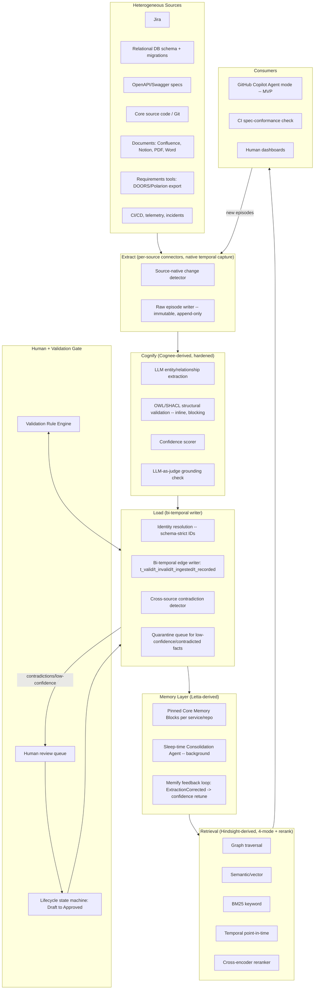

# Specification Knowledge Graph — Technical Specification v2
## Merged Architecture (Graphiti + Cognee + Letta + Hindsight) · Copilot-First MVP · Hallucination-Hardened

This document is the implementation-level follow-on to the v1 architecture report (`specification-knowledge-graph-platform.md`). It assumes that report's ontology (§3), storage design (§6), and traceability model (§7) as given, and specifies three things in full engineering detail per your request:

1. A **merged architecture** that folds in the specific Cognee/Letta/Hindsight features identified previously, with special emphasis on **bi-temporal validity working uniformly across heterogeneous sources** (Jira, relational DB schemas, OpenAPI/Swagger, source code, documents, and requirements tooling).
2. A **Copilot-first MVP integration spec** — concrete, buildable, not a comparison.
3. A **defense-in-depth anti-hallucination and anti-fabrication guardrail architecture**, since this is explicitly targeted at a high-value system where a wrong fact in the graph is worse than a missing one.

Every section marks claims as either (a) established practice, (b) a named feature borrowed from a specific system, or (c) a novel design proposal specific to this spec — no exceptions, per the framing convention set in v1.

---

## 1. Merged Architecture Overview



The architectural change versus v1 is concentrated in three places: **Cognify now blocks on structural validation and a judge pass before anything reaches the graph** (§7), **the Load stage is temporal-source-aware rather than treating all sources identically** (§2), and **a memory layer sits between storage and retrieval** (§3) rather than retrieval reading storage directly.

---

## 2. Temporal Validity Across Heterogeneous Sources

This is the hardest engineering problem in the merged design, and the one you flagged explicitly. The core difficulty: **each source has a different native notion of "when something became true,"** and a uniform bi-temporal model (`t_valid`, `t_invalid`, `t_ingested`, `t_recorded`) can only be smooth if each connector maps its source's native versioning concept into that model correctly — a single generic "ingested_at = now()" strategy silently breaks temporal correctness for every source below.

### 2.1 The four timestamps, defined precisely

| Field | Meaning | Who sets it |
|---|---|---|
| `t_event` | When the fact became true *in the real world* (e.g., when a requirement was actually agreed, when a column was actually added to prod) | Extracted from source-native metadata when available; inferred otherwise, flagged as `event_time_confidence: inferred` |
| `t_recorded` | When the *source system* recorded the fact (e.g., Jira ticket's "updated" timestamp, git commit timestamp, Swagger file's git-blame date) | Read directly from source system metadata — this is the most reliable timestamp and should be preferred over `t_event` when they'd otherwise be conflated |
| `t_ingested` | When the SKG ingested the episode | Set by the Extract stage, always accurate, never inferred |
| `t_valid` / `t_invalid` | The graph-edge validity window used for point-in-time queries (Graphiti's mechanic, reused as-is) | Computed by the Load stage from `t_event`/`t_recorded`, closed automatically when a superseding fact arrives |

**Design rule (novel, load-bearing):** `t_valid` is derived from `t_recorded`, not `t_ingested`, whenever the source provides a reliable recorded-timestamp — this is what prevents "batch re-ingestion" or "backfilled connector" runs from corrupting historical validity windows. `t_ingested` is retained purely for pipeline debugging and replay, never for temporal queries a user would run.

### 2.2 Per-source temporal extraction strategy

| Source | Native temporal signal | Extraction strategy | Known pitfalls / mitigation |
|---|---|---|---|
| **Jira** | Issue `created`, `updated`, transition history (`changelog`), field-history API | Pull full changelog, not just current state — each field change becomes its own episode with `t_recorded` = the changelog entry's timestamp, not the poll time | Jira's changelog can be paginated/rate-limited; a naive poll-and-diff connector will misattribute all changes since last poll to "now." **Mitigation:** always use the changelog API, never diff-by-polling. |
| **Relational DB schema** | Migration history table (Flyway/Liquibase `schema_history`), or DDL event triggers | Treat each applied migration as an episode with `t_recorded` = migration's `applied_at`; parse the migration SQL to derive `Table`/`Column` add/alter/drop as discrete episodes | Schemas changed outside the migration tool (manual DBA `ALTER TABLE`) have no recorded timestamp. **Mitigation:** nightly schema-diff against last-known state; undocumented changes are ingested with `event_time_confidence: inferred` and `t_recorded = detection time`, and are auto-flagged for the Quarantine queue (§4) since an unversioned schema change is itself a governance signal worth surfacing, not just a data-quality footnote. |
| **OpenAPI/Swagger** | Git history of the spec file, plus the spec's own `info.version` field | `t_recorded` = git commit date of the file change; `info.version` bump is captured as a distinct `API` version episode, separate from field-level `Endpoint` changes | Swagger files are often hand-edited out of sync with the deployed API. **Mitigation:** cross-reference against the live API's actual OpenAPI introspection endpoint (if available) as a second episode source; a mismatch between "spec says" and "deployed API says" is itself written as a `SpecDriftDetected` episode (§7.6) rather than silently trusting the file. |
| **Core (source code / Git)** | Commit timestamp, author date vs. commit date, PR merge time | `t_recorded` = commit's author-date (when the change was actually made) for `Method`/`Class` episodes; PR merge time separately captures when it became part of `main` (`t_valid` for the *deployed-truth* view starts at merge, not at commit) | Rebased/squashed history loses individual commit dates. **Mitigation:** prefer PR merge events as the primary temporal anchor for anything traceability-relevant; raw commit-level `t_recorded` is best-effort only. |
| **Documents (Confluence/Notion/PDF/Word)** | Page revision history (Confluence/Notion APIs expose this natively); PDFs/Word docs generally do not | `t_recorded` = revision timestamp where the source API provides it; for revision-less documents, `t_recorded = t_ingested` and the episode is explicitly flagged `event_time_confidence: unknown` | This is the weakest temporal source in the stack. **Mitigation:** documents are never allowed to be the *sole* source for a `Requirement`'s `t_valid` window when a stronger source (Jira, DOORS) exists for the same requirement — see §2.3 precedence rules. |
| **Requirements tools (DOORS Next / Polarion export)** | Native baseline/version history — both tools are explicitly built around versioned requirement baselines | `t_recorded` = the tool's baseline timestamp; each baseline becomes a batch of episodes, one per changed requirement, preserving the tool's own audit trail rather than re-deriving one | Bulk exports can flatten history into a single "import" event if the connector isn't baseline-aware. **Mitigation:** the connector must walk baseline-by-baseline (both DOORS Next and Polarion expose this), not just pull the current state — this is a hard requirement, not an optimization, since it's the only way to avoid losing the very traceability history that justified the DOORS/Polarion investment in the first place. |
| **CI/CD, telemetry, incidents** | Native event timestamps (pipeline run time, log timestamp, incident open/close time) | `t_recorded` = the event's own timestamp; this is the most reliable category since these are inherently event-sourced systems | Clock skew across distributed systems. **Mitigation:** NTP-synchronized ingestion workers; timestamps normalized to UTC at the Extract stage, never left in source-local time. |

### 2.3 Cross-source precedence and conflict resolution

When two sources disagree about the same fact (e.g., Jira says a requirement's acceptance criteria changed on March 1st, a Confluence doc implies it changed on March 3rd), the SKG needs a deterministic precedence rule, not a "last write wins" default — that would make ingestion order (an implementation detail) silently determine truth.

**Precedence order (novel, configurable per-org but shipped with this default):**
1. **System-of-record sources for that entity type** win over general-purpose sources. Concretely: DOORS/Polarion/Jira (whichever is configured as the org's requirements system of record) always wins over a Confluence page for `Requirement`/`AcceptanceCriterion` facts; the DB migration history always wins over a hand-written data-dictionary doc for `Table`/`Column` facts; the live OpenAPI introspection endpoint (when available) wins over the checked-in Swagger file for `Endpoint` facts.
2. **Reliability of the recorded-timestamp** breaks ties within the same tier — a source with an API-native changelog (Jira, DOORS baselines) outranks a source with only inferred timestamps (a PDF).
3. **Recency of `t_recorded`** is the final tiebreaker.
4. **Irreconcilable conflicts** (same tier, same recency, genuinely contradictory content) are never auto-resolved — they are written as a `ContradictionDetected` episode (§7.6) and the entity is held at `lifecycle-state = Disputed` until a human resolves it. This is intentional: silent conflict resolution is exactly the kind of behavior that produces confident-but-wrong answers later.

This precedence table itself is stored as versioned, editable graph data (mirroring the Validation Rule Engine's design in v1 §10.2) — an org using Polarion instead of DOORS, or a different documents tool, reconfigures precedence without a code change.

### 2.4 Temporal query engine

Exposed as an explicit retrieval mode (Hindsight-derived, §3.2), not folded into a generic filter:
- `as_of(node_or_edge, timestamp)` — reconstruct the state of any entity or its neighborhood at a specific point in time, using `t_valid ≤ timestamp < t_invalid`.
- `history(node_or_edge)` — return the full chain of superseded versions, each annotated with its source episode and precedence-tier, so a user can see *why* the current value won, not just what it is.
- `diff(node, t1, t2)` — structural diff of an entity's attributes/relationships between two points in time; this is what powers "what changed about this requirement between the last two releases" queries.

---

## 3. Memory & Retrieval Layer (Merged: Letta + Hindsight)

### 3.1 Pinned Core Memory Blocks (Letta-derived)

Per repository/service, a small, always-injected block set — bypasses retrieval ranking entirely:
- `active_constraints` — all `Constraint` nodes with `Risk=High` tag, current lifecycle state Approved.
- `open_incidents` — any `Incident` with `status=Open` linked (even transitively, up to 2 hops) to this service.
- `pinned_business_rules` — `BusinessRule` nodes explicitly marked `pinned=true` by a human (not automatic — pinning is a deliberate curation action, to prevent this block from growing unbounded).

Size-capped (default 2,000 tokens); if exceeded, oldest-approved-first eviction with a warning surfaced to the service owner that the pinned set needs manual pruning — this is a deliberate design choice over silent truncation, since silently dropping a "High risk" constraint from context is precisely the kind of failure this whole guardrail-focused iteration is meant to prevent.

### 3.2 Hybrid Retrieval — four modes, explicit (Hindsight-derived)

| Mode | Used for | Implementation |
|---|---|---|
| Graph traversal | "What tests cover this transition," precise multi-hop questions | Bounded Cypher traversal, 2–3 hops default |
| Semantic/vector | Fuzzy intent matching, paraphrase-robust search | pgvector/Qdrant over embedded free-text fields |
| BM25/keyword | Exact identifiers, error codes, method names | OpenSearch |
| **Temporal (point-in-time)** | "What did this look like before/after X" | The §2.4 temporal query engine, invoked explicitly, not as a post-hoc filter |

All four run in parallel for open-ended queries; results are merged and passed to a **cross-encoder reranker** (Hindsight-derived) trained/prompted to score (query, candidate-fact) pairs — this replaces v1's vaguer "reranked by a combination of graph-distance and semantic score" with a concrete, swappable component.

### 3.3 Sleep-Time Consolidation Agent (Letta-derived)

A scheduled (nightly) background job, never in the interactive request path:
- Summarizes long low-signal episode chains (e.g., 50 minor commits touching a stable method) into a single rollup episode, preserving links to the originals (never deletes raw episodes — non-lossy, per Graphiti's core principle).
- Proposes (never auto-applies) candidate merges of near-duplicate `Requirement`/`AcceptanceCriterion` nodes detected via embedding similarity above a high threshold, queued for human review.
- Recomputes aggregate confidence-score adjustments from the memify loop (§3.4) in batch, rather than per-write, to bound cost.

### 3.4 Memify Feedback Loop (Cognee-derived)

New episode type `ExtractionCorrected`: fired whenever `HumanReview` overturns an AI-inferred edge or entity. A nightly job aggregates corrections per `(extraction-rule-id, entity-type, source-connector)` triple and adjusts the **default confidence score** assigned to future extractions matching that triple. This is a simple counting/Bayesian-update mechanism, not model retraining — auditable, reversible, and explainable ("this connector's confidence for `BusinessRule` extraction was lowered from 0.8 to 0.6 after 12 human corrections in the last 30 days").

---

## 4. Copilot-First MVP — Full Integration Spec

Per your direction, this is the buildable v1 target. Claude Code integration (v1 report §9.3) is deferred to Phase 2 of the roadmap (§6), but the MCP server itself is built vendor-neutral from day one so that deferral costs nothing later.

### 4.1 MCP server — tool catalog (v1 scope)

| Tool | Input | Output | Notes |
|---|---|---|---|
| `skg_get_context` | anchor (file path, method signature, or free-text task description) | Structured context object: requirement, ACs, transition spec, existing tests, constraints, relevant ADRs | Applies the pinned-block injection (§3.1) + hybrid retrieval (§3.2) automatically |
| `skg_get_traceability` | node id or code symbol | Full up/down traceability chain (v1 report §7.1) | Read-only |
| `skg_check_coverage` | transition id or requirement id | Test coverage status, stale-coverage flags (v1 §7.2) | Read-only |
| `skg_propose_test_skeleton` | transition id | Structured test skeleton (fixtures, assertions targeted, not full test body) | Copilot fills the body; skeleton never auto-commits |
| `skg_impact_analysis` | diff / changed file list | Impacted requirements, services, tests (v1 §9.2) | Read-only, safe for pre-merge use |
| `skg_explain_decision` | node id | Linked ADR/`ArchitectureDecisionRecorded` episodes | Pure retrieval, lowest risk, ship first |
| `skg_submit_episode` | episode type + payload | Confirmation + assigned confidence tier | **Write path — gated, see §5.4 for autonomy tiering; disabled by default in v1, enabled per-org opt-in** |

Only `skg_explain_decision`, `skg_get_context`, `skg_get_traceability`, `skg_check_coverage`, and `skg_impact_analysis` ship enabled by default in the MVP — all read-only. `skg_propose_test_skeleton` ships behind a feature flag. `skg_submit_episode` (write path) ships disabled, per the guardrail principle in §5: **the MVP does not let Copilot write to the graph unsupervised.**

### 4.2 `.agent.md` custom agent definition

Ship a prebuilt custom agent (per v1 §9.3 finding #3) rather than expecting manual server enablement:

```markdown
---
name: spec-aware
description: Coding agent with read access to the Specification Knowledge Graph
tools: [skg_get_context, skg_get_traceability, skg_check_coverage, skg_impact_analysis, skg_explain_decision]
mcp_servers: [skg-mcp]
---
Before proposing any implementation, call skg_get_context for the relevant
requirement/transition. If skg_check_coverage reports missing or stale test
coverage, surface this to the user before writing code. Always cite the
requirement/AC id your implementation is satisfying. If no matching
requirement exists in the graph, say so explicitly rather than proceeding
as if one does — do not infer or invent a requirement id.
```

That last instruction is a direct, load-bearing anti-hallucination control (§5.8) — it is cheap and should not be treated as merely a nicety.

### 4.3 Auth

Copilot's remote-server MCP flows are OAuth-oriented (v1 §9.3 finding #4). The SKG MCP server implements a standard OAuth2 flow scoped per-user, with tokens carrying the user's SKG read/write permissions (mirroring their `Service.owner-team` / RBAC assignment) — so a developer on Team A cannot pull pinned high-risk constraints for Team B's service through the agent even if they know the node id.

### 4.4 Context budget sizing for Copilot Agent mode

Given Copilot's comparatively constrained agent-mode context budget versus Claude Code (v1 §9.3 finding #5), `skg_get_context`'s default traversal depth is capped at **2 hops** (vs. 3 for a Claude Code build later) and top-k retrieval results capped at a smaller default (tunable per-org) — sized to the query up front rather than truncating a larger payload after assembly, per the v1 recommendation.

### 4.5 CI gate

Implemented as a **GitHub required status check** (`skg/spec-conformance`) that queries the Validation Engine's current status for all nodes touched by the PR's diff — agent-agnostic by construction (v1 §9.3 finding #7), so it works identically whether the PR came from a human, `@copilot`, or (later) Claude Code.

### 4.6 Explicit MVP limitations (documented, not hidden)

- Only reachable in Copilot **Agent mode** — inline completions and Ask mode do not see SKG context. This should be stated in onboarding materials, not discovered by users.
- Write-back (`skg_submit_episode`) disabled by default — the graph only grows from the direct source connectors (§2) during MVP, not from agent-observed facts, until the guardrail architecture (§5) has a production track record.
- No cross-repo pinned-block sharing in v1 — pinned blocks are scoped per-repo only, to keep the permission model simple for the first release.

---

## 5. Anti-Hallucination & Guardrail Architecture

This is the section directly answering your third requirement. The governing principle: **no fact enters the graph, and no fact is served to a coding agent as ground truth, without a traceable, checkable basis.** The design is defense-in-depth — ten layers, each catching a different failure mode, on the assumption that any single layer will eventually fail.

### 5.1 Layer 1 — Mandatory source grounding (structural, not optional)

Every extracted entity and edge **must** carry a `source_episode_id` and, where the source is text, a `source_span` (character offset range) pointing to the exact text that justifies the extraction. This is enforced at the schema level — the Load stage (§1) rejects any extraction lacking a source span, full stop, no exceptions for "the model was confident." This directly targets the most common hallucination failure mode: a plausible-sounding fact with no actual textual basis.

### 5.2 Layer 2 — Structural validation at ingestion (Cognee-derived, hardened)

OWL/SHACL constraints run *inline* during Cognify (§1), before anything reaches the graph:
- Type constraints (a `Transition`'s `FROM`/`TO` must reference existing `State` nodes of the same state-machine).
- Cardinality constraints (a `Requirement` extraction claiming zero `AcceptanceCriterion` links from a document that clearly enumerates three is a structural failure, not a business-rule warning — it's rejected and requeued for re-extraction, not silently accepted with a gap).
- Referential integrity (an extracted `Endpoint` claiming to belong to a `Service` not present anywhere in the graph is quarantined, not auto-created — auto-creating entities to satisfy a dangling reference is a classic amplification path for hallucinated structure).

### 5.3 Layer 3 — Confidence scoring with tiered autonomy

Every fact gets a confidence score (§3.4's memify loop tunes the defaults over time) and a corresponding **autonomy tier**:

| Confidence | Tier | Behavior |
|---|---|---|
| ≥ 0.9 AND single reliable source AND passes Layer 2 | **Auto-write, provisional** | Enters graph immediately at `lifecycle-state = Draft`, visible in retrieval but tagged low-authority until promoted |
| 0.6–0.9, OR multiple weaker signals | **Quarantine** | Held in a review queue (§5.7), not visible to `skg_get_context` by default |
| < 0.6, OR failed Layer 2, OR contradicts an existing fact | **Rejected / flagged** | Never enters the graph as a candidate fact; written only as a `ExtractionRejected` episode for audit and memify tuning |

Critically: **`Draft` is never treated as authoritative by consumers.** The v1 ontology's lifecycle state machine (Draft → Reviewed → Approved → Deprecated) already existed; this spec makes it a hard gate — `skg_get_context` and any release-gating query default to `lifecycle-state ≥ Reviewed` unless the caller explicitly opts into seeing Draft-tier facts (useful for a human curator's review UI, wrong for a coding agent about to generate code).

### 5.4 Layer 4 — Corroboration requirement for high-risk entities

Not all facts are equally consequential. Entities tagged `Risk=High` (Section 9 of v1's taxonomy) or belonging to categories with real blast radius — `Requirement`, `BusinessRule`, `Transition.guard` (security/authz-relevant), `Constraint` — require **corroboration from ≥2 independent sources**, or one source plus explicit human confirmation, before promotion past `Reviewed`. A single Confluence paragraph is never sufficient basis for a High-risk `BusinessRule` to reach `Approved`, no matter how confident the extractor is — this directly targets "confidently fabricated business rule" as a failure mode, which is more dangerous than a missing one because it looks authoritative.

### 5.5 Layer 5 — Contradiction detection (temporal + logical)

Two sub-detectors, both continuous background processes:
- **Temporal contradiction** (§2.3): two same-tier sources disagreeing about the same fact at overlapping validity windows → `ContradictionDetected` episode, entity held at `Disputed`.
- **Logical contradiction**: a lightweight rule set (extending v1's Validation Engine, §10) checks for graph-structural impossibilities that indicate a hallucinated or malformed extraction — e.g., a `Transition` whose guard is unsatisfiable given its precondition, an `AcceptanceCriterion` whose Given/When/Then references a `State` that no `Transition` in the relevant state machine ever produces, a `Requirement` marked `Approved` with acceptance criteria that contradict a `Constraint` on the same requirement. These patterns are exactly the kind of "sounds right, checks out structurally wrong" errors an LLM extractor is prone to, and they're cheap to check because they're pure graph queries, not new inference.

### 5.6 Layer 6 — Independent LLM-as-judge grounding pass

Before promotion out of Quarantine, a **second, independently-prompted model call** (not the same extraction call, and ideally a different model or at minimum a fresh context with no extraction framing) is given the source span and the extracted claim, and asked strictly: *"Does this text support this specific claim? Answer only from the provided text; do not use outside knowledge."* A "no" or "partially" response blocks promotion and routes to human review with the judge's reasoning attached. This catches the specific hallucination pattern where an extractor over-generalizes a specific example into a general rule, or infers a relationship that "sounds plausible" but isn't actually stated.

### 5.7 Layer 7 — Human review workflow (the terminal gate)

Everything that isn't Layer 3's narrow auto-write path lands in a review queue, triaged by:
- **Severity** (Risk tag × blast radius from impact analysis) — High-risk items surfaced first.
- **Corroboration gap** — items missing the Layer 4 second source are flagged specifically as "needs second source," not just "needs review," so reviewers know what would resolve it.
- **Judge disagreement** — items where Layer 6 flagged a mismatch are shown with the judge's stated reasoning, not just a raw score, so a human isn't starting from zero.

A reviewer's decision is itself an episode (`ReviewCompleted`, from v1 §8) and directly feeds the memify loop (§3.4). No item auto-promotes on timeout — an unreviewed item stays in Quarantine indefinitely rather than defaulting to Approved, which is the safe failure direction for a high-value system.

### 5.8 Layer 8 — Fabrication and invalid-specification detection heuristics

Distinct from "is this extraction grounded" (Layers 1–6), this layer checks whether **the underlying requirement/specification itself is well-formed**, since a badly written requirement produces unreliable downstream artifacts even with perfect extraction:
- **Unfalsifiable requirement detection**: acceptance criteria with no testable postcondition (e.g., "the system should be user-friendly" with no Given/When/Then) are flagged at authoring time, not silently decomposed into fabricated micro-requirements to fill the gap.
- **Circular traceability detection**: a `Requirement` whose only supporting evidence is a `TestCase` that itself only cites the same `Requirement` with no independent `AcceptanceCriterion` — a sign the chain was reverse-engineered rather than derived, flagged for review.
- **Orphan-claim detection**: any node created that isn't reachable from a `Goal` within a bounded number of hops is flagged periodically (not blocked — orphans are sometimes legitimate exploratory work) as a candidate for either linking or pruning.
- **Vagueness scoring**: a lightweight classifier (rule-based, not LLM-based, to keep this check deterministic and cheap) flags requirement text using known-vague terms ("should", "may", "as appropriate", "user-friendly", "fast") without a quantified `Constraint` attached, and routes to a human for tightening before the requirement can leave `Draft`.
- This layer's outputs are also directly what feeds the `skg_get_context` warning behavior specified in the `.agent.md` instructions (§4.2) — an agent should tell the developer "this requirement has no testable acceptance criteria" rather than inventing plausible-sounding ones to compensate.

### 5.9 Layer 9 — Adversarial testing of the pipeline itself

Before go-live and on a recurring cadence (quarterly), run the extraction pipeline against a held-out **adversarial test set**: documents containing deliberately ambiguous, contradictory, or absent information, with known-correct "should reject" or "should quarantine" outcomes. Track false-acceptance rate (fabricated/wrong facts that made it to `Approved`) as the primary safety metric — not overall extraction accuracy, which can look good while still letting dangerous errors through at low but nonzero rate. This is standard red-teaming practice applied to an extraction pipeline rather than to a chat model, and it's the layer most likely to be skipped under time pressure — it shouldn't be.

### 5.10 Layer 10 — Auditable rollback and versioned provenance

Because of the bi-temporal model (§2.1), **nothing is ever destructively overwritten** — a wrongly-promoted fact can always be rolled back by closing its `t_valid` window and restoring the prior state, with the rollback itself recorded as an episode explaining why. This is the safety net for when Layers 1–9 all fail simultaneously (which will happen eventually at scale): the system is designed so that being wrong is always correctable and always visible in history, never silently persistent.

### 5.11 Guardrail summary and monitored metrics

| Layer | Catches | Primary metric to monitor |
|---|---|---|
| 1. Source grounding | Ungrounded/invented facts | % extractions with valid source_span (should be 100% by construction) |
| 2. Structural validation | Schema-invalid extractions | Rejection rate at Cognify stage |
| 3. Confidence tiering | Low-quality auto-writes | % of Draft-tier facts later rejected in review |
| 4. Corroboration | Single-source high-risk claims | % High-risk entities promoted with only 1 source (target: 0%) |
| 5. Contradiction detection | Conflicting facts | Open `Disputed` entity count, time-to-resolution |
| 6. LLM-as-judge | Over-generalized/misread extractions | Judge disagreement rate by connector/source type |
| 7. Human review | Everything else | Reviewer override rate (a rising trend signals extraction quality regression) |
| 8. Fabrication/vagueness heuristics | Bad requirements, not bad extractions | % requirements flagged vague/unfalsifiable at authoring time |
| 9. Adversarial testing | Systemic pipeline weaknesses | False-acceptance rate on held-out adversarial set |
| 10. Rollback | Everything that still got through | Mean time-to-rollback once an error is identified |

**Design note on cost:** Layers 1–5 are cheap (structural/rule-based) and run on every write. Layer 6 (a second LLM call) is the most expensive per-item and is only invoked for Quarantine-tier items, not the Layer-3 auto-write path — this keeps steady-state cost bounded while still gating the riskiest content. Layer 9 is periodic, not per-write. This tiering is what makes a ten-layer guardrail stack operationally viable rather than prohibitively slow/expensive.

---

## 6. Phased Rollout (Copilot-First)

| Phase | Scope | Guardrail posture |
|---|---|---|
| **0 — Pilot (0–2 months)** | One service; source connectors: Git + one requirements source (Jira or a DOORS export) only; read-only Copilot MCP tools (§4.1's first five) | All ten guardrail layers active from day one — this is not a "phase 2" addition; a hardened pipeline on a small scope beats a permissive pipeline on a small scope |
| **1 — Expand sources (2–5 months)** | Add DB schema, Swagger/OpenAPI, one documents source | Validate §2.2's per-source temporal strategy against real drift/conflict cases; tune §2.3 precedence table per org |
| **2 — Write-back, gated (5–8 months)** | Enable `skg_submit_episode` behind the autonomy tiers in §5.3, still Copilot-only | Watch override rate (§5.11) closely before widening scope |
| **3 — Claude Code integration (8–10 months)** | Add the second MCP client track per v1 §9.3, larger context budgets, headless CI usage | Same MCP server, same guardrail stack — no guardrail relaxation for a "more capable" client |
| **4 — Full source breadth + org scale** | Remaining sources, multi-service, sleep-time consolidation agent (§3.3) at scale | Formal adversarial test-set expansion (§5.9) becomes a recurring governance process, not a one-time launch check |

---

## 7. Open Risks Specific to This Hardened Design

- **Reviewer bottleneck**: a genuinely conservative Quarantine policy (§5.3–5.7) will generate real human review load, especially in Phase 0–1 before the memify loop (§3.4) has enough signal to raise confidence defaults. Budget dedicated reviewer time explicitly for the pilot; don't assume it's absorbed into existing workflow.
- **Precedence-table misconfiguration** (§2.3): if an org's system-of-record mapping is wrong (e.g., Confluence is actually more current than Jira for a given team's practice), the precedence rules will confidently prefer the wrong source. Mitigate with an explicit, visible "why did this fact win" trace (already required by §2.4's `history()` query) so misconfiguration is discoverable, not silently wrong.
- **Judge-model cost and latency at scale** (§5.6): as Quarantine volume grows with source breadth (Phase 1+), the second-LLM-call cost is the largest variable cost in the pipeline. Track it explicitly and consider a cheaper/smaller judge model once enough historical judge-vs.-human-agreement data exists to validate that substitution.
- **Copilot Agent-mode-only visibility** (§4.6): a real adoption risk independent of the guardrail architecture — if developers default to inline completion or Ask mode, the entire spec-aware system is invisible to them regardless of how well it's built. This is a change-management problem, not an engineering one, and should be tracked as an adoption metric from Phase 0.
