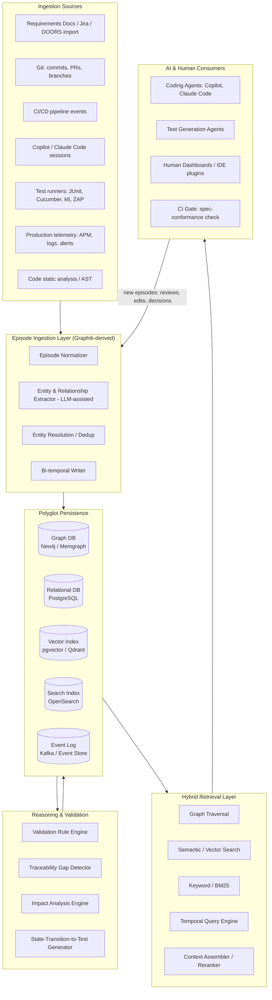

# The Specification Knowledge Graph (SKG): An AI-Native Substrate for Specification-Driven Development

**A Research and Architecture Report**
Principal Architecture Review — Requirements-to-Production Traceability via Executable Knowledge Graphs

---

## 0. Executive Summary

Every SDLC tool built since the 1990s — DOORS, Polarion, Jira, Azure DevOps, Enterprise Architect — treats requirements as *documents* and traceability as a *matrix*. That model breaks down under two pressures that didn't exist when those tools were designed: (1) code is now frequently AI-generated, so provenance must extend into prompts and model decisions, not just human commits; and (2) LLM-based engineering agents (Copilot, Claude Code, Cursor) need machine-consumable, temporally-aware context, not PDF exports.

This report designs an **SKG**: a bi-temporal, provenance-first knowledge graph — architecturally descended from Zep/Graphiti's agent-memory engine — repurposed as the authoritative, executable representation of a system's specification, behavior, architecture, implementation, tests, and operational history. The core inversion relative to Graphiti is scope and authority: Graphiti models *what an agent has observed about a fluid world* (conversation, preferences, facts that can be superseded); the SKG models *what a system is designed and built to do*, where correctness is checkable, versioning is deliberate (not merely temporal decay), and formal validation rules apply.

The report is organized as the fourteen requested deliverables. Where a claim is empirical (Graphiti's mechanics, competitor capabilities), it is sourced. Where a claim is a design proposal for a system that does not yet exist, it is explicitly marked as such — this report does not blur "how Graphiti works today" with "how the SKG should work."

---

## 1. Overall Architecture



**Layering rationale:**
- **Ingestion** is deliberately separated from **storage**: every artifact, human or AI-generated, enters as an *Episode* (Graphiti's core primitive), preserving raw provenance before any extraction/normalization occurs.
- **Storage is polyglot by design** (Section 5) — no single database serves graph traversal, full-text spec search, embedding similarity, and immutable event history equally well.
- **Reasoning is a first-class layer**, not a side effect of storage. Validation, gap detection, and impact analysis run as continuous background processes over the graph, not as one-off document reviews.
- **Retrieval is hybrid by necessity** (Section 10): pure vector search cannot answer "what tests cover this transition," and pure graph traversal cannot answer "find specs similar in intent to this one."

---

## 2. Graphiti as Baseline: What to Reuse, What to Replace

### 2.1 What Graphiti actually is (grounding)

Graphiti (Zep AI) is a temporally-aware knowledge graph engine built for agent memory. Its architecture centers on three points worth preserving verbatim in the SKG:

- **Episodes as the ingestion primitive.** <cite index="2-1">Graphiti continuously ingests new data episodes (events or messages), extracting and immediately resolving entities and relationships against existing nodes.</cite> This "episode-first, extraction-second" pattern is exactly the right shape for engineering provenance: a commit, a Copilot session, a requirement edit are all naturally episodic.
- **Bi-temporal edges.** <cite index="2-1">A key feature is Graphiti's bi-temporal model, which tracks when an event occurred and when it was ingested. Every graph edge includes explicit validity intervals (t_valid, t_invalid).</cite> When a fact changes, <cite index="6-1">the old fact's validity window is closed rather than deleted, and the new fact is recorded — the agent reasons over the current state while the history stays queryable.</cite> This is the correct primitive for "Requirement REQ-102 changed acceptance criteria on 2026-03-14" without losing the audit trail an SOC2/ISO auditor or a root-cause investigation would need.
- **Non-lossy, source-traceable subgraphs.** <cite index="4-1">The architecture consists of three distinct subgraphs — episode, semantic entity, and community — mirroring human episodic and semantic memory, where the episode subgraph houses raw input data and enables non-lossy storage anchoring entities and relationships.</cite> <cite index="5-1">Episodic edges connect episodes to their extracted entity nodes, and bidirectional indices let semantic artifacts be traced back to source episodes for citation, while episodes can retrieve their relevant entities and facts.</cite> This is directly the mechanism the SKG needs for "which commit produced this API contract" provenance.
- **No-LLM-call hybrid retrieval at low latency.** <cite index="2-1">Graphiti's hybrid search approach combines semantic embeddings, keyword (BM25) search, and direct graph traversal — avoiding any LLM calls during retrieval, with vector and BM25 indexes offering near-constant time access to nodes and edges regardless of graph size.</cite> Zep reports <cite index="2-1">P95 latency of 300ms</cite> for this pattern at consumer-memory scale; the SKG's context-assembly path for coding agents should copy this shape exactly, since agent-facing latency budgets are similar.

### 2.2 What must be replaced or extended

| Graphiti concept | Why it's insufficient for SDD | SKG replacement |
|---|---|---|
| Temporal validity = "latest fact wins" | Engineering artifacts need **deliberate versioning with approval gates**, not just decay. A requirement change needs a change-request episode, a reviewer, and a re-validation pass — not silent supersession. | **Versioned entities with lifecycle state machines** (Draft → Reviewed → Approved → Deprecated) layered on top of bi-temporal edges. Temporal validity remains for auditability; lifecycle state governs authority. |
| Entity resolution tuned for conversational entities (people, preferences, casual facts) | Engineering entities (a `Transition`, an `Endpoint`, a `Table.Column`) need **schema-strict identity** — resolution ambiguity here causes false traceability, which is worse than no traceability. | **Typed ontology with strict identifiers** (Section 3) — resolution is schema-validated, not purely LLM-inferred. LLM extraction proposes candidate links; a **deterministic ID/URI scheme** (e.g., `REQ-1042`, `svc:billing/api:POST /invoices`) resolves them, similar to how Backstage entity refs work. |
| Community subgraph clusters by semantic similarity of conversation | Engineering "communities" should follow **architectural and organizational boundaries** (service ownership, bounded contexts), not emergent similarity. | **Explicit taxonomy graph** (Section 9) as a first-class overlay, distinct from the emergent-community pattern. |
| No native concept of formal correctness/validation | Graphiti has no notion that some facts are *supposed* to satisfy invariants (every requirement must have acceptance criteria). | **Validation Rule Engine** (Section 8) as a new layer with no Graphiti analog. |
| Single-tenant "agent memory for one user/session" scale assumption | An SKG must scale to enterprise monorepos: 10⁴–10⁶ requirements/tests/commits across many teams. | **Polyglot persistence + sharded graph partitions by service/bounded-context**, discussed in Section 5. |
| Ontology is open/emergent (LLM decides entity types) | SDD requires a **closed, versioned ontology** for validation and tooling stability — an open schema makes "every Requirement has Acceptance Criteria" unenforceable. | **Fixed ontology with an extension mechanism** (custom fields per org), not a free-form schema. |

**Summary judgment:** Reuse Graphiti's *ingestion and temporal-edge mechanics* almost unchanged — they are genuinely novel and correctly solve provenance and change-over-time. Replace its *identity resolution philosophy* (probabilistic → schema-strict), *closure model* (implicit decay → explicit lifecycle + validation), and *scale assumptions* (session memory → enterprise monorepo). The SKG is best understood as "Graphiti's temporal/episodic core, with a DOORS-grade formal ontology and a rule-based validation engine bolted on top."

### 2.3 Beyond Graphiti: Other Agent-Memory Systems Worth Borrowing From

Graphiti is not the only production-grade memory architecture, and several of its 2026-era peers solve problems the base design in Sections 1–19 leaves open. This section evaluates the field and extracts specific, adoptable features — it does not propose replacing Graphiti as the ingestion/temporal core.

**The landscape.** <cite index="19-1">The leading frameworks — Mem0, Zep/Graphiti, LangGraph's LangMem, Letta (formerly MemGPT), and simple buffer memory — take different architectural approaches: vector-based semantic recall, temporal knowledge graphs, checkpoint-based persistence, or self-editing memory blocks</cite>, and <cite index="21-1">Cognee has emerged as a distinct category built around a hybrid graph-vector architecture, many retrieval modes, and a self-improving memory pipeline</cite>. No single system dominates every axis relevant to the SKG; three are worth adopting features from directly.

**1. Cognee — fills the ontology-validation and ingestion-breadth gaps.**
Cognee's <cite index="25-1">ECL (Extract, Cognify, Load) pipeline is a transparent, auditable three-stage process that ingests data in any format, extracts entities and relationships with an LLM, and loads them into a hybrid graph-vector store</cite>, and, distinctively, <cite index="26-1">it adds RDF-based ontology support and native MCP integration that plugs directly into Claude Code and other agent orchestration environments</cite>. Two concrete gaps this fills in the SKG design:
- **Formal ontology validation.** <cite index="32-1">Cognee applies RDF/OWL ontology validation and cross-document coreference resolution during the "Cognify" stage rather than leaving schema conformance to downstream checks</cite>. The SKG's Validation Engine (Section 10) currently expresses rules as Cypher pattern queries evaluated *after* ingestion. Cognee's approach argues for pushing a subset of validation — the purely structural/schema rules (e.g., "a Transition must reference a valid State pair") — *into the extraction stage itself* using OWL/SHACL constraints, catching malformed extractions before they ever enter the graph, with Cypher-based rules reserved for the cross-entity business rules that need full-graph context (Section 10.1's table).
- **Ingestion breadth.** <cite index="32-1">Cognee's extract phase uses 30+ connectors covering PDF, Notion, Slack, audio, image (with OCR/transcription), and AST-based code chunking</cite>, and separately <cite index="27-1">its cognify phase performs entity and relationship extraction directly over that ingested content</cite>. This validates the Tree-sitter-based AST extraction already recommended in Section 18, and additionally suggests the SKG's ingestion connector library (Section 1) should not be built fully bespoke — a Cognee-derived or Cognee-wrapped connector layer could cover the "soft" sources (Slack architecture discussions, Notion design docs) that Section 1's source list currently omits.
- **Self-improving feedback loop ("memify").** <cite index="31-1">Cognee layers a "memify" step that applies feedback-driven refinement to the graph over time, unifying relational, vector, and graph storage rather than bolting a vector index onto a log</cite>. The SKG has no equivalent today: extraction confidence (Section 7.1) is set once and only manually corrected. **Recommended addition:** a new episode type, `ExtractionCorrected`, fired whenever a human review (Section 8's `HumanEditApplied`/`ReviewCompleted`) overturns an AI-inferred edge; a scheduled job aggregates these corrections per extraction-rule/entity-type and adjusts default confidence scores accordingly — a lightweight, auditable analog to Cognee's memify loop, without requiring model retraining.

**2. Letta (formerly MemGPT) — fills the memory-triage and always-in-context gap.**
<cite index="34-1">Letta's three-tier memory — Core (always in-context, like RAM), Recall (searchable conversation history, like disk cache), and Archival (long-term vector/graph storage) — with the agent self-editing what moves between tiers</cite> — is a genuinely different pattern from Graphiti's "everything is retrieved on demand" model. Two features worth adopting:
- **Pinned "core memory" blocks.** <cite index="38-1">Letta pins blocks like "repository architecture" or "team preferences" directly into the active context window, updating as the agent discovers new patterns, rather than relying on retrieval scoring to surface them every time</cite>. The SKG's context-assembly flow (Section 9.1) currently treats all context as retrieved-and-ranked. **Recommended addition:** a small set of pinned, always-included nodes per service/repo — active `Constraint`s, `BusinessRule`s with `Risk=High` tag, and open `Incident`s — injected unconditionally ahead of the hybrid-retrieval results, so safety-critical invariants can't be reranked out of a coding agent's context under token pressure.
- **Background "sleep-time" consolidation agent.** <cite index="34-1">Letta runs sleep-time agents as a background process for organizing and compacting memory, separating memory management from the live conversation loop</cite>. The SKG has no analogous process today: the episode log (Section 6.2) only grows. **Recommended addition:** a scheduled background agent that periodically summarizes long chains of low-signal episodes (e.g., dozens of minor `CommitModified` episodes on a stable `Method`) into a single rollup episode, and proposes (never auto-applies) candidate consolidations of near-duplicate `Requirement`/`AcceptanceCriterion` nodes for human approval — directly addressing the graph-bloat risk implicit in Section 16's scalability analysis but not previously mitigated by any specific mechanism.

**3. Hindsight — fills the retrieval-architecture and reranking gap.**
<cite index="22-1">Hindsight runs four retrieval strategies — semantic, BM25, graph, and temporal — with a cross-encoder reranker</cite>. Section 12's retrieval table already lists Graph/Semantic/Keyword/Hybrid as strategies, but treats "temporal" as an implicit filter rather than a distinct retrieval mode, and Section 9.1 step 5 names "reranking" without specifying a mechanism. **Recommended refinement:** treat *temporal* as a first-class fourth retrieval mode (explicit point-in-time queries, not just a validity filter applied after the fact — relevant for "what did this API contract look like before the March release" questions), and adopt a **cross-encoder reranker** as the concrete implementation of Section 9.1's context-assembly reranking step, rather than a hand-tuned scoring formula.

**Not adopted, and why:** Mem0 <cite index="19-1">leads on community size, managed-cloud polish, and compliance posture (SOC 2, HIPAA), and is optimized for personalization — remembering things about end-users across sessions</cite> — its core use case (user-preference memory) doesn't map onto engineering-artifact memory, so no architectural feature is borrowed from it. Cloudflare Agent Memory <cite index="23-1">is a closed-source managed service in private beta</cite>, which conflicts with the SKG's requirement for auditable, self-hostable, portable rule/ontology storage (Section 15's anti-lock-in mitigation) — worth monitoring as a market signal, not as a design input.

**Net effect on the architecture:** none of these three additions change the Section 1 architecture diagram's layer boundaries — Cognee's contribution lands inside **Ingestion** (schema validation earlier, broader connectors, a feedback-confidence loop), Letta's lands inside **Retrieval/Context Assembly** (pinned blocks) and a new lightweight **Consolidation** sub-process off the **Reasoning & Validation** layer, and Hindsight's lands inside **Retrieval** (an explicit temporal mode plus a named reranker component). All three are additive refinements to the existing design, not competing architectures to choose between.

---

## 3. Complete Ontology

Entities are grouped by layer per the brief. Each entity lists core attributes and its primary outbound relationships. `:` denotes relationship type; direction is source→target unless noted.

### 3.1 Business Layer
| Entity | Key Attributes | Relationships |
|---|---|---|
| **Goal** | id, statement, OKR-ref, owner, horizon | `REALIZES→` nothing (root); `MEASURED_BY→Metric` |
| **Capability** | id, name, maturity-level | `SUPPORTS→Goal`; `DECOMPOSES_INTO→Epic` |
| **Epic** | id, title, business-value, status | `BELONGS_TO→Capability`; `CONTAINS→Feature` |
| **Feature** | id, title, description, status | `PART_OF→Epic`; `SATISFIED_BY→Requirement` |

### 3.2 Requirement Layer
| Entity | Key Attributes | Relationships |
|---|---|---|
| **Requirement** | id, statement, priority, source, version, lifecycle-state | `DERIVED_FROM→Feature`; `HAS_AC→AcceptanceCriterion`; `CONSTRAINED_BY→Constraint`; `GOVERNED_BY→BusinessRule` |
| **AcceptanceCriterion** | id, Given/When/Then, status | `OF→Requirement`; `DECOMPOSES_INTO→MicroRequirement` |
| **Constraint** | id, type (perf/security/compliance), value | `CONSTRAINS→Requirement` |
| **BusinessRule** | id, statement, rule-logic (formal expr) | `APPLIES_TO→Requirement`, `→Transition`, `→Table` |
| **MicroRequirement** | id, single-behavior statement, precondition, postcondition | `OF→AcceptanceCriterion`; `PRODUCES→Transition` |

### 3.3 Behavior Layer
| Entity | Key Attributes | Relationships |
|---|---|---|
| **State** | id, name, entity-type (which state machine) | `SOURCE_OF/TARGET_OF→Transition` |
| **Transition** | id, name, precondition, postcondition | `FROM→State`; `TO→State`; `TRIGGERED_BY→Trigger`; `GUARDED_BY→Guard`; `EXECUTES→Action`; `EMITS→Event`; `IMPLEMENTED_BY→Method`; `VERIFIED_BY→TestCase` |
| **Guard** | id, expression | `GUARDS→Transition` |
| **Trigger** | id, type (event/API-call/timer) | `TRIGGERS→Transition` |
| **Action** | id, description, side-effect-type | `PART_OF→Transition`; `UPDATES→Table`; `CALLS→Endpoint` |
| **Event** | id, schema-ref, topic | `PUBLISHED_BY→Transition`; `CONSUMED_BY→Service` |
| **Workflow** | id, name | `ORCHESTRATES→Transition[]` |

### 3.4 Architecture Layer
| Entity | Key Attributes | Relationships |
|---|---|---|
| **Service** | id, name, repo-ref, owner-team | `EXPOSES→API`; `OWNS→Database`; `PRODUCES/CONSUMES→KafkaTopic` |
| **API** | id, spec-ref (OpenAPI), version | `PART_OF→Service`; `HAS→Endpoint` |
| **Endpoint** | id, method, path, contract-ref | `IMPLEMENTS→Requirement`(via Transition); `TESTED_BY→TestCase` |
| **Database** | id, engine, name | `OWNED_BY→Service`; `HAS→Table` |
| **Table** | id, name, purpose | `HAS→Column`; `GOVERNED_BY→BusinessRule` |
| **Column** | id, type, nullable, PII-flag | `PART_OF→Table` |
| **KafkaTopic** | id, name, schema-ref | `PRODUCED_BY/CONSUMED_BY→Service` |
| **Cache** | id, technology, TTL-policy | `USED_BY→Service` |
| **ExternalSystem** | id, name, contract-type | `INTEGRATED_VIA→API` |

### 3.5 Implementation Layer
| Entity | Key Attributes | Relationships |
|---|---|---|
| **Repository** | id, url, primary-language | `CONTAINS→Class` |
| **Class** | id, fqcn, package | `HAS→Method`; `PART_OF→Repository` |
| **Method** | id, signature, AST-hash | `IMPLEMENTS→Transition/MicroRequirement`; `MODIFIED_BY→Commit` |
| **PullRequest** | id, title, status, author | `CONTAINS→Commit[]`; `CLOSES→Requirement/Defect`; `REVIEWED_BY→HumanReview` |
| **Commit** | id, sha, message, timestamp | `MODIFIES→Method/Class`; `PART_OF→PullRequest` |
| **Branch** | id, name, base | `HOLDS→Commit[]` |

### 3.6 Testing Layer
| Entity | Key Attributes | Relationships |
|---|---|---|
| **TestCase** | id, type (unit/functional/integration/perf/security), spec-ref | `VERIFIES→Transition/AcceptanceCriterion`; `PART_OF→TestSuite`; `GENERATED_BY→AIDecision` (if applicable) |
| **TestSuite** | id, name, scope | `CONTAINS→TestCase[]` |
| **AutomationScript** | id, framework, path | `IMPLEMENTS→TestCase` |
| **TestRun** | id, timestamp, result, environment | `EXECUTES→TestCase`; `PRODUCES→Defect` (on failure) |
| **Defect** | id, severity, status, root-cause-ref | `RAISED_BY→TestRun`; `TRACES_TO→Requirement`; `FIXED_BY→PullRequest` |

### 3.7 Operations Layer
| Entity | Key Attributes | Relationships |
|---|---|---|
| **Release** | id, version, timestamp | `INCLUDES→PullRequest[]`; `DEPLOYS→Service` |
| **Incident** | id, severity, timeline | `CAUSED_BY→Release/Defect`; `IMPACTS→Requirement` |
| **Alert** | id, condition, threshold | `MONITORS→Metric`; `RAISES→Incident` |
| **Metrics** | id, name, source | `MEASURES→Service/Goal` |
| **Logs** | id, source, retention | `EVIDENCE_FOR→Incident` |

### 3.8 AI Layer
| Entity | Key Attributes | Relationships |
|---|---|---|
| **CopilotSession** | id, agent-id, timestamp, context-window-ref | `CONTAINS→Prompt[]`; `PRODUCES→GeneratedCode/GeneratedTest` |
| **Prompt** | id, text-ref (not full text if sensitive), model | `PART_OF→CopilotSession`; `REFERENCES→Requirement/Transition` |
| **GeneratedCode** | id, diff-ref, confidence-score | `PROPOSED_FOR→Method`; `REVIEWED_BY→HumanReview` |
| **GeneratedTest** | id, diff-ref | `PROPOSED_FOR→TestCase` |
| **AIDecision** | id, decision-type, rationale-ref, model-version | `INFLUENCES→GeneratedCode/GeneratedTest`; `SUPERSEDED_BY→AIDecision` |
| **HumanReview** | id, reviewer, verdict, comments-ref | `REVIEWS→GeneratedCode/PullRequest`; `OVERRIDES→AIDecision` |

**Design note (novel, not established practice):** Every entity above is *also* an `Episode` node in the temporal layer — the ontology defines the schema, while every mutation to an ontology instance is captured as a bi-temporal episodic fact (`RequirementCreated`, `RequirementApprovalGranted`, `TransitionGuardModified`). This dual-layer pattern (typed ontology graph + episodic provenance graph, linked 1:1) is the structural core of the SKG and is what most distinguishes it from both plain graph-based ALM tools (Backstage, Enterprise Architect) and plain agent-memory tools (Graphiti/Zep).

---

## 4. Multi-Level Abstraction

A single `Requirement` node is the anchor; every other layer's view is a **graph projection** rooted at that node, not a separate document.

```
Business View        → Goal ← Capability ← Epic ← Feature ← [Requirement]
Functional View       → [Requirement] → AcceptanceCriterion → MicroRequirement
Behavior View          → MicroRequirement → Transition (State/Guard/Trigger/Action/Event)
Architecture View       → Transition → Service/API/Endpoint/KafkaTopic
Implementation View      → Endpoint/Action → Method/Class/Repository → Commit/PR
Database View              → Action → Table/Column, annotated with BusinessRule
Testing View                 → Transition/AC → TestCase → TestRun → Defect
Operations View                → Release → Incident/Alert/Metrics, back to impacted Requirement
```

**Navigation mechanism (design proposal):**
1. Every node carries a `view-role` tag from the ontology layer it belongs to (Section 3).
2. A **"zoom" query** is a bounded graph traversal (default depth 2–3 hops) filtered by target `view-role`, e.g. "show me the Architecture View for REQ-1042" = traverse `Requirement→AC→MicroRequirement→Transition→{Service,API,Endpoint}` and collapse intermediate nodes into edges labeled with hop count.
3. **Breadcrumbing**: the UI/IDE plugin keeps the traversal path so a developer looking at `Method.processRefund()` can one-click "up" to the `MicroRequirement` and further to the originating `Requirement`, and "down" to the `TestCase` and `TestRun` history — this symmetric up/down navigation is only possible because relationships are stored, not inferred, at ingestion time (Section 6).
4. **Cross-cutting views** (e.g., "show all Security-tagged nodes across every layer") are taxonomy-driven (Section 9), not layer-driven, and use a separate index rather than graph traversal for performance.

This differs from Backstage's "software catalog" model, which projects mainly Architecture/Implementation views and treats Business/Requirement layers as external links rather than graph-native nodes — a gap discussed further in Section 11.

---

## 5. State-Driven Knowledge Graph

**Should state machines be first-class citizens?** Yes — this is the load-bearing design decision of the whole platform, for three reasons:

1. **Transitions are the natural unit of testability.** A `Requirement` is too coarse to test directly; a `Transition` (precondition → action → postcondition, with guards and side effects) is exactly the unit a test asserts against. This is why the ontology in Section 3.3 gives `Transition` the richest attribute set.
2. **Transitions are the natural unit of AI code generation.** An LLM generating code from "the user can cancel an order" is under-specified; an LLM generating code from a `Transition{from: Placed, to: Cancelled, guard: "order.status != Shipped", action: "refund + emit OrderCancelled", postcondition: "order.status == Cancelled"}` has a testable, checkable spec — closer to a formal contract than prose.
3. **Transitions compose cleanly into test types**, per the requested attribute set:

| Transition attribute | Drives generation of |
|---|---|
| Precondition + Guard | Negative/boundary functional tests (guard-violation cases) |
| Action + Database Updates | Integration tests (assert DB state post-transition) |
| Events Published | Contract/consumer-driven tests (assert event schema + downstream consumption) |
| APIs Called | API/contract tests, and — at scale — chaos/latency tests on the dependency |
| Expected Outputs | Functional assertions |
| Acceptance Criteria link | Traceability check: "does at least one TestCase exist per Transition per AC?" |
| Side Effects (rate, volume) | Performance/load test parameters (e.g., expected throughput becomes a k6 target) |
| Guard involving auth/roles | Security test generation (authz bypass attempts) |

**Automatic test generation flow (design proposal, not established practice):**
```
MicroRequirement --produces--> Transition
   Transition.precondition + guard   -> generate boundary/negative test skeletons
   Transition.action + db-updates    -> generate integration test skeleton (setup/act/assert-state)
   Transition.events                 -> generate contract test skeleton against event schema registry
   Transition.apis-called            -> generate API test skeleton (mocked dependency) + perf test if SLA constraint present
   Transition.expected-output        -> generate functional assertion body
   -> AI coding agent fills in test body using retrieved similar TestCases (Section 10) as few-shot context
   -> Human review required before TestCase.status = Approved (never auto-merge generated tests)
```
This is a **generation-assist**, not full autonomy: the graph produces structurally correct, traceable test *skeletons* with the right fixtures and assertions targeted; an LLM (Copilot/Claude) fills in framework-specific syntax; a human approves. This mirrors current best practice in AI-assisted test authoring (skeleton + LLM completion + human gate) rather than the more speculative "fully autonomous test generation" claimed by some vendors — flagged here explicitly as the responsible framing.

---

## 6. Database Modeling — Storage Architecture

### 6.1 Options compared

| Store | Strength for SKG | Weakness for SKG |
|---|---|---|
| **Neo4j** | Mature Cypher tooling, native to Graphiti reference implementation, strong ecosystem (APOC, GDS for impact-analysis algorithms), good enterprise support | Write throughput and horizontal scale weaker than newer alternatives at very large graph sizes; licensing cost at enterprise scale |
| **Memgraph** | In-memory, very low query latency, native support for streaming/CDC ingestion — good fit for real-time episode ingestion from CI/CD and telemetry | Smaller ecosystem, less battle-tested for multi-tenant enterprise graphs, memory-cost profile at scale |
| **RDF Stores (e.g., GraphDB, Blazegraph)** | Strongest for formal ontology reasoning (OWL/SHACL constraint validation maps directly to Section 8's rule engine); best interop with standards-based compliance tooling | Weaker developer ergonomics, SPARQL less familiar to engineering teams than Cypher/SQL, poorer support for property-graph-style rich edge attributes needed for bi-temporal edges |
| **PostgreSQL** | Best for strictly relational, high-integrity records: users/permissions, CI/CD run metadata, structured test results, audit logs; `pgvector` extension gives "good enough" vector search without a second system | Not suited to multi-hop traversal queries (traceability chains, impact analysis) |
| **Event Store (e.g., Kafka + a log-structured store)** | Correct system of record for the episodic/provenance layer itself — episodes are append-only events by nature | Not queryable for graph traversal or semantic search directly; needs projection into the graph/search layers |
| **Hybrid Graph + Relational** | Matches the actual shape of the problem: structural/traversal queries → graph; transactional/audit-integrity records → relational | Operational complexity of keeping two systems consistent; requires a clear ownership boundary per entity type |

### 6.2 Recommendation: polyglot persistence with a clear ownership boundary

- **Graph Database (Neo4j primary recommendation; Memgraph as a caching/real-time layer in later stages):** owns the ontology graph proper — all entities from Section 3 and their relationships — and the bi-temporal edges (`t_valid`, `t_invalid`) that give point-in-time reasoning.
- **Relational Database (PostgreSQL):** owns identity/access management, CI/CD run metadata, structured test-result tables, and the append-only **episode log** (episodes are inserted here first, then projected into the graph — giving a durable, replayable source of truth independent of graph-engine uptime).
- **Vector Database (pgvector to start; dedicated store — Qdrant/Weaviate — at scale):** owns embeddings of free-text fields (requirement statements, AC text, PR descriptions, incident postmortems) for semantic retrieval; embeddings reference graph node IDs, never duplicate content.
- **Search Index (OpenSearch/Elasticsearch):** owns full-text/BM25 indexing of the same free-text fields, plus the taxonomy facets (Section 9) for filterable, faceted search across the whole corpus — this is what Graphiti's own hybrid search relies on, and the SKG should mirror that pattern rather than trying to make the graph database do BM25 itself.
- **Event Store (Kafka):** is the ingestion bus — every source system (Section 1) publishes episodes here; consumers project into Postgres (durable log), the graph (structural update), and the vector/search indexes (retrieval update) asynchronously. This decouples ingestion velocity from graph-write latency and gives natural replay/reprocessing if the ontology or extraction model changes.

This mirrors, and is directly justified by, Graphiti's own production architecture: <cite index="6-1">Graphiti runs on graph databases (e.g., Neo4j, FalkorDB) when self-hosted, or on a dedicated context-graph runtime at scale</cite> — i.e., even the reference implementation treats the graph engine as one component of a larger serving system, not the only store.

---

## 7. Traceability Model

### 7.1 The chain

```
Requirement → AcceptanceCriterion → MicroRequirement → Transition
   → Service → API/Endpoint → Database/Table
   → Method/Class (source code)
   → TestCase → TestRun
   → PullRequest/Commit → Release (Pipeline)
   → Production (Metrics/Incident)
```

Every arrow above is a **stored edge**, not an inferred one — this is the central architectural bet of the SKG versus keyword-matching traceability tools. Traceability is only as trustworthy as the weakest link's provenance, so every edge additionally carries: `created_by` (human or AI decision), `created_at`, `confidence` (1.0 for human-declared links, <1.0 for AI-inferred links pending review), and `t_valid/t_invalid`.

### 7.2 Automatic gap detection (design proposal)

Gaps are detected as **graph pattern queries** run continuously (or on every write) by the Validation Engine (Section 8):

- *Orphan requirement*: `Requirement` node with no outgoing `HAS_AC` edge.
- *Untested transition*: `Transition` node with no incoming `VERIFIED_BY` edge, or one whose only `TestCase` has `status = Deprecated`.
- *Untraceable code*: `Method` node with no `IMPLEMENTS` edge to any `Transition`/`MicroRequirement` — flags dead or undocumented code paths, valuable for legacy-system SKG adoption.
- *Untraceable API*: `Endpoint` with no path back to a `Requirement` — flags accidental/undocumented surface area, a genuine security and API-governance signal.
- *Stale coverage*: `TestCase.t_valid` predates the most recent `t_valid` of the `Transition` it claims to verify (i.e., the behavior changed after the test was last confirmed against it) — this is only possible *because* of bi-temporal edges, and is a capability neither Jira/DOORS-style tools nor plain vector-RAG systems have, since both lack a first-class notion of "this fact became stale on this date."
- *Deployed-but-unverified*: `Release` includes a `PullRequest` that closes a `Requirement` with no `Approved`-status `TestCase` coverage.

Each detected gap is itself written back as an episode (`GapDetected`), so gap-detection history is auditable and can be trended (e.g., "average time-to-close for traceability gaps by team").

---

## 8. Engineering Memory — Expanding "Episodes"

Graphiti's episode concept generalizes cleanly; the SKG's contribution is a **closed taxonomy of engineering episode types**, each with a defined payload schema and defined downstream graph effects:

| Episode type | Payload | Graph effect |
|---|---|---|
| `RequirementCreated` / `Updated` | full text, author, links | Creates/versions `Requirement`; opens new `t_valid` window |
| `ArchitectureDecisionRecorded` | ADR text, alternatives considered, decision | New `Episode` node linked to affected `Service`/`API` nodes; queryable later as "why does this exist" |
| `CopilotPromptIssued` | prompt ref, model, session id | New `Prompt` node under `CopilotSession` |
| `CodeGenerated` | diff ref, confidence | New `GeneratedCode` node, provisional `IMPLEMENTS` edge (confidence < 1.0) |
| `HumanEditApplied` | diff ref, editor | Edge from `HumanReview`→`GeneratedCode`; may raise confidence to 1.0 |
| `ReviewCompleted` | verdict, comments | `HumanReview` node; may `OVERRIDES` a prior `AIDecision` |
| `Merged` | PR id, target branch | `PullRequest.status = Merged`; propagates `IMPLEMENTS` edges to `main` |
| `Deployed` | release id, environment | `Release` node; `DEPLOYS→Service` edge |
| `IncidentOpened`/`Resolved` | severity, timeline, root cause | `Incident` node; `CAUSED_BY` edge if root cause identified |
| `DefectFiled`/`Fixed` | severity, trace ref | `Defect` node; `TRACES_TO→Requirement` |

**Why this improves future AI assistance (design rationale):** an agent asked to modify `processRefund()` can retrieve not just the current code and its `Transition` spec, but the **episode history**: which prior AI-generated attempts were rejected and why (`HumanEditApplied`/`ReviewCompleted` payloads), which ADRs constrain the service's dependencies, and which past incidents trace back to this transition. This is qualitatively different from vector-similarity code-context retrieval (what Copilot/Cursor do today from a repo alone) because it surfaces **why**, not just **what** — the single biggest gap in current AI coding-assistant context per practitioner reporting, and the primary justification for building an SKG rather than relying on repo-level RAG.

---

## 9. GitHub Copilot / Coding-Agent Integration

### 9.1 Context retrieval strategy (combining graph traversal, semantic retrieval, temporal memory)

For a coding-agent request scoped to, say, `Method.processRefund()` or a natural-language task ("implement order cancellation"):

1. **Anchor resolution**: resolve the request to graph node(s) — either directly (method/file path → `Method` node) or via semantic search over `Requirement`/`MicroRequirement` text (vector + BM25 hybrid, mirroring Graphiti's no-LLM-call retrieval pattern for latency).
2. **Bounded traversal (2–3 hops)** from the anchor: up to `MicroRequirement`/`AcceptanceCriterion`/`Requirement` for intent; sideways to `Transition` siblings for consistency; down to existing `TestCase`s for expected behavior contracts; to `BusinessRule`/`Constraint` nodes for non-negotiable invariants.
3. **Temporal filter**: only include edges/nodes where `t_valid ≤ now < t_invalid` — i.e., current truth, not superseded requirements — with an explicit *"as of"* override for agents doing historical/regression analysis.
4. **Episode enrichment**: pull the last N relevant episodes (`ArchitectureDecisionRecorded`, `ReviewCompleted` with rejections) touching the anchor, so the agent knows what's been tried and rejected.
5. **Context assembly + reranking**: merge graph-traversal results with semantic-search results, dedupe, rerank by a combination of graph-distance and semantic score, and truncate to the agent's context budget — this reranking step is exactly the role Graphiti's hybrid search plays, extended with graph-distance as an additional ranking signal specific to structured engineering data.
6. **Output packaging** as a structured context object (not raw prose): `{requirement, acceptance_criteria[], transition_spec, existing_tests[], constraints[], relevant_adrs[], prior_rejected_attempts[]}` — this structured shape is what lets the coding agent (or its tool-calling harness) selectively expand any section rather than parsing free text.

### 9.2 Concrete capabilities enabled

- **Generate tests from Acceptance Criteria** → direct use of Section 5's transition-driven test-skeleton generation, with the agent filling syntax.
- **Detect missing Requirements** → run pattern query: `Method` nodes with no `IMPLEMENTS` edge, cross-referenced against code-churn frequency, surfaced to the agent as candidate undocumented behavior needing a retroactive requirement.
- **Detect missing State Transitions** → static-analysis pass (AST) proposes candidate transitions from control-flow branches lacking a graph counterpart; flagged for human triage, never auto-inserted (avoids polluting the spec graph with guesses).
- **Suggest impacted tests / impacted services** → this *is* graph traversal: given a changed `Method` or `Table.Column`, traverse `MODIFIES→Method→IMPLEMENTS→Transition→VERIFIED_BY→TestCase` and `Table→OWNED_BY→Service` respectively; this is strictly more precise than churn-based or import-graph-based impact analysis because it follows the same edges traceability uses.
- **Explain architectural decisions** → retrieve `ArchitectureDecisionRecorded` episodes linked to the node in question; this is a direct, low-risk win since it's pure retrieval, not generation.
- **Recommend regression suites** → union of `TestCase`s reachable within N hops of all changed nodes in a PR's diff.
- **Validate implementations against specifications** → this is the Validation Engine (Section 10) invoked as a CI gate, comparing `Method`/`Transition` postconditions against generated test outcomes.

### 9.3 Dual Integration: GitHub Copilot vs. Claude — Where the Implementation Must Differ

Both assistants now speak MCP, so the SKG should expose **one vendor-neutral MCP server** (Section 18) with tools like `get_context(anchor)`, `get_traceability(node_id)`, `propose_test_skeleton(transition_id)`, and `publish_episode(type, payload)`. That server is shared. What differs is *how each client discovers, gates, and budgets against it* — and the roadmap should treat these as distinct integration tracks, not one config with two labels.

**1. Maturity and scope of MCP support.** <cite index="47-1">GitHub Copilot supports MCP through extensions, but the integration is newer and less mature than Claude Code's native implementation</cite>, whereas <cite index="43-1">Claude Code connects to MCP servers as a first-class, from-the-start architectural feature, with over 300 third-party MCP servers already in use as of April 2026</cite>. Practical consequence: build and validate the SKG MCP server against Claude Code first — it is the lower-friction, better-supported target — then port/harden for Copilot as a second track, budgeting extra QA time for Copilot-side edge cases.

**2. Which chat surface actually sees the tools.** <cite index="50-1">In VS Code / Copilot, MCP servers register as tools available specifically in Copilot's Agent mode — this is the key difference from Claude Code, where MCP tools are available in all chat modes</cite>. This has a direct design implication: if a developer is using Copilot's inline-completion or "Ask" mode (not Agent mode), the SKG is **invisible** to them regardless of server health. The rollout plan and any developer-facing documentation must be explicit that Copilot users need Agent mode (or a custom agent, below) for SKG-backed answers — this is not a bug to fix, it's a platform constraint to design around (e.g., surfacing a "switch to Agent mode for spec-aware answers" hint).

**3. Registration and configuration mechanics differ.**
- **Claude Code:** register via the CLI (`claude mcp add`, project- or user-scoped) or a checked-in project config; the server is then available uniformly. <cite index="44-1">Claude Code also supports headless mode for CI/CD automation</cite> — this is the natural home for the SKG's spec-conformance CI gate (Section 9.2's "validate implementations against specifications"), since it can invoke the SKG server non-interactively as part of a pipeline step.
- **Copilot/VS Code:** configure via `.vscode/mcp.json` or, for scoped behavior, a custom agent definition — <cite index="44-1">Copilot supports custom agents created via an interactive wizard or `.agent.md` files, where each agent can specify its own tools, MCP servers, and instructions</cite>. **Recommendation:** ship a prebuilt `spec-aware.agent.md` that pins the SKG MCP server plus a scoped instruction set ("always check traceability before proposing new endpoints"), rather than relying on developers to discover and enable the server manually inside a general-purpose agent. <cite index="50-1">VS Code's MCP implementation also layers in sandboxing, input variables, Settings Sync, and enterprise policy controls</cite>, which is a genuine strength for regulated orgs but means the SKG server's connection details (DB creds, internal URLs) may need to be expressed as VS Code "input variables" and the server's URL allowlisted via enterprise policy before it will connect at all — plan for a separate enterprise-rollout checklist for Copilot that Claude Code doesn't need.

**4. Authentication differs and is not interchangeable.** Where the SKG server sits behind an existing GitHub-hosted MCP layer (e.g., proxying through GitHub's own MCP server for repo data), <cite index="48-1">Claude Code and Claude Desktop must use a Personal Access Token passed as a Bearer header — attempting OAuth in Claude Code produces connection errors</cite>, while Copilot's remote-server flows generally expect OAuth. **Implication:** the SKG's own MCP server should support both auth paths (PAT/Bearer and OAuth) simultaneously rather than picking one, and any setup documentation needs a client-specific auth section — a single "how to connect" page will be wrong for half the readers.

**5. Context budget and window size differ materially.** <cite index="44-1">Claude Code with Opus 4.8 supports a 1M-token context window with internal usage tracking and pruning</cite>, while Copilot's agent-mode context is comparatively constrained by its IDE-embedded, lower-latency design point. **Design implication for Section 9.1's context-assembly step:** the SKG's context-packaging function should take a `client` parameter and apply a materially larger traversal depth / higher top-k retrieval budget for Claude Code sessions than for Copilot sessions, rather than shipping one fixed context size and truncating late — truncating a pre-built large payload wastes retrieval work; sizing the query to the budget up front is cheaper and gives better precision at the smaller Copilot budget.

**6. Copilot already has its own competing memory feature — plan for coexistence, not collision.** <cite index="44-1">Copilot maintains "Repository Memory" — it remembers conventions, patterns, and preferences across sessions and can answer questions about past work, files, and PRs</cite>. This is a real overlap risk: if Copilot's native memory and the SKG disagree about "why does this code exist" or "what's the current status of this requirement," trust in both erodes fast. **Recommendation:** scope the SKG MCP tools explicitly to what Copilot's native memory does *not* cover — formal traceability chains, test-coverage-to-requirement mapping, cross-service impact analysis, and validation-engine status — and avoid building an SKG tool that answers general "what are this repo's conventions" questions, ceding that ground to Copilot's built-in feature rather than competing with it.

**7. The CI/CD gate should be agent-agnostic even though the two integrations differ.** Since <cite index="47-1">tagging @copilot on a GitHub issue creates a branch, implements the change, runs tests, and opens a PR autonomously</cite> as a GitHub-native flow distinct from Claude Code's general-purpose headless CLI, the two agents will produce PRs through different mechanisms. The SKG's spec-conformance check (Section 10.2's CI integration) should therefore be implemented as a **required PR status check that queries the SKG's validation status regardless of which agent (or human) authored the PR**, rather than as a hook embedded in either agent's own workflow — this is both simpler to maintain and correctly agent-agnostic, matching the design principle already established in Section 10.2.

**Summary table:**

| Dimension | Claude (Code/Desktop) | GitHub Copilot |
|---|---|---|
| MCP maturity | Native, first-class, all chat modes | Newer, agent-mode-only |
| Config surface | CLI / project config | `.vscode/mcp.json` or `.agent.md` custom agent |
| Auth to a proxied GitHub-backed server | PAT / Bearer (OAuth fails) | OAuth-oriented |
| Context budget | Very large (1M tokens, Opus 4.8) | Comparatively constrained, IDE-embedded |
| Headless / CI use | Native headless CLI mode | GitHub-issue-triggered `@copilot` agent flow |
| Competing native memory | None (SKG is the memory layer) | "Repository Memory" already exists — scope SKG to avoid overlap |
| Enterprise controls | Fewer built-in gates | Sandboxing, input variables, policy allowlisting — extra setup needed |

---

## 10. Validation Engine

### 10.1 Rule categories (from the brief, extended)

| Rule | Query pattern | Severity |
|---|---|---|
| Every Requirement has AC | `Requirement` with no `HAS_AC` edge | Block (spec incomplete) |
| Every AC maps to Micro Requirements | `AcceptanceCriterion` with no `DECOMPOSES_INTO` edge | Warn (may be acceptable for coarse ACs early in refinement) |
| Every Micro Requirement has State Transitions | `MicroRequirement` with no `PRODUCES` edge | Warn |
| Every Transition has Functional Tests | `Transition` with no `VERIFIED_BY` edge of type functional | Block for release-gating; Warn otherwise |
| Every API maps to a Requirement | `Endpoint` with no upstream path to `Requirement` | Warn (governance signal) |
| Every DB Table maps to a Business Rule | `Table` with no `GOVERNED_BY` edge | Info (many tables are legitimately unconstrained) |
| Every Test maps to an AC | `TestCase` with no `VERIFIES` edge | Warn (flags orphan/legacy tests) |
| Every Deployment maps to tested Requirements | `Release` containing a `PullRequest` closing a `Requirement` lacking Approved `TestCase` coverage | Block |

### 10.2 Scalable architecture

- **Incremental, not batch**: rules are re-evaluated only over the *delta subgraph* touched by the triggering episode (new commit, new requirement edit), using the graph engine's change-notification/trigger mechanism (Neo4j: transaction event handlers; Memgraph: triggers) — full-graph re-scan is reserved for scheduled deep audits (nightly), not every write.
- **Rule engine as declarative queries, not imperative code**: each rule compiles to a Cypher/SPARQL pattern plus a severity and a message template, stored as data (versioned, itself an entity in the graph — `ValidationRule` with its own episode history) so rules can evolve without redeployment, and rule-change history is itself auditable.
- **Tiered execution**: (1) synchronous, cheap structural checks run at write time and can block the write (e.g., "Requirement must have an id"); (2) asynchronous, graph-traversal checks run within seconds via a queue and annotate nodes with a `validation_status`; (3) scheduled deep audits (cross-service consistency, orphan detection across the whole graph) run nightly/on-release.
- **CI/CD integration**: a release gate queries `validation_status = Blocked` for any node touched by the release's diff — this is the mechanism referenced in Section 9.2's "validate implementations against specifications."
- **Horizontal scale**: partition rule evaluation by bounded context/service ownership (matching the `Service.owner-team` attribute) so no single validation run needs to lock the whole graph — this also lets teams own their own validation rule extensions.

This is squarely an **established-practice extension** (constraint/rule engines over graphs are well precedented — e.g., SHACL over RDF, Neo4j's own constraint system) applied to a **novel domain** (SDLC artifacts); the novelty is the rule *content*, not the rule *mechanism*.

---

## 11. Labels and Taxonomy

Free-form tags fail at scale because they don't compose, dedupe, or support faceted retrieval well. The SKG instead models taxonomies as **first-class hierarchical graphs**, each a separate small graph that entities link into via a generic `TAGGED_WITH` edge (so the core ontology in Section 3 stays uncluttered).

| Taxonomy | Example hierarchy | Primary consumers |
|---|---|---|
| **Domain** | `Billing > Invoicing > Refunds` | Search facets, team ownership routing |
| **Risk** | `High > Financial`, `High > Data-loss`, `Medium`, `Low` | Release-gate weighting, review prioritization |
| **Architecture** | `Microservice > Sync-API`, `Microservice > Event-driven` | Impact-analysis blast-radius estimation |
| **Technology** | `Backend > Java > Spring`, `Frontend > React` | Copilot context filtering (only retrieve Java-relevant examples for a Java task) |
| **Compliance** | `PCI-DSS > Req-3`, `GDPR > Art-17` | Compliance reporting, audit-scope queries |
| **Security** | `OWASP > A01-BrokenAccessControl` | Security test-generation targeting (Section 5) |
| **Testing** | `Functional > Regression`, `Non-functional > Load` | Regression-suite assembly |
| **Performance** | `SLA-critical`, `Best-effort` | Perf-test prioritization, alert routing |
| **Lifecycle** | `Draft > Review > Approved > Deprecated` | Governs which nodes are authoritative for retrieval (Section 9's temporal filter) |
| **Ownership** | Team/org hierarchy | Access control, notification routing |

**Why this improves clustering/retrieval over free tags:** (1) hierarchy enables roll-up queries ("all High-risk items" instead of enumerating leaf tags); (2) a closed taxonomy is a controlled vocabulary, so semantic search and faceted search agree on category boundaries — free tags routinely fragment ("perf", "performance", "perf-critical" as three unreconciled tags); (3) taxonomies can carry their own governance (who can add a new Domain node) separate from ontology governance, which is operationally important since taxonomy evolves faster than the ontology.

---

## 12. Retrieval Architecture

| Method | Best for | Weakness |
|---|---|---|
| **Graph Traversal** | Precise, explainable multi-hop questions ("what tests cover this transition") | Requires knowing the anchor node; poor for fuzzy/exploratory queries |
| **Semantic (Vector) Search** | Fuzzy intent matching ("find requirements similar to this one"), cross-lingual/paraphrase robustness | No structural precision; can't answer "is this fully tested" |
| **Keyword (BM25) Search** | Exact-term matches (error codes, identifiers, specific method names) | Misses paraphrases/synonyms |
| **Vector Search (dense embeddings)** | Same as semantic — noting these are typically the same mechanism | Same |
| **Hybrid Search** | Combines the above; matches how Graphiti itself retrieves | Higher engineering complexity; needs a reranking strategy |

**Recommendation:** hybrid is not optional for this domain — it's the only strategy that answers both "what does this mean" (semantic) and "is this true/complete" (graph) questions, which are both routine in engineering workflows. Concretely: <cite index="2-1">Graphiti's own approach — combining semantic embeddings, keyword BM25 search, and direct graph traversal while avoiding LLM calls during retrieval — is the correct template</cite>, extended with the taxonomy facets (Section 11) as a fourth filtering dimension and graph-distance as an explicit reranking signal (Section 9.1).

**How an AI assistant should retrieve (design proposal):** default to hybrid retrieval for open-ended questions; drop to pure graph traversal when the query names a specific anchor node/id (fast, deterministic, no embedding cost); drop to pure keyword search for identifier/error-code lookups; never rely on vector search alone for questions with a correctness answer (coverage, traceability) — those must be graph queries, since embeddings can only approximate similarity, not verify structural completeness.

---

## 13. Comparative Analysis

| System | Strength | Weakness relative to SKG | Integration opportunity |
|---|---|---|---|
| **Graphiti** | Best-in-class temporal/episodic memory mechanics; open source | No formal ontology, no validation engine, not scoped to SDLC artifacts | SKG's ingestion/temporal layer is directly built on it |
| **Backstage** | Strong software-catalog / service-ownership model, large plugin ecosystem | Requirements/Business layer is out of scope; catalog is largely static YAML, not a temporal graph | SKG could populate/consume Backstage's catalog as its Architecture-layer source of truth for `Service`/`API` entities |
| **Jira** | Ubiquitous for epics/stories/defects, strong workflow tooling | No graph model; traceability is via manual links or plugins; no code/test/prod linkage | Episode source for `RequirementCreated`, `DefectFiled` |
| **Azure DevOps** | Integrated boards + pipelines + repos in one product | Same structural limitation as Jira — traceability is relational-DB link tables, not a graph; no temporal/bi-temporal model | CI/CD and PR episode source |
| **Polarion** | <cite index="12-1">Strong traceability features valued especially in regulated industries like aerospace/defense</cite>; ALM-native | <cite index="12-1">Steeper configuration learning curve reported by users</cite>; document-centric model, not a queryable graph; no AI-native context retrieval | Could remain the human-facing requirements authoring UI while SKG becomes the underlying graph substrate |
| **IBM DOORS Next** | <cite index="11-1">Robust version control and advanced data management for organizations with extensive compliance needs</cite>; the gold standard for regulated-industry traceability | <cite index="11-1">Usability challenges reported for occasional/non-expert users</cite>; matrix-based traceability, not graph-native; no code/AI-generation awareness | Import path for orgs migrating legacy DOORS specs into the SKG ontology |
| **Cameo/MagicDraw, Enterprise Architect** | Rich formal modeling (SysML/UML), strong for systems engineering | Modeling is disconnected from runtime code/test/ops reality — models drift from implementation | SKG's Behavior layer (state machines) could interop via SysML export/import |
| **Neo4j GraphRAG** | Mature graph+RAG tooling, same underlying DB as recommended for SKG | It's a retrieval pattern/library, not an SDLC ontology or ingestion pipeline | Directly usable as the SKG's retrieval-layer implementation |
| **LangGraph** | Strong for orchestrating multi-step agent workflows | Not a knowledge/persistence layer at all — it's an agent-orchestration framework | Natural orchestration layer for the AI Layer's `CopilotSession` workflows (test generation, impact analysis agents) |
| **LlamaIndex** | Mature ingestion/indexing framework, many connectors | Generic RAG framework, no engineering ontology or bi-temporal model | Usable for the ingestion connectors (Section 1) feeding episodes into the SKG |
| **Microsoft Copilot Memory / OpenAI Responses API with Memory** | Native integration into widely-used coding assistants; low adoption friction | Memory is user/session-scoped and product-specific, not an organization-wide, auditable, ontology-governed graph; no traceability guarantees | SKG could expose an MCP-style context-provider so these assistants pull from the SKG rather than (or in addition to) their native memory |

**Overall positioning:** the SKG is not a replacement for Jira/Polarion/DOORS as authoring UIs, nor for Graphiti/Neo4j-GraphRAG as retrieval infrastructure — it is the **missing ontology + validation + provenance layer** that sits between human-facing ALM tools and AI-facing retrieval infrastructure, with the bi-temporal episodic core borrowed directly from Graphiti.

---

## 14. Future Vision — AI Operating System for Software Engineering

If matured over 3–5 years, the SKG becomes the substrate for an "AI OS for engineering," where:

- **The specification is executable**: a `Transition` node isn't documentation of behavior, it's close enough to a formal contract that property-based tests and even partial formal verification (e.g., generating TLA+-style checks for critical state machines) can be derived from it directly.
- **Continuous validation replaces point-in-time review**: the Validation Engine (Section 10) runs constantly, so "is the system compliant with spec" is always a live query, not a quarterly audit exercise.
- **Autonomous impact analysis** becomes the default pre-merge step: every PR is automatically annotated with its full blast radius (impacted requirements, services, tests, and — via `Incident`/`Defect` history — historically fragile areas) before a human reviews it.
- **Autonomous test generation** matures from skeleton-generation-plus-human-fill (Section 5's current, responsible framing) toward higher autonomy *only* in low-risk categories (pure functional unit tests against explicit postconditions) while security/performance/compliance-relevant tests remain human-gated indefinitely — this asymmetric-autonomy model is a deliberate risk-management design choice, not a technical limitation.
- **Specification evolution is agent-assisted**: agents propose requirement refinements from observed production behavior (an `Incident` repeatedly traces to a `Transition` whose guard was under-specified → agent proposes a guard amendment as a reviewable episode), closing the loop from operations back to specification — this is speculative and depends on the Validation Engine and taxonomy maturing first; it should be treated as a Horizon-3 capability, not an MVP goal.
- **Reasoning is graph-native, not prompt-native**: instead of stuffing context into an LLM prompt, agents increasingly issue graph queries directly (Cypher-generating sub-agents) and only use the LLM for the final synthesis/generation step — this is a genuine architectural bet, since it trades some flexibility for auditability and cost control.

---

## 15. Risk Analysis

| Risk | Category | Mitigation |
|---|---|---|
| **Extraction error propagates as false traceability** (an LLM incorrectly links a commit to the wrong requirement) | Correctness | Confidence-scored edges (Section 7.1); human-review gate before `confidence = 1.0`; validation engine flags low-confidence edges for periodic audit |
| **Ontology rigidity vs. real-world messiness** — not every org's SDLC maps cleanly to this ontology | Adoption | Extension mechanism for custom fields/entity subtypes; explicitly support partial adoption (start with Testing+Implementation layers only, add Business layer later) |
| **Graph write contention at high commit velocity** (monorepo with thousands of daily commits) | Scalability | Async episode ingestion via event bus (Section 6.2); incremental validation (Section 10.2); partition by service ownership |
| **Sensitive data in episodes** (prompts, code diffs may contain secrets/PII) | Security/Privacy | Episode payloads store references, not raw content, where sensitive; PII-flagged `Column` entities propagate access-control tags; audit log is itself access-controlled |
| **Vendor/tooling lock-in to Neo4j/Graphiti internals** | Architectural | Ontology and validation rules stored as portable, declarative data (Section 10.2), not vendor-specific code, to ease future migration |
| **Team distrust of AI-generated traceability links** | Organizational/adoption | Confidence scoring and mandatory human review for anything release-gating; transparent provenance (every edge shows its source episode) builds trust incrementally |
| **Scope creep into "yet another ALM tool" that teams abandon** | Product | MVP scoped narrowly (Section 16) to a single, high-value workflow (test generation + traceability for one service) before expanding layers |
| **Bi-temporal model complexity confuses non-expert users** | Usability | Default UI shows only "current truth"; historical/point-in-time queries are an explicit power-user mode, not the default view |

---

## 16. Scalability Analysis

- **Graph size**: an enterprise with 500 services, 5,000 requirements, 50,000 tests, and 5 years of commit history is on the order of 10⁶–10⁷ nodes and 10⁷–10⁸ edges — well within Neo4j's demonstrated production scale, but requiring deliberate indexing (composite indexes on `id`, `lifecycle-state`, `t_valid`) and partitioning by `owner-team`/`Service` to keep traversal queries bounded.
- **Ingestion throughput**: CI/CD and telemetry episodes can spike to thousands/minute during large deployments; the event-bus-first ingestion design (Section 6.2) decouples this from graph-write latency, at the cost of eventual (not immediate) graph consistency — acceptable for most SKG use cases except release-gating checks, which should read from the durable relational log directly if the graph projection is lagging.
- **Retrieval latency budget for coding agents**: Graphiti's own benchmark of <cite index="2-1">P95 300ms retrieval</cite> is a reasonable target ceiling for the SKG's context-assembly path; achieving it at enterprise graph scale requires the same hybrid-index strategy (vector + BM25 + graph, no LLM call in the retrieval hot path).
- **Validation engine cost**: incremental (delta-subgraph) validation keeps per-write cost near-constant; nightly full audits scale linearly with graph size and should be budgeted as a batch job, not a real-time requirement.
- **Multi-tenancy**: for a vendor offering this as a platform (vs. a single enterprise's internal tool), graph partitioning per tenant (separate graph databases or Neo4j's multi-database feature) is materially simpler and safer than shared-graph tenant isolation.

---

## 17. Implementation Roadmap (MVP → Enterprise)

| Phase | Scope | Key deliverable |
|---|---|---|
| **MVP (0–3 months)** | Single service, manual-entry Requirement/AC/Transition ontology; Git + test-runner episode ingestion only; Neo4j + Postgres; basic Cypher-based traceability-gap queries; no AI generation yet | Prove the ontology + traceability-gap-detection value on one real service |
| **Phase 2 (3–6 months)** | Add Copilot/Claude Code context-retrieval integration (Section 9) for the pilot service; add vector+BM25 hybrid search; add basic Validation Engine rules (Section 10.1) as CI gate | Prove AI-assisted development gets measurably better context; first release-gate value |
| **Phase 3 (6–12 months)** | Expand ontology to full Business/Architecture/Operations layers; add taxonomy system (Section 11); add episode ingestion from CI/CD, telemetry, incidents; multi-service rollout with per-team partitioning | Full traceability chain requirement→production live for multiple teams |
| **Phase 4 (12–18 months)** | Transition-driven automated test-skeleton generation (Section 5); impact-analysis engine as a PR-bot; taxonomy-driven compliance reporting | Measurable reduction in untested-transition rate, faster PR review via auto-annotated blast radius |
| **Phase 5 / Enterprise (18+ months)** | Multi-tenant platform option; formal-verification exploration for critical transitions; agent-assisted specification-evolution proposals (Section 14, Horizon-3); DOORS/Polarion/Jira bulk-import tooling for legacy migration | Platform-grade "AI OS for engineering" capabilities, opt-in and risk-tiered |

Each phase should end with an explicit go/no-go based on adoption metrics (active queries/day, traceability-gap closure rate, developer-reported context-quality improvement) rather than calendar time alone.

---

## 18. Recommended Technology Stack

| Layer | Recommendation | Rationale |
|---|---|---|
| Graph database | **Neo4j** (Memgraph as a real-time cache layer if p95 latency becomes a bottleneck later) | Ecosystem maturity, Cypher familiarity, reference alignment with Graphiti |
| Ingestion core | **Graphiti (graphiti-core)**, extended with a custom SKG ontology schema | Reuse proven bi-temporal/episodic mechanics rather than reimplementing |
| Relational store | **PostgreSQL** | Durable episode log, identity/access, structured test-run data |
| Vector index | **pgvector** (MVP) → **Qdrant** (scale) | Start simple, avoid a second system until proven necessary |
| Search index | **OpenSearch** | BM25 + taxonomy facets, open-source, mature |
| Event bus | **Kafka** (or a managed equivalent) | Decouples ingestion sources from graph-write path |
| Agent orchestration | **LangGraph** (or equivalent) for multi-step agent workflows (test-gen agent, impact-analysis agent) | Purpose-built for exactly this orchestration need, not a persistence layer competitor |
| AI coding agent integration | **MCP (Model Context Protocol) server** exposing SKG retrieval as tools, consumable by Claude Code, Copilot (via extension), Cursor | Vendor-neutral integration path, avoids locking the SKG to one coding assistant |
| Static analysis / AST | **Tree-sitter** based extractors per language | Cheap, incremental, multi-language AST for Method/Class extraction and missing-transition detection |
| Validation rule storage | Rules as versioned graph nodes (Cypher templates), evaluated by a lightweight rule-runner service | Declarative, auditable, hot-reloadable without redeploying core services |
| CI/CD integration | GitHub Actions / GitLab CI webhooks → Kafka episodes | Standard, low-friction integration point |

---

## 19. Research Gaps and Novel Contributions

Candidates for publication or IP, distinguished from established practice used elsewhere in this report:

1. **Bi-temporal validity applied to formal engineering-artifact staleness detection** ("stale coverage" pattern in Section 7.2) — extending Graphiti's fact-invalidation mechanic from conversational memory into a formally checkable software-engineering invariant is, to this report's knowledge, not published elsewhere; it is a genuinely novel application, not just a novel system.
2. **Transition-attribute-to-test-type generation mapping** (Section 5's table) as a systematic, ontology-derived generation strategy — most current "AI test generation" work is prompt-driven from natural-language requirements directly; deriving structured test skeletons from a formal state-transition ontology first, then delegating only syntax-filling to the LLM, is a meaningfully different (and more verifiable) architecture worth a methods paper.
3. **Confidence-scored provenance edges as a trust calibration mechanism for AI-augmented traceability** — a systematic study of how confidence decay/promotion rules (Section 7.1) affect developer trust and review burden would be a novel empirical HCI/SE contribution.
4. **Asymmetric autonomy policy keyed to taxonomy risk tags** (Section 14 — autonomous generation permitted only for low-risk-tagged transitions) as a formal governance pattern for AI-generated engineering artifacts — this connects AI-safety-style risk-tiering directly to a software ontology in a way not seen in current AI-coding-assistant governance literature, and could be proposed as a reference pattern or even a lightweight standard.
5. **Graph-distance-augmented hybrid reranking for engineering-context retrieval** (Section 9.1, step 5) — extending Graphiti's semantic+BM25+graph hybrid retrieval with an explicit graph-topological ranking signal tuned for ontology-typed graphs (as opposed to Graphiti's more homogeneous conversational-entity graph) is an incremental but publishable systems contribution, particularly with benchmark data on retrieval precision for coding-agent context tasks.

These are explicitly flagged as **proposals**, not validated results — the report's contribution is architectural design, not empirical proof; each item above would need a prototype and evaluation before any publication or patent claim.

---

## Appendix: Explicit Framing Note

This report distinguishes three kinds of claims throughout:
- **Established fact about Graphiti/Zep or named competitor products** — cited to a source.
- **Established engineering practice applied to a new domain** (e.g., rule engines, event sourcing, polyglot persistence) — presented without citation as general industry knowledge, but not claimed as novel.
- **Design proposal specific to this report** (e.g., the ontology in Section 3, the gap-detection queries in Section 7.2, the roadmap in Section 17) — explicitly marked as such and not attributed to any existing system, since the SKG as specified here does not currently exist as a product.
