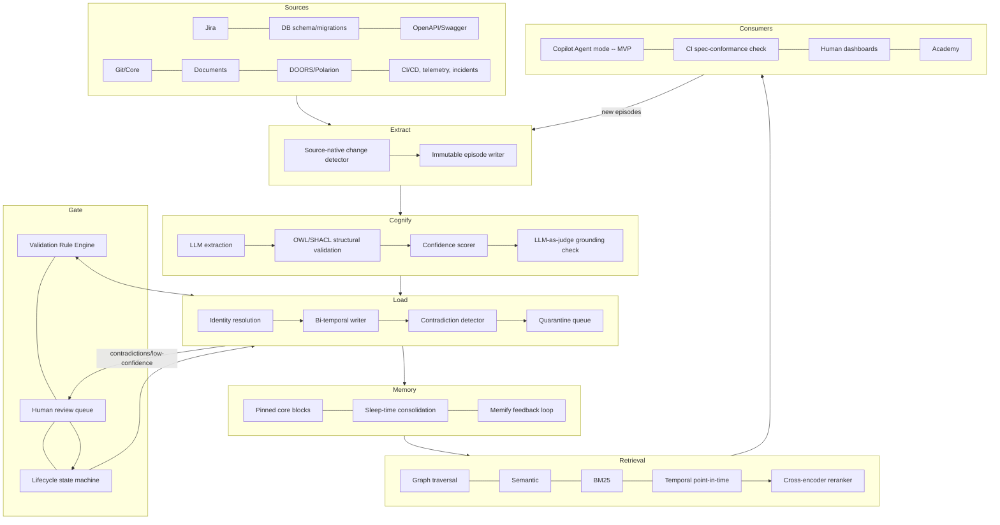

# Métis
# Technical Specification & Documentation

**Document status:** Draft v3.0 — **final positioning (superseding the v2.0 "lives inside Atlas" framing below, kept for history).** Métis is a standalone platform with its own repository and skill tree — it does not live inside Atlas's `.agents/skills/` tree or register in Atlas's router. Two separate, real prior-art systems inform its design, in different ways: **Atlas's** proven conventions (the RPI anti-hallucination protocol, the Stage Confirmation Protocol, the `SKILL.md` step-decomposition structure) are adopted as *patterns* for Métis's own skill authoring — proven ideas, reimplemented independently, not literal code reuse. **Athena's** existing ETL connectors (git, Jira, OpenAPI, CI/CD pipeline, Kubernetes, test-management) are Métis's actual data layer — Métis reads from Athena's already-populated tables (the `athena_internal_read` protocol) rather than re-fetching from source, and Métis's own graph state lives in a single Neo4j Enterprise database (§3.3). This document consolidates the structure (not all content) of three prior working documents: `specification-knowledge-graph-platform.md`, `skg-technical-specification-v2.md`, `skg-v3-addendum.md`.

**v3.0 changes (this session — the Métis rename):** platform renamed from "Atlas [Graph Extension]" to **Métis**, chosen specifically to avoid the ambiguity of sharing a name with either real prior-art system. §4.6 rewritten a second time — no longer "lives inside Atlas's repo" (that was v2.0's positioning, itself already complicated by the Athena ETL reconciliation that happened after it was written); now "adopts Atlas's conventions as patterns, in Métis's own repo." §4.7, §9.2, §12.4, and §16 updated to match — Atlas and Athena are both now consistently prior art informing specific, named parts of the design, not systems Métis is embedded inside of. All tool names (`metis_get_context`, etc.) and requirement IDs (`REQ-METIS-*`) updated throughout. §3.3's storage architecture updated to the single-Neo4j-Enterprise-database decision (superseding the Postgres-based design referenced in v2.0's changelog below).

**v2.0 changes (superseded by v3.0 above, kept for history):** reversed the v1.2 "standalone platform" positioning per explicit direction at the time — the extension was built *as* Atlas, living inside Atlas's repo/router. §12.4 reversed back to genuine, live integration with Athena (matching Atlas's existing `athena-analyzer` pattern) — this specific piece of reasoning **remains correct** and carries forward into v3.0, just without the "lives inside Atlas" framing around it. §18 updated: security sign-off and staffing removed as blockers per explicit direction — logged as accepted risks instead (§15), unchanged in v3.0.

**v1.2 changes (superseded by v2.0 above, kept for history):** had corrected positioning to make this a standalone platform separate from Atlas — that correction was reversed in v2.0, then effectively restored (in a more informed form) by v3.0.

**v1.1 changes:** incorporated real Atlas/Athena source material (`atlas.zip`/`athena.zip`); corrected §9.2's token-management design from a generic invented "Cost Gate API" to Atlas's actual Research/Plan/Implementation (RPI) protocol + Stage Confirmation Protocol; revised §3.3 for Neo4j's native 2026 vector/full-text capabilities.

---

## 0. Document Control

| Field | Value |
|---|---|
| System name | Métis |
| Document type | Master technical specification |
| Scope | Requirements→production traceability platform for a high-value system with large requirement/graph volume |
| Initial integration target | Claude (Claude Code / Claude Desktop) — tested first, per explicit direction |
| Parallel integration target | GitHub Copilot (Agent mode) — same MCP server, added once Claude testing validates the tool contracts (§11) |
| Superseding documents | v1 (architecture/research), v2 (merged design + guardrails), v3 (SDD skills/cost/resumability/Academy) |
| Convention | Requirements below are tagged `REQ-METIS-<area>-<n>` for traceability inside this document itself — eating our own dog food |

---

## 1. Purpose, Scope, and Design Philosophy

### 1.1 Purpose
Replace document-and-matrix-based requirements traceability with an **executable, bi-temporal knowledge graph** that is the single source of truth for the full SDLC: business goals through production telemetry. The graph, not a document export, is authoritative.

### 1.2 Scope
In scope: ontology and storage design; ingestion from Jira, relational DB schemas, OpenAPI/Swagger, Git/source code, documents (Confluence/Notion/PDF/Word), requirements tools (DOORS Next/Polarion-style baselines), CI/CD, telemetry/incidents; retrieval and AI-agent context assembly; a ten-layer anti-hallucination guardrail stack; a Copilot-first MCP integration; token/cost management; resumable/idempotent processing; and a user-facing Academy/learning layer.

Out of scope (explicitly): this specification does not select a specific graph-database vendor contract, does not define an org's actual `Constitution` rule content (only the mechanism), and does not replace human authorship of requirements — it constrains and validates that authorship, it does not generate requirements from nothing.

### 1.3 Design philosophy (five governing principles, referenced throughout)

| # | Principle | Where it's enforced |
|---|---|---|
| P1 | **No fact enters the graph without a traceable basis.** | §7 (guardrails) |
| P2 | **Temporal truth is derived from the most reliable source-native timestamp, never from ingestion time.** | §6 |
| P3 | **Every unit of work has a content-derived identity; nothing is position-addressed.** | §10 |
| P4 | **Every LLM call must be irreplaceable by deterministic code before it is allowed to exist.** | §9 |
| P5 | **The system explains itself; retrieval and pedagogy share the same provenance data.** | §12 |

---

## 2. Definitions and Glossary

| Term | Definition |
|---|---|
| **Episode** | The atomic, immutable ingestion unit (Graphiti-derived) — a raw event, message, or document fragment, from which entities/relationships are extracted. Non-lossy: the episode is never deleted even after extraction. |
| **Bi-temporal edge** | A graph relationship carrying `t_valid`/`t_invalid` (when the fact was true in the graph's model) distinct from `t_recorded`/`t_ingested` (when it was captured) — see §6.1. |
| **Cognify** | The extraction stage (Cognee-derived) where an LLM proposes entities/relationships from an episode, gated by inline structural validation before anything is written. |
| **Lifecycle state** | `Draft → Reviewed → Approved → Deprecated`, plus `Disputed` and `Rejected` — governs whether a fact is authoritative for a given consumer. |
| **Confidence tier** | Auto-write / Quarantine / Rejected — determines autonomy level for a given extracted fact (§7.3). |
| **Constitution** | A distinguished, highest-precedence, human-authored rule set that every extraction is checked against at Cognify time (SDD Spec-Kit-derived concept). |
| **EARS** | Easy Approach to Requirements Syntax — five sentence patterns (Ubiquitous, Event-driven, State-driven, Unwanted-behavior, Optional) used as a deterministic requirement-quality gate. |
| **Delta marker** | `ADDED`/`MODIFIED`/`REMOVED` tag on any edit episode (OpenSpec-derived), replacing ambiguous full-state diffs. |
| **unit_id** | A content-derived (not sequence-derived) identifier guaranteeing idempotent, resumable writes (§10). |
| **Memify** | The confidence-retuning feedback loop (Cognee-derived) that adjusts default extraction confidence from accumulated human corrections. |
| **Pinned core memory block** | A small, always-in-context (never reranked out) set of high-risk constraints/incidents per service (Letta-derived). |
| **Sleep-time agent** | A scheduled background process (Letta-derived) that consolidates/summarizes low-signal episode chains without touching the live request path. |

---

## 3. System Architecture

### 3.1 Component diagram



### 3.2 Layer responsibilities

| Layer | Responsibility | Key invariant |
|---|---|---|
| Extract | Convert source-native events into immutable episodes | Never mutates or interprets — pure capture |
| Cognify | Propose graph structure from episodes | Nothing exits this layer without a `source_span` and a structural-validity pass (P1, P4) |
| Load | Commit bi-temporal, identity-resolved graph state | Writes are idempotent by `unit_id` (P3) |
| Memory | Curate what's actively surfaced vs. archived | Never blocks the live request path (sleep-time work is async) |
| Retrieval | Answer queries against current + historical graph state | Four explicit modes, never silently substituting one for another |
| Gate | Enforce rules and human sign-off | Nothing reaches `Approved` without passing every applicable rule |
| Consumers | Coding agents, CI, humans, learners | Read-only by default (§11) |

### 3.3 Storage architecture (revised — single database, Neo4j Enterprise)

| Store | Owns | Technology |
|---|---|---|
| Graph DB | Ontology graph + bi-temporal edges + vector index + full-text index + episode log + review-queue state + cost tracking + RBAC | **Neo4j Enterprise Edition** (single database) |
| ETL | Git, Jira, OpenAPI, CI/CD pipeline, Kubernetes, test-management (Zephyr/TMS) | **Athena's existing connectors, unchanged** — Métis reads from Athena's already-populated tables (`athena_internal_read` protocol), it does not re-fetch from these sources independently |
| High-volume raw data (test executions, 1M+/month) | Stays in Athena's existing store | **Never duplicated into the graph** — summarized into periodic `MetricsSnapshot` nodes instead (see below) |

### 3.3.1 Why this is the final answer, not just a repeat of the earlier Neo4j-only analysis

§3.3.1 originally concluded *against* full single-database consolidation, for two reasons: the episode log needed a failure domain independent of the graph engine, and Neo4j had no equivalent to Kafka's ingestion-decoupling role. **Both of those objections were correct when written and have since been resolved by decisions made later in this conversation, not by re-litigating the same tradeoff:**

1. **The failure-domain argument weakened once Neo4j Enterprise was already going to be licensed anyway** (for the clustering/HA requirements §13's availability NFR demands regardless of this database question) — Enterprise includes proper online backup, which was the actual capability the "independent failure domain" argument was standing in for. Paying for that capability once and using it fully is more efficient than paying for it and *also* maintaining a second database to avoid depending on it.
2. **The re-fetch/duplication problem is what actually eliminated the need for Kafka-style ingestion decoupling**, not a change of mind about Kafka's value in general. The original design assumed every source was independently polled by this platform's own connectors, which is exactly the "ingestion burst" pattern that needed a buffer. Once ETL for Git/Jira/OpenAPI/CI-CD/Kubernetes/test-management is **Athena's existing, already-running, already-scheduled connectors** — not a second independent ingestion — there's no new burst to buffer. Métis polls Athena's tables incrementally (`change_detection_column`, typically `updated_at`), which is a much gentler, already-proven load pattern, not a fresh ingestion spike.
3. **The 1M+/month test-execution volume is real and does need special handling — but the fix is architectural (never store raw), not a second database.** Raw storage would be 12M+ nodes/year; a naive daily rollup only reduces that 2×, not enough to matter at this scale — computed precisely, not estimated. A **tiered rollup cadence** (daily only for `Performance:SLA-critical` or recently-code-changed `TestCase`s, weekly for everything else) cuts it 15×, and the underlying raw execution data simply stays in Athena's store, referenced by a query pointer, never copied.

`REQ-METIS-ARCH-03` (supersedes `REQ-METIS-ARCH-01`/02): the single Neo4j Enterprise database is authoritative for graph state, episode provenance, review-queue state (expressed as `lifecycle_state`/`risk_tag` properties, not a separate table), cost tracking (attached to `Episode` nodes), and RBAC (Neo4j Enterprise native roles, scoped by `owner_team`). No PostgreSQL instance is required for this platform's own state. Athena's existing PostgreSQL (`athena_db`) continues to exist, unchanged, as the source Métis reads from for ETL-covered entities and the store of record for high-volume raw execution data — this is Athena's database, not a second database *for Métis*.
`REQ-METIS-ARCH-04`: `MetricsSnapshot` nodes never duplicate raw execution rows — they store aggregates only, with a reference back to Athena's own data for drill-down, per the tiered cadence in `metis-graph-03-single-db-consolidation.cypher`.

---

## 4. Ontology and Data Model Specification

### 4.1 Layered entity model (reference: v1 §3, full attribute/relationship tables preserved there — not reproduced in full here to avoid duplication per P3's spirit)

Business → Requirement → Behavior → Architecture → Implementation → Testing → Operations → AI layers, ~50 entity types total. Every entity is simultaneously (a) a typed ontology node and (b) linked 1:1 to the `Episode` node(s) that justify it — this dual-layer pattern is the structural core of the whole system.

### 4.2 Net-new entities added since v1 (this document is authoritative for the current entity set)

| Entity | Purpose | Introduced in |
|---|---|---|
| `Constitution` | Highest-precedence, human-authored non-negotiable rule set, checked at Cognify time | v3 §1.1, formalized here |
| `ExternalAPISpec` | Registry-backed ground truth for third-party API surfaces, preventing hallucinated external-dependency shapes | v3 §1.1, formalized here |

`REQ-METIS-ONT-01`: Every `Requirement` and `AcceptanceCriterion` MUST be validated against the EARS grammar (§4.3) before it may leave `Draft`.
`REQ-METIS-ONT-02`: Every `Transition.APIs Called` edge referencing an `ExternalSystem` MUST resolve to a corroborated `ExternalAPISpec` node before reaching `Approved`, or be explicitly human-overridden with a recorded justification.
`REQ-METIS-ONT-03`: No entity may exist without at least one `source_episode_id`. This is a hard schema constraint, not a convention.

### 4.3 EARS conformance (requirement quality gate)

| Pattern | Form | Example |
|---|---|---|
| Ubiquitous | "The \<system\> shall \<response\>." | "The billing service shall reject invoices with a negative amount." |
| Event-driven | "When \<trigger\>, the \<system\> shall \<response\>." | "When a payment webhook is received, the system shall update order status." |
| State-driven | "While \<state\>, the \<system\> shall \<response\>." | "While an order is in Shipped state, the system shall reject cancellation requests." |
| Unwanted-behavior | "If \<condition\>, then the \<system\> shall \<response\>." | "If the refund amount exceeds the original charge, then the system shall reject the refund." |
| Optional | "Where \<feature is included\>, the \<system\> shall \<response\>." | "Where multi-currency is enabled, the system shall display the settlement currency." |

`REQ-METIS-ONT-04`: The EARS check is implemented as deterministic grammar matching (regex/parser), not an LLM call (P4).

**Grounding (Constitution Amendment 4, `CONST-047`): EARS structure is necessary but not sufficient.** EARS is a *structural* pattern for writing requirements that tend to satisfy good quality — the actual, internationally-standardized substance behind "good quality" is **ISO/IEC/IEEE 29148:2018**'s requirement quality characteristics: unambiguous, complete, singular (one testable statement, not a bundle), feasible, verifiable, correct, necessary, and consistent. A requirement can pass EARS structural conformance and still fail "singular" (a bundled While/When clause covering two behaviors) or "verifiable" (an unmeasurable term like "shall respond quickly"). Both checks are required at `Approved` tier — EARS conformance is the deterministic, cheap first pass; the 29148 characteristic checklist (`CONST-047`, `metis-standards-integration.md`) is the substantive second pass, and neither substitutes for the other.

### 4.4 Taxonomy overlay
Domain / Risk / Architecture / Technology / Compliance / Security / Testing / Performance / Lifecycle / Ownership — hierarchical, closed-vocabulary, linked via generic `TAGGED_WITH` edges (reference: v1 §11). Unchanged from v1; no revisions required by later documents.

### 4.5 Concurrency control (net-new, from v3 survey)

`REQ-METIS-ONT-05`: Every `Requirement`/`AcceptanceCriterion` carries a `revision` integer. Every edit episode carries `based_on_revision`. A submission against a stale revision is rejected with a merge-conflict prompt, never silently overwritten (Spec-Kitty-derived worktree-isolation equivalent, graph-native form).

### 4.6 Skill-Authoring Style — Métis's Own Skill Tree, Modeled on Atlas's Conventions

**Positioning (final, superseding the v2.0 "lives inside Atlas" framing):** Métis is a standalone platform with its own repository and skill tree — it does not run inside Atlas's runtime, does not live in Atlas's `.agents/skills/` tree, and does not register in `atlas.agent.md`'s router. What it does do is adopt Atlas's proven skill-authoring conventions as **patterns**, reimplemented in Métis's own tree, exactly the way it separately adopts Athena's ETL connectors as its data layer (§3.3, §6) — two different kinds of borrowing from two different real systems, neither of which makes Métis a part of either. §4.7 below is the capability gap analysis that motivated building Métis in the first place, framed as "what neither Atlas nor Athena does today," not as a roadmap item for either of those systems.

**House style, adopted as patterns (not literal file placement inside Atlas's repo):**

| Convention | Rule | How Métis uses it |
|---|---|---|
| **File layout** | `.agents/skills/<name>/SKILL.md` (slimmed) + `steps/NN-<stage-slug>.md` + `knowledge/<topic>.md`, unchanged `scripts/`/`resources/`/`configs/`/`tests/` | Every Métis skill (graph context retrieval, traceability, coverage checking, etc.) follows this exact structure inside **Métis's own** skill tree |
| **Content boundary rule** | Always-enforced rules in `SKILL.md`; supporting detail in `knowledge/` | Adopted as-is — a well-tested judgment call worth reusing verbatim |
| **RPI anti-hallucination protocol** | Scope Lock → Forbidden Substitutions → Confidence Tagging (`VERIFIED`/`INFERRED`/`UNVERIFIED`) → Drift Check | Reimplemented in Métis's own shared knowledge base, modeled directly on Atlas's `shared/knowledge/anti-hallucination-protocol.md` — Métis's guardrail stack (§7) is an *elaboration* of RPI (adding persistence, corroboration, and contradiction tracking that a single workflow run doesn't need), not a parallel protocol invented from scratch |
| **Stage Confirmation Protocol** | `[C]/[R]/[B]/[X]` menu, standalone-pauses/chain-auto-advances | Reimplemented independently for Métis's own pipeline (§9.2), same design, not shared code |
| **Config resolution pattern** | Resolve once per session, project-level then host-level fallback, never re-ask | Adopted as a general pattern for Métis's own connector configuration, modeled on `atlas-config-manager`'s approach |

`REQ-METIS-SKL-01` (final): Every Métis skill follows the step-decomposition structure above within Métis's own skill tree — there is no dependency on an Atlas installation, no shared runtime, no shared router.
`REQ-METIS-SKL-02` (final): Métis skills register in Métis's own router, built independently on the same *pattern* as `atlas.agent.md`'s Quick Routing table — not inside Atlas's actual routing table. If an org runs both Atlas and Métis, they coexist as two separate tools a person or a Copilot Agent-mode session can invoke, neither depending on the other's installation.

### 4.6.1 Convention for Presentation/Slide-Producing Skills

Neither Atlas nor Athena produces slide decks — Atlas's `report-generator`/`quality-reporter` skills output markdown/HTML; Athena's reporting surface is Grafana. This is a genuine extension, not something borrowed from either archive.

**Scope correction (see §12.5 for the full decision):** this is a **renderer**, not an independent content-producing skill. The content-gathering step (Stage 1 below) is the same content-assembly logic Academy (§12.1) already needs — it's written once and shared across the PPTX renderer and the Site renderer (§12.5), not duplicated here. What's specific to this skill is stages 2–4: turning already-gathered, already-grounded content into a `.pptx` file.

**Folder structure** (extends §4.6's base convention with two new folders specific to this skill type):

```
.agents/skills/<slide-skill-name>/
├── SKILL.md                    # frontmatter + purpose + Step Index + Non-Negotiable Rules
├── steps/
│   ├── 01-gather-content.md    # RPI-gated: pulls from the Métis graph (metrics, traceability, gaps)
│   ├── 02-select-template.md   # picks/validates the .potx layout to fill
│   ├── 03-generate.md          # runs script/build_deck.* against gathered content + template
│   └── 04-qa-and-validate.md   # content QA + file QA + visual QA, per the checklist below
├── knowledge/
│   └── deck-narrative-patterns.md   # how to turn graph facts into a slide narrative arc, reused across deck types
├── script/                     # NEW — generation logic, kept separate from templates
│   └── build_deck.js           # (or .py) assembles the .pptx from gathered content + chosen template
├── templates/                  # NEW — reusable, versioned slide masters/themes
│   ├── executive-quality-summary.potx
│   ├── traceability-gap-report.potx
│   └── theme-tokens.md         # brand palette, type scale — single source so decks don't drift stylistically
├── resources/                  # supporting reference (e.g., a chart-style guide) — unchanged from base convention
├── configs/
└── tests/
```

**Content boundary rule, applied to this skill type:** `script/` holds only generation logic (no content, no narrative decisions) — it should be swappable for a different rendering library without touching `templates/` or `steps/`. `templates/` holds only visual structure (layouts, masters, theme tokens) — no data, no per-run content. This mirrors §4.6's general content-boundary rule (always-enforced vs. supporting detail) applied specifically to the code/design split that slide generation needs and that this skill type is the first to need called out explicitly.

**Pipeline stages, RPI-gated per §9.2:**
1. **Gather content** (R/P) — query the Métis graph for the deck's actual subject matter (e.g., §7.1's guardrail metrics over a date range, or a `Requirement` subtree's traceability status). Every number or claim that lands on a slide carries the same `source_episode_id`/`source_span` provenance as any other Métis-served fact (§7 Layer 1) — a deck is not exempt from grounding just because it's a presentation artifact.
2. **Select template** — pick the right `.potx` for the content shape (a metrics-trend deck and a gap-analysis deck need different layouts), following the thumbnail-grid-then-pick workflow: render a labeled grid of the template's slides, choose layouts per section rather than defaulting every section to the same title-and-bullets slide.
3. **Generate** — `script/build_deck.*` assembles the deck. If building from scratch, this is a scripted generation pass (`pptxgenjs`/`python-pptx`); if filling an existing template, it's the unzip → edit slide XML → rezip pattern, never hand-duplicating a slide file.
4. **QA and validate** (the Drift Check equivalent, §9.2 Gate 4) — three required passes before a deck can leave `Draft`:
   - **Content QA**: extract text back out and check for missing content, leftover placeholder text, and — specific to this platform — that every claim on a slide still traces to its source episode (a deck-specific instance of §7's grounding requirement).
   - **File QA**: schema/relationship/content-type validation; any template-derived deck is checked against its source template so the template's own pre-existing issues don't misread as regressions.
   - **Visual QA**: render to images and inspect for overflow, overlap, low contrast, and misaligned template decoration — the same defect classes any slide-generation workflow needs to catch, checked here rather than assumed away.

`REQ-METIS-SLD-01`: No Métis-generated slide ships with a claim lacking a `source_episode_id` — decks are a rendering of the graph's provenance-backed facts, not a separate, ungrounded artifact type.
`REQ-METIS-SLD-02`: `script/` and `templates/` are versioned independently — a template redesign doesn't require touching generation logic, and a generation-library swap doesn't require touching templates.
`REQ-METIS-SLD-03`: Deck generation goes through the same Stage Confirmation Protocol as any other multi-stage Métis workflow (§9.2) — standalone mode pauses for review after generation and before the QA gate is presented as complete; it does not auto-advance to "done" without the human seeing the rendered result.


### 4.7 Gap Analysis — Capabilities Neither Atlas Nor Athena Provides Today

This is the concrete scope of what's being built: Atlas today (per the archive) doesn't have a persistent graph, doesn't model time formally, doesn't track cross-run corroboration, and doesn't validate structure. Athena today doesn't have an ontology at all — it's a metrics warehouse. Everything below is a capability gap Métis exists to close, not a roadmap item for either existing system.

| Capability | Atlas today | Athena today | Métis |
|---|---|---|---|
| **Persistence model** | Per-run artifacts (`business-analysis.md`, JSON manifests under `.atlas/tmp/`) — each workflow run produces documents, not a standing graph | Relational tables + SQL views — a metrics warehouse, not a specification model | A persistent, bi-temporal **graph** (§3, §5) — the specification itself is the artifact, continuously current, not regenerated per run |
| **Cross-run memory** | None beyond what's re-fetched from Jira/Confluence/git each time; RPI's confidence tagging (`VERIFIED`/`INFERRED`/`UNVERIFIED`) exists only within a single workflow's output, discarded after | Historical execution data persists, but as flat facts, not as a reasoned, corroborated, versioned graph of *why* something is true | Confidence tiers, corroboration counts, and provenance (§7) persist and compound across runs via the memify loop (§8.4) — the system gets more confident (or more suspicious) over time, which it doesn't today |
| **Temporal correctness** | No bi-temporal model — a re-run overwrites the prior artifact; no "what did this look like on March 1st" query is possible | Timestamps exist per row, but no formal validity-window model, no precedence rules across disagreeing sources | Full bi-temporal model with per-source-type extraction strategy and explicit cross-source precedence (§5) — this is a capability gap neither system has, not a maturity gap |
| **Contradiction handling** | RPI's "forbidden substitutions" rule says *don't* silently reconcile conflicts within one run, but there's no mechanism to track an unresolved conflict *across* runs or sources | None — Athena reports what each source says independently; reconciling Jira vs. a doc vs. a schema is a human, out-of-band task | `Disputed` lifecycle state + `ContradictionDetected` episodes (§5.3, §7 Layer 5) — conflicts are first-class, tracked, and queryable, not silently dropped between runs |
| **Formal validation/ontology** | Structural rules are per-skill prose (BDD format, technique-selection requirements) — enforced by instruction-following, not a schema | None — no ontology at all, it's a metrics warehouse | OWL/SHACL structural validation (§7 Layer 2) + a closed, versioned ontology (§4) — machine-enforced, not instruction-following-dependent |
| **Corroboration requirements** | Not present — a single Jira ticket or a single doc is sufficient evidence for any artifact Atlas produces | N/A | Mandatory ≥2-source corroboration for high-risk entities before `Approved` (§7 Layer 4) — a genuinely new safety property |
| **Third-party API hallucination guard** | Not addressed — `downstream-analyzer`/`git-repository-analyzer` verify *your own* code/APIs exist, not external dependencies' actual shapes | N/A | `ExternalAPISpec` + registry-backed corroboration (§4.2) |
| **Retrieval for coding agents** | Atlas produces documents for humans and test code for CI; it doesn't serve structured, ranked, budget-aware context to a coding agent mid-task | N/A | Four-mode hybrid retrieval + cross-encoder reranking + pinned core memory blocks, purpose-built for agent context assembly (§8) |
| **Explainability/pedagogy** | `atlas-academy` exists for onboarding to Atlas itself, not for explaining *why a specific answer was retrieved* | Grafana dashboards explain metrics trends, not individual fact provenance | `metis_explain_answer` + inline "why" annotations tied to the same provenance every guardrail layer already maintains (§12) — explains individual answers, not just the system as a whole |
| **Source breadth for temporal correctness** | Sources are fetched, not modeled temporally — a re-fetched Jira ticket has no notion of "which version of this fact is authoritative" | Execution/pipeline data has timestamps but no cross-source precedence model | §5.2's per-source temporal strategy is a genuinely new layer of rigor over what either system does today |

**What's worth carrying forward as engineering debt avoidance, not as a dependency:** Athena's schema-catalog technique (parsing a committed DDL snapshot into a dynamic, machine-readable catalog so query tooling doesn't hardcode relation names — §12.4) is a good pattern worth reimplementing *inside* Métis's own storage layer (§3.3), applied to the graph's own evolving ontology rather than to Athena's tables. That's borrowing an idea, not taking a dependency.

---

## 5. Temporal Model Specification

### 5.1 The four timestamps (reference: v3/v2 §2.1, authoritative here)

| Field | Meaning | Source of truth |
|---|---|---|
| `t_event` | When the fact became true in reality | Source-native metadata when available; else inferred and flagged |
| `t_recorded` | When the source system recorded it | Preferred anchor for `t_valid` (P2) |
| `t_ingested` | When Métis ingested the episode | Pipeline debugging only, never used for temporal queries |
| `t_valid`/`t_invalid` | Graph-edge validity window | Derived from `t_recorded`, closed automatically on supersession |

`REQ-METIS-TMP-01`: `t_valid` MUST be derived from `t_recorded`, never from `t_ingested`, whenever the source provides a reliable recorded timestamp. Violating this corrupts historical validity windows under backfill/replay — this is a hard requirement, not a default.

### 5.2 Per-source temporal strategy (summary table; full pitfall/mitigation detail in v2 §2.2)

| Source | `t_recorded` anchor | Primary risk |
|---|---|---|
| Jira | Changelog entry timestamp (never poll time) | Diff-by-polling misattributes historical changes to "now" |
| DB schema | Migration tool's `applied_at` | Manual out-of-band DDL has no recorded timestamp → flagged `inferred`, routed to quarantine |
| OpenAPI/Swagger | Git commit date of spec file | Spec drifts from deployed API — cross-checked against live introspection, mismatch → `SpecDriftDetected` |
| Git/Core | PR merge time (primary) vs. commit author-date (secondary) | Rebase/squash loses individual commit dates |
| Documents | Native revision API where available; else `t_recorded = t_ingested`, flagged `unknown` | Never sole source for a `Requirement`'s validity window when a stronger source exists |
| DOORS/Polarion | Baseline timestamp, walked baseline-by-baseline | Bulk export flattening loses the very audit trail that justified the tool |
| CI/CD, telemetry | Native event timestamp | Clock skew — mitigated by NTP-synced ingestion, normalized to UTC |

### 5.3 Cross-source precedence (reference: v2 §2.3)

1. System-of-record for that entity type wins (configurable per-org, shipped default: requirements tool > docs; live API introspection > checked-in spec; migration history > data-dictionary doc).
2. Reliability of recorded-timestamp breaks ties.
3. Recency breaks remaining ties.
4. Irreconcilable conflicts → `ContradictionDetected` episode, entity held `Disputed`, never auto-resolved.

`REQ-METIS-TMP-02`: The precedence table MUST be stored as versioned, editable graph data, not hardcoded, so per-org system-of-record differences don't require a code change.

**Confirmed default for this deployment (Jira as requirements/ticketing system):**

| Entity type | System of record | Precedence over |
|---|---|---|
| `Requirement`, `AcceptanceCriterion`, `BusinessRule` | Jira (via a Jira-analyzer-style connector, §5.2) | Confluence, any other document source |
| `Epic`, `Feature` | Jira | Confluence |
| `Defect` | Jira (assuming defects are tracked as Jira issues) | — |
| `Endpoint`, `API` | Live OpenAPI introspection endpoint where available, else the checked-in Swagger file | Confluence-documented API descriptions |
| `Table`, `Column` | DB migration history (Flyway/Liquibase) | Any hand-written data dictionary |

This resolves §5.3's "configurable per-org" placeholder for this deployment specifically. If a second requirements source is ever introduced (e.g., a design doc that pre-dates the Jira ticket), Jira still wins per this table — the precedence table, not chronological intuition, governs.

### 5.4 Temporal query interface

| Query | Purpose |
|---|---|
| `as_of(entity, timestamp)` | Point-in-time reconstruction |
| `history(entity)` | Full supersession chain with source + precedence-tier per version |
| `diff(entity, t1, t2)` | Structural diff between two points in time |

---

## 6. Ingestion Pipeline Specification

### 6.1 Stage contract

| Stage | Input | Output | Blocking checks |
|---|---|---|---|
| Extract | Source-native event/document | Immutable `Episode` | None — pure capture, always succeeds or the source connector retries |
| Cognify | `Episode` | Candidate entity/edge set + confidence | OWL/SHACL structural validation (§7.2); rejection on failure, never partial-accept |
| Load | Validated candidates | Committed graph state | Idempotency check via `unit_id` (§10); contradiction check (§7.5) |

### 6.2 Connector requirements

`REQ-METIS-ING-01`: Each connector MUST populate `t_recorded` using its source's native mechanism per §5.2 — a generic `now()` default is a spec violation, not an acceptable fallback.
`REQ-METIS-ING-02`: Each connector MUST be idempotent per §10's `unit_id` scheme.
`REQ-METIS-ING-03`: Structural extraction (AST parsing, migration/DDL parsing, OpenAPI parsing, Jira field mapping) MUST be implemented as deterministic code per §9 — LLM extraction is reserved for free-text sources only (documents, unstructured requirement statements).

### 6.3 Code-vs-LLM allocation (reference: v3 §2.3, authoritative summary)

| Category | Examples | Implementation |
|---|---|---|
| Deterministic (code) | DB migration parsing, OpenAPI parsing, EARS check, AST extraction, drift detection, structural validation, temporal/logical contradiction detection, confidence aggregation | ~10 of 14 pipeline steps |
| Judgment (LLM) | Free-text entity/relationship extraction, grounding verification (Layer 6), vague-requirement remediation suggestions, test-skeleton body-filling | ~4 of 14 pipeline steps |

This allocation is the primary cost lever and is what makes the ten-layer guardrail stack (§7) operationally affordable.

---

## 7. Validation and Anti-Hallucination Guardrail Specification

Ten layers, defense-in-depth (full rationale in v2 §5; requirements formalized here).

| Layer | Control | Requirement ID |
|---|---|---|
| 1. Source grounding | Every entity/edge carries `source_episode_id` + `source_span`; schema-enforced, no exceptions | `REQ-METIS-GRD-01` |
| 2. Structural validation | Inline OWL/SHACL at Cognify; type, cardinality, referential-integrity checks; failures quarantined, never auto-created to satisfy a dangling reference | `REQ-METIS-GRD-02` |
| 3. Confidence tiering | ≥0.9 + single reliable source + passes L2 → auto-write as `Draft` (never authoritative); 0.6–0.9 → Quarantine; <0.6 or L2-fail or contradiction → Rejected, logged only | `REQ-METIS-GRD-03` |
| 4. Corroboration | `Risk=High`-tagged entities and `Requirement`/`BusinessRule`/security-relevant `Transition.guard`/`Constraint` require ≥2 independent sources or explicit human confirmation before `Reviewed`→`Approved` | `REQ-METIS-GRD-04` |
| 5. Contradiction detection | Temporal (overlapping validity windows, same tier) + logical (graph-structural impossibility) — both continuous background processes | `REQ-METIS-GRD-05` |
| 6. LLM-as-judge | Independent model call, source span + claim only, "does this text support this claim, answer only from provided text" — blocks promotion on disagreement | `REQ-METIS-GRD-06` |
| 7. Human review | Terminal gate; triaged by severity/corroboration-gap/judge-disagreement; **no auto-promotion on timeout** — unreviewed stays quarantined indefinitely | `REQ-METIS-GRD-07` |
| 8. Fabrication/invalid-spec heuristics | EARS non-conformance, circular traceability, orphan-claim detection, vagueness — catches bad requirements, not just bad extractions | `REQ-METIS-GRD-08` |
| 9. Adversarial testing | Quarterly, held-out adversarial document set with known-correct reject/quarantine outcomes; primary metric is false-acceptance rate, not overall accuracy | `REQ-METIS-GRD-09` |
| 10. Auditable rollback | Bi-temporal model means nothing is destructively overwritten; rollback closes `t_valid`, restores prior state, recorded as an episode | `REQ-METIS-GRD-10` |

### 7.1 Monitored metrics (mandatory dashboard, not optional telemetry)

| Metric | Layer | Alert condition |
|---|---|---|
| % extractions with valid `source_span` | 1 | Any value < 100% is a pipeline bug, page immediately |
| Cognify rejection rate | 2 | Sudden spike → likely a connector regression |
| % Draft-tier facts later rejected | 3 | Rising trend → confidence defaults miscalibrated, feed to memify |
| % High-risk entities promoted with 1 source | 4 | Target 0%; any nonzero value is a guardrail breach |
| Open `Disputed` count + time-to-resolution | 5 | Growing backlog → precedence table likely misconfigured |
| Judge disagreement rate by connector | 6 | Isolate which source type is producing over-generalized extractions |
| Reviewer override rate | 7 | Rising trend → extraction quality regression |
| % requirements flagged vague/unfalsifiable at authoring | 8 | Track as a leading indicator, not just a gate |
| False-acceptance rate on adversarial set | 9 | The single most important safety number in the system |
| Mean time-to-rollback | 10 | Should trend down as tooling matures |

### 7.2 `Constitution`-gated validation (net-new, from v3 SDD survey)

`REQ-METIS-GRD-11`: The `Constitution` entity set (§4.2) is checked at Cognify time, ahead of the general Validation Rule Engine's cross-entity business rules — a `Constitution` violation is always a hard block, never a Quarantine-tier soft flag.

---

## 8. Memory and Retrieval Specification

### 8.1 Pinned core memory blocks

`REQ-METIS-MEM-01`: Per service/repo, `active_constraints` (Risk=High, Approved), `open_incidents` (status=Open, ≤2 hops), and `pinned_business_rules` (explicitly human-pinned) are injected unconditionally into agent context, bypassing retrieval ranking. Size-capped at 2,000 tokens default; overflow triggers a visible warning to the service owner, never silent truncation.

### 8.2 Hybrid retrieval — four explicit modes

| Mode | Use case |
|---|---|
| Graph traversal | Precise multi-hop structural questions |
| Semantic/vector | Fuzzy intent matching |
| BM25/keyword | Exact identifiers |
| Temporal point-in-time | "What did this look like before/after X" — explicit mode, not a post-hoc filter |

`REQ-METIS-MEM-02`: Results from all four modes are merged and passed through a cross-encoder reranker (Hindsight-derived) as the concrete implementation of context-assembly ranking.

### 8.3 Sleep-time consolidation

`REQ-METIS-MEM-03`: A nightly background job summarizes low-signal episode chains into rollup episodes (never deletes raw episodes — non-lossy) and proposes (never auto-applies) near-duplicate `Requirement`/`AcceptanceCriterion` merges for human review. Runs interruptibly per §10's resume protocol.

### 8.4 Memify feedback loop

`REQ-METIS-MEM-04`: `ExtractionCorrected` episodes (fired on any human override of an AI-inferred fact) feed a nightly aggregation job that adjusts default confidence per `(extraction-rule, entity-type, connector)` triple — a Bayesian-style counting update, auditable and reversible, not model retraining.

---

## 9. Token and Cost Management Specification

### 9.1 Layer allocation

| Mechanism | Applies to | Does NOT apply to |
|---|---|---|
| **Caveman-style micro-directive** (system-prompt style compression, ~15–20% real savings, best on multi-turn/cached/high-call-volume paths) | Cognify extraction prompts; Layer 6 judge prompts | `metis_get_context`'s user-facing Copilot output (low-volume, single-shot); any text that becomes stored specification content |
| **Headroom-style deterministic compression proxy** (structural pruning of tool/RAG output, 70–95% reported reduction, no accuracy loss) | All read-only MCP tool responses (`metis_get_context`, `metis_get_traceability`, `metis_impact_analysis`) between the Métis server and the Copilot client | Never applied to `source_episode_id`/`source_span` fields — hard field-level exclusion, provenance is not compressible |
| **Cache-stabilization** (Cache-Aligner pattern) | Bi-temporal fields (`t_valid`, `t_recorded`, `t_ingested`) must be normalized/stabilized before repeated calls, or prompt caching never engages on graph-query responses | N/A — this is a prerequisite for the above, not optional |
| **Code-first reduction** (§6.3) | ~10 of 14 pipeline steps | The ~4 irreducibly judgment-based steps |

`REQ-METIS-COST-01`: The compression proxy MUST be configured with an explicit field-level exclusion list covering all provenance fields; this is enforced at the guardrail boundary (§7), not left as a tuning default.

### 9.2 RPI Stages + Stage Confirmation Protocol (adopted from Atlas as a pattern)

**Correction from the prior draft of this section:** "RPI" in your request was not a typo for "API" — it's Atlas's own established term for **Research / Plan / Implementation**, a four-gate anti-hallucination pattern already implemented across Atlas's skills (`shared/knowledge/anti-hallucination-protocol.md`), paired with a separate but complementary **Stage Confirmation Protocol** (`atlas-mode-instructions-compact.md`) that gates advancement between pipeline stages on explicit user input. Métis adopts both patterns directly, by name, reimplemented in its own pipeline, rather than the generic "Cost Gate API" invented in an earlier draft — that invented design is subsumed by the two mechanisms below, which are already proven and running in production in Atlas today.

**RPI's four gates, applied to every Métis pipeline stage that touches an LLM call (Cognify extraction, Layer 6 judge pass, test-skeleton generation):**

| Gate | Atlas's existing RPI definition | How Métis's guardrail stack elaborates it |
|---|---|---|
| 1. Scope Lock (start of R) | Write down explicitly what the step is bounded to, and what's out of scope by default | Before Cognify extraction on an episode, lock the `primary_item` (e.g., the specific `Requirement`/ticket/file the episode concerns) — extraction that drifts onto unrelated entities is scope creep, not a bonus |
| 2. Forbidden Substitutions (throughout R and P) | Never fill a gap with a guessed value, carried-over memory, or a silently reconciled conflict | Directly reinforces `REQ-METIS-GRD-01`/§7 Layer 1 (mandatory source grounding) and §5.3's contradiction handling (conflicts are preserved as `Disputed`, never silently picked) — Atlas's existing wording for this rule is adopted verbatim, unchanged |
| 3. Confidence Tagging (end of P, throughout I) | Every fact tagged `VERIFIED` / `INFERRED` / `UNVERIFIED`, never proceed past a required output that depends on an `UNVERIFIED` item | **Maps directly onto §7.3's confidence tiers** — Métis's confidence tiers (§7.3) align to Atlas's existing three-value `VERIFIED`/`INFERRED`/`UNVERIFIED` scale instead of a numeric 0.6/0.9 threshold where a human is reading the output, since it's more legible; keep the numeric score internally for the memify loop (§8.4), surface the three-value tag externally |
| 4. Drift Check (end of I, before the Gate) | Re-derive the scope lock; if fewer than 50% of produced items directly serve the locked scope, discard and re-derive rather than pass drifted output downstream | **Net-new, stronger than anything in the prior guardrail draft** — add as `REQ-METIS-GRD-12`: after Cognify extraction, if fewer than half the extracted entities/edges trace to the locking episode's primary subject, discard the batch and re-run rather than committing a partially-relevant extraction |

`REQ-METIS-COST-06` (supersedes an earlier invented `/cost-gate` API sketch): every RPI-labeled stage in Métis MUST reference Métis's own shared protocol document once (Atlas's own convention — "do not duplicate this prose into individual step files; link to it instead") rather than reimplementing the four gates per skill.

**Stage Confirmation Protocol — this is the actual token-usage-accident guard, layered on top of RPI:**

Atlas's real mechanism, reimplemented as Métis's own:
```
[C]ontinue to next stage
[R]eview this stage in detail
[B]ack to previous stage
[X]it workflow
```
applied after every stage that produces artifacts, **never auto-advancing**, with two modes:
- **Standalone mode** (single-skill invocation, e.g. a targeted `metis_get_context` deep-dive): always pauses and shows the menu — matches the low-volume, single-shot cost profile from §9.1's Caveman guidance (this is exactly the case where a per-call confirmation is cheap and appropriate).
- **Chain mode** (a multi-stage pipeline run, e.g. a full Cognify batch over a new document source): auto-advances through stages **unless** a `validation_check` fails, in which case it stops and shows the full menu — this is what prevents "confirmation fatigue" from a legitimate multi-step job while still hard-stopping on the first sign of trouble, which is the actual accidental-overspend scenario worth guarding against (a bad batch silently running to completion), not routine multi-stage progress.

`REQ-METIS-COST-07`: Métis's ingestion pipeline (§6) and the sleep-time consolidation agent (§8.3) both adopt chain-mode semantics — auto-advance through stages, hard-stop and prompt on any Gate 3/Gate 4 (RPI) failure or any guardrail Layer 2–6 (§7) rejection, exactly mirroring Atlas's fail-fast rules: validation failure blocks and asks for a fix, a crashed step logs and continues to the next rather than auto-retrying, a missing artifact blocks advancement rather than substituting one, and an invalid pipeline manifest stops immediately.
`REQ-METIS-COST-08`: Any action Métis initiates that would trigger a materially larger-than-typical batch of LLM calls (a full-repository re-extraction, a large document-batch Cognify run) shows the proposed plan and stage count up front and requires explicit confirmation before starting — mirroring Atlas's exact "Confirm to proceed? [yes/no]" pattern shown before a multi-stage workflow begins, not just between stages once it's already running.

### 9.3 Model Selection and Cost Recommendation (resolves §18.2's model/vendor gap)

You asked for a recommendation with rough tradeoffs rather than a fixed choice — here's one, using current published Claude API rates (per-million-token, checked at time of writing) as the concrete anchor. This is a starting point to validate against a real pilot batch (§18.3), not a number to commit budget against yet.

**Recommended split — different models for different stages, not one model for everything:**

| Stage | Recommended model | Why this tier |
|---|---|---|
| Cognify extraction (§6.1, the highest-volume call site — one per episode) | **Haiku-class** (cheapest current tier) | This is structured extraction against a well-defined ontology (§4) — a smaller model with a good schema and few-shot examples handles this well, and volume makes the per-token rate the dominant cost driver |
| Layer 6 LLM-as-judge (§7 Layer 6 — only runs for Quarantine-tier items, a fraction of total volume) | **Sonnet-class** (mid tier) | This call's whole job is catching subtle over-generalization the extraction model itself produced — using the *same* tier for both steps weakens the check; the judge needs to be at least as capable as, ideally more capable than, the extractor it's checking |
| Cross-encoder reranker (§8.2) | **Not a foundation-model API call at all** | A cross-encoder reranker is a small, specialized model, normally self-hosted (e.g., a sentence-transformers-style cross-encoder) — routing this through a per-token-billed chat API would be both slower and needlessly expensive for what's fundamentally a scoring pass, not a generation task |
| Test-skeleton generation (§6, only the body-filling step) | **Sonnet-class** | Low volume (human-triggered per transition, not per-episode), and code generation benefits from the stronger tier more than extraction does |

**Rough order-of-magnitude cost, Cognify + Layer 6 only (the two genuine per-token cost drivers):**

Using published rates (Haiku-class ≈ $1/$5 per MTok input/output; Sonnet-class ≈ $2–3/$10–15 per MTok depending on current promotional pricing), with prompt caching on the shared ontology/schema context (≈90% off the cached portion) and batch processing for the async Cognify pass (≈50% off everything, since ingestion isn't latency-sensitive per §13):

- **Cognify**, assuming ~2,000 input tokens/episode (mostly cached schema context) + ~500 output tokens: roughly **$1.50–2.00 per 1,000 episodes**.
- **Layer 6 judge**, assuming ~30% of extractions land in Quarantine and need a judge pass, ~800 input + ~150 output tokens per call: roughly **$0.40–0.60 per 1,000 episodes** (i.e., per 300 judge calls).
- **Combined: very roughly $2–3 per 1,000 episodes ingested**, before accounting for the Cost Gate's own overhead or any Phase-4-scale sleep-time consolidation cost (§8.3).

**Caveats on this number, stated plainly:** this is a back-of-envelope estimate from assumed token counts, not measured ones — real requirement/AC text length, actual cache-hit rates, and your real Quarantine rate (which depends on how clean your Jira data already is) will move this up or down materially. The right next step is exactly what §18.3 already recommends: run a small real batch (a few hundred actual Jira tickets from the pilot service) through Cognify once schema + contracts are wired up, and replace this estimate with a measured one before committing a budget number to anyone.

`REQ-METIS-COST-09`: Model choice per stage is configuration, not code — the Cognify/judge/reranker model names are read from a config the Cost Gate (§9.2) can reference when estimating a batch confirmation, so swapping tiers later (e.g., after the pilot shows Haiku's extraction quality needs an upgrade) doesn't require a pipeline code change.

---

## 10. Resumability and Idempotency Specification ("One Source of Truth")

### 10.1 Core mechanism

`REQ-METIS-RES-01`: Every unit of generated or extracted content carries a `unit_id` derived deterministically from its inputs (e.g., `hash(source_episode_id + extraction_rule_id + chunk_offset)`), never an auto-incrementing counter.

`REQ-METIS-RES-02`: Every edit episode carries an explicit `delta_type ∈ {ADDED, MODIFIED, REMOVED}` (OpenSpec-derived).

`REQ-METIS-RES-03`: Long-running artifacts (documents, batch extractions) carry inline or property-level checkpoint markers with `checkpoint_status ∈ {PENDING, COMMITTED, FAILED}`, flipped to `COMMITTED` only after the full atomic write (including guardrail checks) succeeds.

### 10.2 Resume algorithm

```
1. Discard all PENDING units from the interrupted run — never resume mid-unit.
2. Find the highest-numbered COMMITTED unit.
3. Resume from the next logical unit, re-deriving unit_id identically.
4. Before writing: if unit_id already exists as COMMITTED, skip (idempotent no-op).
   Else, proceed.
```

`REQ-METIS-RES-04`: This algorithm applies uniformly to: (a) long-running Cognify extraction batches, (b) long technical-document generation (including this document itself and its predecessors), and (c) sleep-time consolidation runs (§8.3).

### 10.3 Why this satisfies "one source of truth"

Content-derived identity means two independent workers processing the same input after a network partition converge on the same `unit_id` — the second write is a guaranteed no-op, not a duplicate requiring downstream deduplication. Prevention, not after-the-fact detection, is the primary mechanism.

---

## 11. MCP Client Integration Specification (Claude first, Copilot in parallel)

**Reframed from the original "Copilot Integration (MVP), Claude Code deferred to Phase 3" positioning.** Métis's tool-serving layer is a standard MCP server over Streamable HTTP (§3.3's `mcp-server` component) — the protocol itself is already client-agnostic by construction; what needed fixing was several genuinely Copilot-specific assumptions that had been written as if they were platform constraints. **Per explicit direction: Claude is the first client tested, Copilot follows the same server in parallel** — this is a testing-order decision, not a capability difference; both clients reach the identical 9 tools (`metis_get_context`, etc.) over the identical protocol.

### 11.1 MCP tool catalog

| Tool | Default state | Read/Write |
|---|---|---|
| `metis_explain_decision` | Enabled | Read |
| `metis_get_context` | Enabled | Read |
| `metis_get_traceability` | Enabled | Read |
| `metis_check_coverage` | Enabled | Read |
| `metis_impact_analysis` | Enabled | Read |
| `metis_propose_test_skeleton` | Feature-flagged | Read (produces skeleton only, never commits) |
| `metis_submit_episode` | **Disabled by default** | Write — gated behind confidence tiers (§7), org opt-in required |
| `metis_explain_answer` | Enabled | Read — Academy-linked (§12) |

`REQ-METIS-CPT-01`: The write path (`metis_submit_episode`) MUST remain disabled until the guardrail stack (§7) has a production track record — this is a phase-gate, not a permanent restriction, and applies identically regardless of which client is connecting.

### 11.2 Registration and auth — one model, two client-side entry points

`REQ-METIS-CPT-02` (revised): registration is client-specific *at the config layer only* — the server side (OAuth2 scoping, RBAC, tool contracts) is identical for both:
- **Claude** (Claude Code, Claude Desktop): a `.mcp.json` entry (project-scoped) or Claude Desktop's custom-connector config, pointing at the deployed `mcp-server` endpoint — see `metis-multi-client-integration.md` for the actual config snippet.
- **Copilot**: a prebuilt `spec-aware.agent.md` custom agent pinning the read-only tool set — Copilot's own convention for surfacing a fixed tool set without relying on manual server discovery. This is Copilot-specific file *format*, not a Copilot-specific *capability* — it's a discovery convenience, not a different auth or permission model underneath.

`REQ-METIS-CPT-03` (unchanged in substance): OAuth2 flow, scoped per-user, tokens carrying the user's `Service.owner-team`/RBAC assignment — cross-team pinned-block access is denied even with a known node id. Token lifecycle detailed in `CONST-064` (1-hour access tokens, 30-day revocable refresh tokens, re-validated every request, not cached from issuance) — this applies identically to a Claude-issued token and a Copilot-issued token; the server doesn't distinguish clients at the authorization layer, only at the discovery-file layer above.

`REQ-METIS-CPT-04` (revised — no longer a platform-wide gate): each client has its own equivalent entry point, not a single mode restriction treated as inherent to the platform: Copilot requires **Agent mode** specifically (a real Copilot-side constraint, documented in Copilot's own onboarding); Claude requires either Claude Code with the MCP server configured in `.mcp.json`, or Claude Desktop with the server added as a custom connector. Neither is "the" required mode — each is the client-specific way of reaching the same server.

### 11.3 Context budget — tuned per client, not sequenced as MVP-then-future

`REQ-METIS-CPT-05` (revised): traversal depth and retrieval top-k are **negotiated per client connection**, not fixed platform-wide: Copilot's smaller context budget gets the tighter 2-hop default; Claude's larger context budget (1M-token-class for Claude Code/Sonnet-5-and-above sessions) supports the fuller 3-hop traversal without needing to wait for a "future build." Both are configured now, in the same server, not staged as MVP-vs-deferred.

### 11.4 CI gate

`REQ-METIS-CPT-06`: Implemented as a GitHub required status check (`metis/spec-conformance`), agent-agnostic by construction — works identically for human, `@copilot`, or Claude Code-authored PRs, unchanged by this reframing.

### 11.5 Claude — the first client tested (was: "Deferred, Phase 3")

Same MCP server, larger context budget (§11.3), headless-capable for CI usage, PAT/Bearer auth path available as an alternative to interactive OAuth2 for non-interactive (CI/automation) contexts. **This is being stood up now, not deferred** — see `metis-multi-client-integration.md` for the concrete `.mcp.json` configuration to actually connect a Claude Code session to a deployed `mcp-server` instance.

---

## 12. Academy and Explainability Specification

### 12.1 Components

| Component | Function | Requirement ID |
|---|---|---|
| `metis_explain_answer` tool | Explains the retrieval path behind any prior answer: sources, traversal path, confidence tier per fact | `REQ-METIS-ACD-01` |
| Academy module | Versioned, progressive-disclosure docs: graph model basics, reading traceability chains, confidence tiers, EARS authoring | `REQ-METIS-ACD-02` |
| Inline "why" annotations | Every guardrail rejection (§7) surfaces a specific reason, linked to the relevant Academy page | `REQ-METIS-ACD-03` |
| Next-step guidance | Every gap surfaced by `metis_get_context` includes a concrete next action, not just a flag | `REQ-METIS-ACD-04` |
| Changelog | Plain-language, checkpoint-protected (§10) running log of ontology/rule changes | `REQ-METIS-ACD-05` |

### 12.2 Design constraint
`REQ-METIS-ACD-06`: Academy content MUST be versioned alongside the ontology itself — it is a spec violation for Academy content to describe a schema version that is no longer live.

### 12.3 Rationale
The Academy layer exposes provenance data the guardrail architecture (§7) already obligates the platform to maintain — it is a UX/exposition layer, not a separate subsystem with independent cost.

### 12.4 Metrics — Métis Reads Directly From Athena's Existing Data

**Reversed back from an even earlier draft's "supersede Athena" position, and refined once more since the v2.0 draft below.** Athena is a working, deployed ETL and metrics system — Métis doesn't duplicate it, doesn't route around it, and doesn't require Atlas's `athena-analyzer` Copilot skill as an intermediary either (that skill is a Copilot-facing query convenience; Métis's ETL integration is a layer below that, reading Athena's tables directly, per §3.3/§6's `athena_internal_read` protocol). Two different integration points, easy to conflate, worth keeping distinct: `athena-analyzer` is how a *person using Copilot* queries Athena; `athena_internal_read` is how *Métis's own Extract stage* reads Athena's data to build the graph.

**What this actually means:**
- §7.1's guardrail metrics (source-grounding rate, rejection rate, corroboration compliance, judge disagreement, reviewer override rate, false-acceptance rate, rollback MTTR) are written as new logical objects in Athena's existing schema catalog (the same `athena_schema_catalog.py` pattern already used for `athena.mv_items`) — not a parallel dashboard system, and queryable the same way any of Athena's other computed objects are.
- A new Grafana dashboard JSON for Métis's guardrail metrics is added alongside `DefectsStatistics.json`/`RegressionStatistics.json` in both the on-prem and AWS variants, following the same convention Athena's other dashboards already use — not a separately branded reporting surface.
- Métis's own ingestion (§6) for Git, Jira, and OpenAPI/Swagger reads from Athena's existing `athena-client-git`/`athena-client-atlassian-jira`/`athena-client-openapi`-populated tables directly (§3.3's `athena_internal_read` protocol) rather than re-implementing connectors Athena already has working. What Métis adds on top is the bi-temporal graph/ontology/guardrail layer (§5–§7) — genuinely new — not a second copy of source connectivity Athena already solved.
- Where Métis and Athena both observe the same underlying fact (e.g., a test execution result), `t_recorded` (§5.1) is sourced from Athena's own ingestion timestamp for that fact rather than re-derived independently — Athena is the established, longer-running system of record for execution/CI data specifically, and per §5.3's precedence rules, an established system-of-record wins over a newly-added layer for the same entity type.

`REQ-METIS-MTX-01`: Guardrail and platform metrics are exposed as new objects in Athena's existing schema catalog — not as a standalone graph-only metrics surface.
`REQ-METIS-MTX-02`: Métis's Git/Jira/OpenAPI ingestion reads Athena's existing tables directly, as a live, ongoing integration — not a one-time backfill that lets Athena be decommissioned afterward.
`REQ-METIS-MTX-03`: The schema-catalog pattern itself (parsing a committed schema snapshot into a machine-readable catalog rather than hardcoding relation/label names) is extended to cover Métis's own evolving graph ontology (§4) as well, using the same technique Athena already established, kept consistent across both.

**This applies throughout the document, not just here:** Métis is a standalone platform (§4.6) with a real, live data-layer dependency on Athena specifically for ETL-covered sources (§3.3, §6) — not a dependency on Atlas. Any place elsewhere in this spec that still describes a dependency on Atlas itself (as opposed to adopting Atlas's conventions as patterns) is stale and should be read per §4.6's final positioning.

### 12.5 Consolidation Decision: One Content Layer, Two Thin Renderers (not three separate systems)

**Your instinct is right, with one refinement.** Academy, a browsable "Site," and PowerPoint decks (§4.6.1) look like three things to build and maintain, but they're actually **one content model with three possible output formats** — and two of those formats (interactive Academy pages, browsable Site pages) are close enough to merge outright. The third (PPTX) genuinely serves a different job and is worth keeping separate, for a specific reason below — but as a thin renderer, not a parallel content system.

**What actually differs between the three, and why that leads to "one source, two renderers" rather than "one of everything":**

| | Academy (as originally scoped, §12.1) | "Site" (the thing that made you pause — Atlas has one: `site/skills/*.html`, `site/agents/*.html`) | PowerPoint (§4.6.1) |
|---|---|---|---|
| Audience | Anyone using the system, in-the-moment | Anyone browsing/referencing, out-of-the-moment | Leadership/stakeholders, periodic |
| Content | Explains *this specific answer* (`metis_explain_answer`) + general concepts | Reference documentation of what exists (entities, skills, ontology) | A curated narrative snapshot of status/trends |
| Freshness | Always current (live queries against the graph) | Always current (should be generated from the graph, same as Academy) | Point-in-time — a deck from last Tuesday is *supposed* to say last Tuesday's numbers |
| Interactivity | Interactive (follow-up questions, drill-down) | Static, browsable, linkable | Static, presented/shared offline |

The first two rows show real overlap: Academy's "general concepts" content (graph model basics, EARS authoring, confidence tiers — §12.1) *is* reference documentation. A separate "Site" skill generating its own copy of that explanation would immediately duplicate content and drift out of sync with Academy — exactly the "two sources of truth" failure this whole platform exists to prevent (P1, §5.3's contradiction handling). There's no good reason to author that content twice.

PowerPoint is different for one real reason, not an arbitrary one: **it's the only format where staleness is a feature, not a bug.** A quarterly board deck should show what was true when it was generated and stay that way in the shared file — re-rendering it live would undermine its purpose as a fixed record of a specific reporting period. Site and Academy should never be stale; a deck, once shared, correctly should be.

**Consolidated design:**

```
Academy (canonical content layer — the only place content is authored/assembled)
   ├── renders inline, interactively, in Copilot chat  → this is "Academy" as originally scoped
   ├── renders as a static, browsable HTML site         → this is what "Site" becomes: a renderer, not a second author
   └── renders as a point-in-time .pptx snapshot         → this is §4.6.1, unchanged in mechanics, reframed in role
```

`REQ-METIS-ACD-07`: There is exactly one content-assembly stage — querying the graph for explanations, gap descriptions, metrics, and provenance (§12.1's existing components) — shared by all three output paths. The Site and PPTX paths differ only in their final rendering step, matching this document's own P4 principle (code over LLM calls) applied to *presentation*, not just extraction: the content-gathering LLM/graph-query work happens once, and rendering to HTML vs. rendering to `.pptx` is deterministic code (a template fill), never a second independent generation pass.
`REQ-METIS-ACD-08`: The Site renderer follows the same skill-folder convention as §4.6.1 (`script/` for the static-site generator, `templates/` for the HTML/CSS layout), sharing the `steps/01-gather-content.md` stage with the PPTX renderer rather than duplicating it — content-gathering is written once per content type (e.g., "explain this traceability gap"), not once per output format.
`REQ-METIS-ACD-09`: The Site is regenerated on every relevant graph change (or on a short schedule) since it must stay current per the table above; the PPTX renderer runs on-demand or on a reporting cadence and is never auto-regenerated to "fix" staleness — staleness there is intentional.

**Net effect on scope:** you're not building three systems. You're building one content-assembly layer (already scoped in §12.1) and two renderers that share a folder convention (§4.6.1, extended). If you want to cut scope further for the MVP, the Site renderer is the one to defer — Academy's interactive, in-chat form (via `metis_explain_answer`) is more valuable per unit of build effort for Phase 0 (§14) than a static site nobody's asked for yet, and PPTX is worth keeping only if you already know leadership wants a periodic deck. Recommendation: build Academy (interactive) first, treat Site and PPTX as Phase 2+ renderers added once the content-assembly layer is proven, not as three parallel Phase 0 workstreams.


---

## 13. Non-Functional Requirements

| Category | Requirement |
|---|---|
| Scalability | Support 10⁶–10⁷ nodes / 10⁷–10⁸ edges (500 services, 5,000 requirements, 50,000 tests, 5 years history) with bounded traversal via `owner-team`/`Service` partitioning |
| Latency | P95 context-assembly retrieval ≤ 300ms target (Graphiti-benchmark-aligned), achieved via hybrid indexing, no LLM call in the retrieval hot path |
| Availability | Episode log lives in the single Neo4j Enterprise database (§3.3) — its durability depends on Neo4j Enterprise's own clustering/backup, not a separate independent store; this is the direct tradeoff the single-database decision made, and it's why Enterprise-tier HA/backup (Cost/Licensing row below) is not optional for a production deployment the way it might be with a Postgres-backed log |
| Security/Privacy | Episode payloads store references, not raw secrets/PII, where sensitive; `Column.PII-flag` propagates access-control tags; audit log itself access-controlled |
| Multi-tenancy | Per-tenant graph partitioning (separate DBs or Neo4j multi-database) preferred over shared-graph isolation for platform deployments |
| Auditability | Bi-temporal model + episode provenance make every fact's origin and every rollback fully reconstructable (§7 Layer 10) |
| Cost/Licensing | Graph-engine clustering, failover, and proper backup (needed to satisfy the Availability row above at real production scale) are Neo4j Enterprise Edition features, not included in the free Community Edition — see §15's risk register entry for actual pricing. Community Edition is an acceptable, zero-cost choice for Phase 0's single-instance pilot scope; Enterprise licensing becomes a real, budgeted line item at the Phase 1→2 transition, not before. |

---

## 14. Rollout Plan

| Phase | Scope | Guardrail posture |
|---|---|---|
| 0 — Pilot (0–2mo) | One service; Git + one requirements source; read-only tools tested on **Claude first** (Claude Code/`.mcp.json`), Copilot added in parallel once Claude testing validates the tool contracts | All ten guardrail layers active from day one, not phased in |
| 1 — Expand sources (2–5mo) | DB schema, Swagger/OpenAPI, one documents source | Validate §5 temporal strategy and §5.3 precedence table against real conflicts |
| 2 — Gated write-back (5–8mo) | Enable `metis_submit_episode` per confidence tiers | Watch reviewer-override rate closely before widening |
| 3 — Full multi-client parity (8–10mo) | Both clients at full capability — Claude's larger context budget fully exercised, Copilot's Agent-mode integration hardened for org-wide rollout | Same guardrail stack, zero relaxation for a "more capable" client |
| 4 — Full scale | Remaining sources, multi-service, consolidation agent at scale | Adversarial testing (§7, Layer 9) becomes recurring governance, not a launch checklist item |

---

## 15. Risk Register

| Risk | Mitigation |
|---|---|
| Reviewer bottleneck under conservative Quarantine policy | Dedicated reviewer time budgeted explicitly in Phase 0–1, not assumed absorbed |
| Precedence-table misconfiguration | `history()` query (§5.4) makes "why did this fact win" always inspectable |
| Judge-model cost/latency at scale | Tracked explicitly; cheaper judge model substitution once judge-vs-human agreement data exists |
| Copilot Agent-mode-only visibility | Tracked as an adoption metric from Phase 0, not treated as solved by shipping the integration |
| Graph write contention at high commit velocity | Async episode ingestion via event bus; incremental (delta-subgraph) validation |
| Sensitive data in episodes | Reference-not-raw-content storage; PII-flag propagation |
| Ontology rigidity vs. real-world messiness | Extension mechanism for custom fields; explicit partial-adoption support |
| **No formal security/compliance review before Phase 0 (accepted per explicit direction, §18.2)** | The underlying controls (§7's grounding/PII-flag/access-control requirements) remain in force regardless — this accepts the risk of skipping *external review* of them, not the risk of dropping them. Revisit before any auto-write path (§11.1's `metis_submit_episode`) is enabled beyond the pilot, since that's where an unreviewed gap would first matter in practice. |
| **No named staffing/ownership before Phase 0 (accepted per explicit direction, §18.2)** | §7 Layer 7's fail-safe (no auto-promotion on timeout) means an unstaffed review queue degrades to "nothing gets approved" rather than "bad things get approved silently" — the safe failure mode, but still a real one: if nobody is checking the queue, the extension effectively stops producing new Approved facts. Worth a lightweight, even informal, owner before Phase 0 generates enough Quarantine volume to matter. |
| **Neo4j Enterprise Edition licensing cost, previously unpriced.** Clustering, failover, proper online backup, and RBAC are Enterprise-only features (Community Edition is single-instance, no official clustering/backup support) — self-managed Enterprise pricing runs **$20K–$40K/year for a small-to-mid deployment, $80K–$200K+/year at larger scale**, plus 18–22% annual maintenance. This is a real, likely-unavoidable cost given §13's availability requirements and the Constitution's own "critical system" definition, and it was not explicitly budgeted before this was checked. | Budget this explicitly before Phase 1–2 (§14) — Phase 0 can likely run on Community Edition (single-instance, no HA) given its small pilot scope, but the transition to a real production deployment needs this line-itemed, not discovered mid-rollout. Community Edition remains viable for as long as single-instance is an acceptable availability posture. |

---

## 16. Atlas/Athena/Métis — The Full Positioning History, Stated Plainly

**Four positioning changes across this project, kept honest rather than smoothed over:**
1. Built as an integration into Atlas (lives in Atlas's repo, uses Atlas's router).
2. Corrected to a standalone platform, separate from both Atlas and Athena.
3. Reversed back to "built as Atlas" per explicit direction at the time.
4. **Final state:** renamed to **Métis** — a standalone platform in its own right, which (a) adopts Atlas's proven skill-authoring conventions (RPI, Stage Confirmation Protocol, `SKILL.md` structure) as *patterns*, reimplemented independently, and (b) has a real, live data-layer dependency on Athena specifically — Métis's Extract stage reads Athena's already-populated tables directly for every source Athena already covers (Git, Jira, OpenAPI, CI/CD, Kubernetes, test-management), rather than re-fetching independently. This is not the same claim as phase 3's "built as Atlas" — Métis has no dependency on an Atlas installation at all; its dependency is specifically and only on Athena's data layer.

| Item | Final resolution |
|---|---|
| §4.6 — Skill-authoring style | Métis's own skill tree, in its own repository, following Atlas's proven conventions as patterns — not literal placement inside Atlas's repo |
| §4.7 — Gap analysis | The concrete list of capabilities neither Atlas nor Athena provides today (persistent graph, bi-temporal model, cross-run memory, contradiction handling, ontology validation, corroboration requirements) — the justification for building Métis as its own platform |
| §9.2 — RPI + Stage Confirmation | Atlas's existing Research/Plan/Implementation protocol and Stage Confirmation Protocol, reimplemented independently in Métis — Métis's guardrail stack (§7) elaborates on RPI for persistent, cross-run needs a single workflow run doesn't have, but doesn't share code or runtime with Atlas |
| §12.4 — Metrics | Métis reads Athena's existing tables directly (`athena_internal_read`, §3.3, §6) — a real, live, ongoing data dependency, distinct from (and lower-level than) Atlas's `athena-analyzer` Copilot skill — Athena is not superseded, backfilled-then-discarded, or routed around |
| §3.3 — Storage | Single Neo4j Enterprise database — no separate Postgres instance; episode log, review queue, cost tracking, and RBAC all Neo4j-native |

**Explicitly out of scope for this document, per direction:** a formal security/compliance sign-off and a staffing plan are not required before proceeding — see §15 for those items logged as accepted risks instead of blockers, and §18 for the updated readiness checklist.

---

## 17. Traceability Index (this document to prior working documents)

| This document | Source of full detail |
|---|---|
| §3 (Architecture) | v1 §1–§2, v2 §1 |
| §4 (Ontology) | v1 §3, v2 §1, v3 §1 |
| §5 (Temporal) | v2 §2 |
| §6 (Ingestion) | v2 §1, v3 §2.3 |
| §7 (Guardrails) | v2 §5, v3 §1.1 (Constitution) |
| §8 (Memory/Retrieval) | v2 §3 |
| §9 (Cost) | v3 §2; §9.2 is RPI + Stage Confirmation Protocol adopted from Atlas (corrected from an earlier invented "Cost Gate API" draft) |
| §10 (Resumability) | v3 §3 |
| §11 (Copilot) | v2 §4, v1 §9.3 |
| §12 (Academy) | v3 §4 |
| §4.6–4.7, §9.2, §12.4 | Atlas/Athena source archives (`atlas.zip`, `athena.zip`) — new in v1.1; §4.7 is the capability gap analysis that justifies building Métis as its own standalone platform |
| §13–15 (NFRs, rollout, risk) | v1 §15–17, v2 §6–7 |

---

## 18. Implementation Readiness Assessment

Honest answer to "are we ready for implementation": **the design is ready; the project isn't, yet.** Below is what's actually settled versus what's still a decision, an input, or a piece of work standing between this document and a team writing code for Phase 0 (§14).

### 18.1 What's genuinely design-complete

| Area | Status |
|---|---|
| Architecture (§3), ontology (§4), temporal model (§5), guardrail stack (§7) | Settled — internally consistent, cross-referenced, requirement-tagged |
| Storage decision (single Neo4j Enterprise database, §3.3) | Settled — superseded from an earlier Neo4j + PostgreSQL + Kafka design once Athena's ETL reuse eliminated the ingestion-burst problem Kafka existed for, and once Enterprise-tier Neo4j licensing (needed anyway for HA) made a second database's failure-domain argument weaker than the operational cost of maintaining it |
| Copilot MVP integration shape (§11), RPI + Stage Confirmation adoption (§9.2) | Settled, grounded in a real reference implementation (Atlas) rather than invented from scratch |
| Positioning vs. Atlas/Athena (§4.7) | Settled — you have a real "why build this" answer, not just a feature list |

### 18.2 Status update — all nine gaps now resolved, waived, or given a working default

| Gap | Status | Artifact |
|---|---|---|
| **No concrete schema.** | ✅ **Resolved** | `metis-graph-01-entity-baseline-constraints.cypher` (auto-generated per-entity constraints/indexes for all 49 ontology entities) + `metis-graph-02-entity-specific-constraints.cypher` (hand-written: EARS/revision fields, confidence tiering, corroboration counts, Episode node, vector/full-text indexes). Both syntax-checked. |
| **No JSON schemas for the MCP tools.** | ✅ **Resolved** | `metis-mcp-tool-contracts.json` — 9 tools (8 original + `metis_quality_score`), all validated as well-formed JSON Schema (Draft 2020-12). |
| **No model/vendor selection.** | ✅ **Resolved (recommendation, not yet measured)** | §9.3 — Haiku-class for Cognify, Sonnet-class for the Layer 6 judge and test-skeleton generation, a self-hosted cross-encoder for reranking. Rough estimate: ~$2–3 per 1,000 episodes ingested, flagged as an estimate to replace with a measured number. |
| **Precedence table uses shipped defaults.** | ✅ **Resolved** | §5.3 — confirmed Jira as system-of-record. |
| **No security/compliance sign-off.** | ✅ **Waived per explicit direction** | Logged as an accepted risk in §15; underlying controls (§7) still apply in full. |
| **No staffing/ownership.** | ✅ **Waived per explicit direction** | Logged as an accepted risk in §15; §7 Layer 7's fail-safe still holds. |
| **`Constitution` content is empty.** | ✅ **Resolved** | `metis-constitution-adopted.md` — full Constitution adopted, all Articles filled, including the two hardest brackets (compliance regime, target load) resolved with honest defaults rather than left blank. Two amendments filed on top: Data Quality Framework (Article XI) and Fool-Proof/Security (Article XII). |
| **No pilot service chosen.** | ✅ **Given a working default — dogfooding** | See below. Override any time you have a specific service in mind; this default exists so Phase 0 isn't blocked on a decision only you could make, while still giving you something concrete to redirect rather than nothing to react to. |
| **No test plan / Phase 0 done-criteria.** | ✅ **Drafted** | See below, scoped to the dogfooding pilot. |

**Pilot service (proposed default): Métis manages its own specification.** Rather than wait on naming an external service, Phase 0's pilot scope is **Métis's own requirements, architecture decisions, and test suite** — the specification you've been building across this whole conversation becomes the first real content ingested. This is a legitimate, common pattern (a QE platform validating itself before it validates anything else), not a placeholder dressed up as a decision:

- **Requirements source:** the four adopted documents themselves (`metis-specification.md`, the adopted Constitution, and its two amendments) — each `REQ-METIS-*`/`CONST-*` tagged rule becomes a `Requirement` or `BusinessRule` node, already EARS-adjacent by construction since they were written as testable statements from the start.
- **Architecture source:** the Cypher/SQL/JSON schema files already built become the `Service`/`API`/`Table`/`Endpoint` layer.
- **Test source:** the validation passes already run in this session (`sqlfluff`, `jsonschema.Draft202012Validator`) become the first real `TestRun` records — genuinely already executed, not hypothetical.
- **Why this is a *good* pilot, not just a convenient one:** every gap this platform is designed to catch (untraceable requirements, unverified facts, stale coverage) is directly checkable against content you already know the ground truth for, since you were in the room when it was written — making it unusually easy to tell if the guardrail stack is working correctly versus just running.

Redirect this to a different service at any point — nothing above is irreversible, and the dogfooding pilot doesn't block a second, external pilot from starting in parallel once you have one in mind.

### 18.3 Phase 0 Done-Criteria (drafted against the dogfooding pilot)

| # | Criterion | Target | Ties to |
|---|---|---|---|
| 1 | Requirements ingested | All `REQ-METIS-*` and `CONST-*` rules across the four adopted documents (**verified count: 60 `REQ-METIS-*` IDs + 42 `CONST-*` rules = 102 total**, not estimated — counted directly from the documents) loaded as graph nodes | §4 ontology |
| 2 | EARS conformance on ingestion | ≥ 90% of ingested rules parse as EARS-conformant without rewriting (most were already written in "MUST"/"shall"-style testable form) | DQ-003 |
| 3 | Traceability chain completeness | 100% of ingested `Requirement`s trace to at least one `AcceptanceCriterion` or enforcement-mapping row (every Article already has one in both Constitution documents) | DQ-017 |
| 4 | Guardrail stack exercised | At least one deliberately-planted bad extraction (e.g., a request to extract a requirement from a document containing a prompt-injection attempt, per the new BS-008 corpus) is correctly caught and quarantined, not silently accepted | §7 Layers 1–9, BS-008 |
| 5 | Composite quality score computed | `metis_quality_score(project_wide)` returns a real number against the ingested pilot content, not an error or a placeholder | §3 of the Data Quality Framework |
| 6 | Human review queue exercised | At least one item reaches the review queue and is actually approved or rejected by a named human, exercising CONST-013/AF-005's acknowledgment-checklist flow for real | §7 Layer 7, AF-005 |
| 7 | Cost measured, not estimated | Real $/1,000-episode figure recorded from this actual ingestion run, replacing §9.3's estimate | §9.3 |
| 8 | Rollback exercised at least once | A deliberately-introduced bad fact is rolled back using §7 Layer 10's mechanism, confirming CONST-028 works in practice, not just on paper | §7 Layer 10, CONST-028 |

**Phase 0 is done when all eight pass.** Every criterion above is checkable using only what's already been built in this conversation — nothing here waits on external input.
