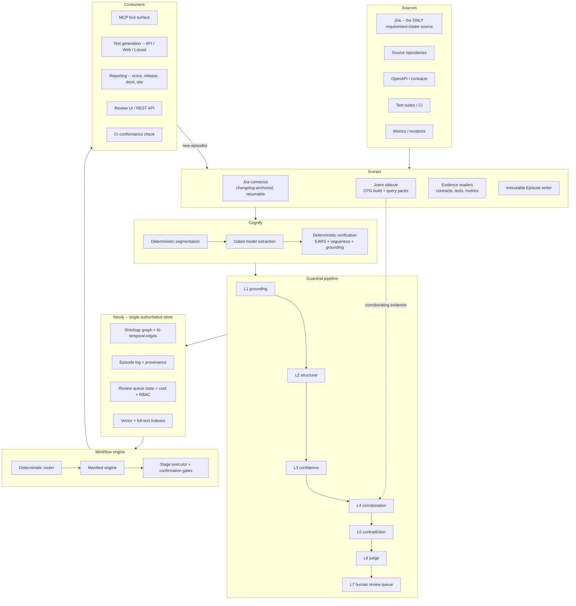

# 02 — System Architecture

## 2.1 Component model



## 2.2 Layer responsibilities and invariants

| Layer | Responsibility | Invariant that must never be violated |
|---|---|---|
| **Extract** | Convert source-native events into immutable Episodes | Never mutates or interprets — pure capture. Always succeeds or the connector retries |
| **Cognify** | Propose graph structure from Episodes | Nothing exits without a `source_span` and a structural-validity pass |
| **Guardrail** | Decide whether a proposal may be written, and at what tier | Nothing reaches `Approved` without every applicable rule passing |
| **Store** | Commit bi-temporal, identity-resolved state | Writes are idempotent by `unit_id` |
| **Workflow** | Orchestrate multi-stage operations deterministically | Same input → same stage sequence, regardless of model |
| **Consumers** | Tools, generators, reports, CI | Read-only by default; every write path is gated and confirmed |

## 2.3 Runtime processes

Five deployable units. Each is independently scalable and independently
restartable.

| Process | Responsibility | Scaling | Notes |
|---|---|---|---|
| **`metis-mcp-server`** | MCP tool surface (stdio + Streamable HTTP), OAuth2, RBAC | Horizontal, stateless | The only process clients talk to directly |
| **`metis-review-api`** | Review queue REST API + reviewer UI | Horizontal, stateless | May be co-deployed with the MCP server |
| **`metis-ingestion-worker`** | Jira sync, Cognify, mining, evidence readers, Joern orchestration | Vertical (JVM heap for CPG builds) | Batch only. Never in a request path |
| **`metis-scheduler`** | DQ metric computation, contradiction detection, sleep-time consolidation, memify aggregation, adversarial corpus runs, site regeneration | Single instance | Cron-driven |
| **`joern-sidecar`** | CPG build and CPGQL query-pack execution | Job-per-repository | JVM. Own storage. See §13 |

`REQ-OPS-006` — Ingestion runs as a scheduled worker, never in a request path.
CPG builds run minutes to hours; a request-path invocation is an architectural
defect, not a performance problem.

## 2.4 Storage architecture

| Store | Owns | Technology |
|---|---|---|
| **Graph** | Ontology graph, bi-temporal edges, episode log, review-queue state, cost tracking, RBAC, vector and full-text indexes | **Neo4j** — single authoritative database |
| **CPG artifact store** | `cpg.bin` per `(repo, commit_sha)`; optionally a **separate** Neo4j database for browsing | Filesystem / object storage |
| **Source-system data** | High-volume raw execution rows, metrics history | Stays where it is. **Never duplicated** into the graph |

### Why a single database for platform state

Two objections normally raised against consolidating the episode log into the
graph engine, and why they do not apply here:

1. *"The episode log needs a failure domain independent of the graph engine."*
   The capability that argument stands in for is proper online backup — which is
   an Enterprise-tier feature already required by the availability target (§10.1).
   Paying for that capability once and using it fully beats paying for it and
   also operating a second database to avoid depending on it.
2. *"Ingestion bursts need a decoupling buffer."* That is true when every source
   is independently polled by this platform's own connectors. With Jira-only
   intake on an incremental, changelog-anchored cursor, and code analysis as a
   scheduled batch, there is no burst to buffer.

`REQ-PLT-001` — The graph is authoritative for platform state. No second
operational database is required.

`REQ-PLT-009` — Raw high-volume execution data is never copied into the graph.
It is summarised into `Metrics` aggregates with a query pointer back to the
source, on a **tiered cadence** — frequent for SLA-critical or recently-changed
test cases, infrequent for everything else. A uniform daily rollup does not
reduce volume enough to matter at 1M+/month; a tiered one does.

## 2.5 Data flow — the two write paths

Exactly two paths write to the graph, and both go through the same gate.

**Path A — requirement intake (Jira only):**
```
Jira issue (+changelog)
  → JiraExtractor → UIF document (schema-validated)
  → Episode (raw_content = prose rendering)
  → Stage 1 deterministic segmentation  [no model calls]
  → Stage 2 gated model extraction       [NEEDS_LLM candidates only]
  → Stage 3 deterministic verification   [EARS + vagueness + grounding ratio]
  → Stage 4 pure planner → LandingPlan   [edge legality provable offline]
  → guardrail pipeline → Quarantine
```

**Path B — evidence (code, contracts, tests, metrics):**
```
Repository @ commit_sha
  → Joern CPG → query pack → extraction-report.json (schema-validated)
  → Episode per analysed unit
  → guardrail pipeline → Quarantine
```

`REQ-CGA-003` — There is no privileged write path. Code analysis lands through
the same Episode and candidate-submission contract as everything else.

## 2.6 The code-vs-model allocation

The primary cost lever, and the reason a ten-layer guardrail stack is
operationally affordable.

| Category | Steps | Implementation |
|---|---|---|
| **Deterministic (code)** | CPG extraction, contract parsing, schema parsing, Jira field mapping, EARS checking, vagueness checking, grounding-ratio computation, drift detection, structural validation, contradiction detection, confidence aggregation, coverage computation, DQ metrics, all rendering | ~10 of 14 pipeline steps |
| **Judgement (model)** | Free-text entity/relationship extraction from prose, grounding verification (judge), vague-requirement remediation suggestions, test-body filling, AC↔Transition candidate matching | ~4 of 14 |

`REQ-COST-001` — Every model call site must be justified as irreplaceable by
deterministic code. `REQ-COST-002` — Structural extraction is always code.

## 2.7 Retrieval architecture

Four explicit modes, never silently substituted for one another:

| Mode | Use case | Status |
|---|---|---|
| Graph traversal | Precise multi-hop structural questions | Primary |
| BM25 / keyword | Exact identifiers | Full-text index |
| Temporal point-in-time | "What did this look like before X" — an **explicit mode**, not a post-hoc filter | Implemented |
| Semantic / vector | Fuzzy intent matching | **Blocked** — indexes exist, path refuses to run until embeddings are populated (`REQ-ONT-013`) |

Results merge and pass through a reranking stage. The reranker is a small
specialised scoring model, **not** a per-token-billed chat API call — routing a
scoring pass through a generation API is both slower and needlessly expensive.

### Pinned core memory

Per service: active high-risk constraints, open incidents within 2 hops, and
explicitly human-pinned business rules are injected unconditionally, bypassing
retrieval ranking. Size-capped, with **overflow raising a visible warning to the
service owner — never silent truncation.**

### Sleep-time consolidation

A scheduled background job summarises low-signal episode chains into rollup
episodes (**never deletes raw episodes — non-lossy**) and *proposes*, never
auto-applies, near-duplicate merges for human review.

## 2.8 Client integration

The protocol is client-agnostic by construction. Only the discovery/config layer
differs.

| Client | Registration | Context budget |
|---|---|---|
| Claude (Code / Desktop) | `.mcp.json` project entry, or a custom connector | Larger — supports fuller 3-hop traversal |
| GitHub Copilot (Agent mode) | A generated agent discovery file pinning the read-only tool set | Tighter — 2-hop default |

`REQ-MCP-005` — Client difference is confined to configuration and discovery.
OAuth2 scoping, RBAC and tool contracts are identical server-side.

`REQ-SKL-003` — Agent definitions for every client are **generated from one
source** so the two cannot drift, with a drift test that fails when they do.

## 2.9 Repository layout

```
metis/
├── metis_core/                  # the platform library
│   ├── ontology/                # KNOWN_LABELS, ALLOWED_RELATIONSHIPS, validators
│   ├── temporal/                # four timestamps, revisions, as_of/history/diff, rollback
│   ├── graph/                   # Neo4j store, idempotent writers, resume
│   ├── guardrails/              # the ten layers, pipeline, RPI gates, cost gate
│   ├── quality/                 # DQ metrics, composite score, gates
│   ├── governance/              # Constitution parsing + enforcement mapping
│   ├── intake/                  # Jira client, field mapping, UIF, episode landing
│   ├── mining/                  # segmentation, extraction, verification, landing planner
│   ├── behaviour/               # determinism, guard atomicity/completeness, reachability
│   ├── retrieval/               # four modes, reranking, pinned memory
│   ├── reporting/               # content assembly + renderers
│   └── academy/                 # explanation content model
├── code_analysis/               # §13
│   ├── sidecar/                 # CPG build orchestration
│   ├── packs/<pack>/            # query.sc, pack.yaml, output.schema.json, tests/
│   ├── frameworks/              # per-framework route/annotation config
│   └── mapping/                 # CPG → ontology mapper
├── workflows/
│   ├── manifest.yaml            # workflow → stage → skill definitions
│   ├── engine/                  # router, manifest validator, stage executor
│   └── skills/<name>/           # SKILL.md, steps/, knowledge/, scripts/, tests/
├── generators/
│   ├── api/                     # API functional generation
│   ├── web/                     # Web functional generation
│   ├── performance/             # load-test generation
│   └── publishing/              # test-management client, MR client, defect client
├── services/
│   ├── mcp_server/
│   ├── review_api/
│   ├── ingestion_worker/
│   └── scheduler/
├── schema/                      # the three Cypher files
├── deploy/                      # Dockerfiles, chart, values per environment
├── docs/                        # this specification set
└── tests/                       # unit, integration, contract, determinism, adversarial
```

`REQ-PLT-006` — The repository installs from a clean checkout with one documented
command, exercised in CI. (v1 shipped a broken package definition for a long time
precisely because installation was never actually run the way a user would run it.)

## 2.10 Technology decisions

| Decision | Choice | Rationale |
|---|---|---|
| Graph engine | Neo4j | Bi-temporal modelling, native vector + full-text, team-scoped RBAC at Enterprise tier |
| Platform language | Python | Matches the carried-forward 13k LOC core and the ported generators |
| Code analysis | Joern (JVM) | §13.1 — only engine clearing licence + multi-language + CDG + export |
| Query language for code | CPGQL (Scala), in versioned packs | §13.4 |
| Workflow definition | Declarative YAML manifest | §07 — determinism requires the sequence be data, not code |
| Transport | MCP over stdio and Streamable HTTP | Client-agnostic |
| Auth | OAuth2 + per-team RBAC | §10 |
| Packaging | Containers + a versioned chart | §10 |

## 2.11 Failure modes and degradation

| Failure | Behaviour | Rationale |
|---|---|---|
| Jira unreachable | Sync stops and reports; no partial landing | `REQ-INT-016` |
| Model provider unavailable | Stage 2 mining halts; Stage 1 DIRECT candidates still land | Deterministic path is independent of the model |
| Joern build fails or partially parses | Job fails; **no partial extraction report is emitted** | A partially parsed repository silently under-reports, which looks identical to "clean code" |
| Review queue unattended | Nothing is approved | The safe failure mode, and it must stay that way (`REQ-GRD-024`) |
| Graph unavailable | All tools fail explicitly | No cached-stale-answer fallback; a stale answer presented as current is worse than an error |
| Embedding pipeline absent | Semantic mode refuses | `REQ-ONT-013` — never a silent fallback to another mode |

## 2.12 What is deliberately *not* in this architecture

| Not present | Why |
|---|---|
| A message bus | No ingestion burst to buffer (§2.4) |
| A second operational database | §2.4 |
| A per-run document store as source of truth | The graph replaces it; run artifacts are disposable projections |
| Multi-tenancy | Single-tenant with team-scoped RBAC (§01.6) |
| An LLM call in the retrieval hot path | Latency target (§10.1) forbids it |
| Session/prompt/generated-code logging as graph entities | Removed by explicit decision in v1 — ephemeral session data in a persistent source of truth is counterproductive (§03.9) |
